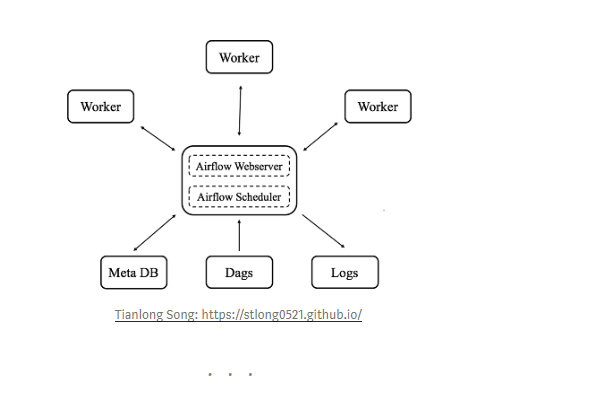

# Airflow

Mit Airflow kann man Python module managen, sprich Bedingungen erstellen wann welches Modul mit welchen Bedingungen ausgeführt wird. Konkret entstehen somit sogenante DAGs = irected Acyclic Graph, 

[MediumLink](https://medium.com/bd-a/airflow-tutorial-teil-1-dies-ist-der-auftakt-einer-kleinen-serie-%C3%BCber-airflow-44c1ca44f0b0)
Airflow ist ein frei verfügbares Workflow Managementsystem, mit dem es gelingt, Daten-Pipelines automatisiert und zu bestimmen Zeitpunkten ablaufen zu lassen. Dabei kann der aktuelle Status der einzelnen Tasks auf einer grafischen Oberfläche eines Webserver live mitverfolgt werden. Es eignet sich also ideal, um Workflows, die zum Beispiel täglich anfallen, mit Airflow täglich automatisch anzustoßen.

Alternative wäre Luigi
-------
## Begriffe

1. DAG (Directed Acyclic Graph)
    Die anfallenden Tasks werden in einer gerichteten Baumstruktur (einem sog. DAG) gespeichert und entsprechend dieser abgearbeitet. Dabei ist es auch möglich, mehrere Tasks gleichzeitig ablaufen zu lassen.
2. Scheduler
    Erstellt einen Plan, wonach die Tasks, entsprechend der DAG-Definition, abgearbeitet werden können. Airflow unterstützt sowohl sequentiell- als auch parallel-arbeitende Scheduler (Celery). Celery ist in der Lage, die anfallenden Tasks auf mehrere Worker parallel zu verteilen.
3. Worker
    Sie übernehmen die von Scheduler zugewiesen Tasks und arbeiten diese ab.
4. Webserver
Grafische Oberfläche für die Überwachung bzw. Interaktion mit den DAGs
5. Meta DB
    Alle Informationen bezüglich der Tasks werden in der Metadatenbank abgespeichert.
6. Logs
    Ausgabedateien, die separat abgespeichert werden, können zur Fehleranalyse herangezogen werden.DAG (Directed Acyclic Graph)
    Die anfallenden Tasks werden in einer gerichteten Baumstruktur (einem sog. DAG) gespeichert und entsprechend dieser abgearbeitet. Dabei ist es auch möglich, mehrere Tasks gleichzeitig ablaufen zu lassen.

-------
## Technische Bedingungen
Die Installation ist ausschließlich ausgehend von der SHELL.

Man kann Airflow auf Basis von 
1. Python 2.7
2. Python 3.x

und mit unterschiedlichen Datenbankanbindungen
* MSSQL
* POSTGRESS
* ....
installieren
-------
## Installation

* [Tutorial1](./Tutorial1.md)
  Tutorial Installing Apache Airflow on Ubuntu 18.04 unter postgress
  Verifiziert => Läuft

