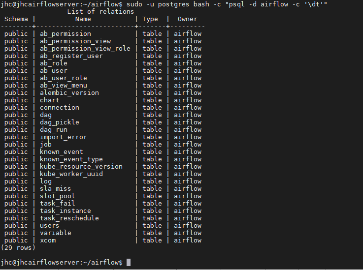

# Tutorial 1
[Link](https://corbettanalytics.com/tools/airflow/#install-airflow-and-postgres)

## Annahmen
* Es läuft unter Amazon webservice => ich habe es selbst unter einem privaten Hyper-V auf eine Ubuntu Headless 19 zum laufen gebracht
* Start mit einer Ubuntu-Headless-Server Maschine 

## Rollout
1. Standard update / Upgrade<br>
   > sudo apt-get update && sudo apt-get -y upgrade && sudo apt-get dist-upgrade && sudo reboot
2. Install required Software<br>
   >sudo apt-get update && sudo apt-get install -y python3-pip postgresql postgresql-contrib
3. Install Airflow<bR>
   > pip3 install apache-airflow[postgres]==1.10.3 flask==1.0.4

4. prüfen ob Airflow unter "/home/ubuntu/.local/bin" installiert ist (mit cd /ls / dir usw)


5. Füge das Directory zur Sitzung hinzu<br>
   Ausschließlich für eine Sitzung:
   ```
   export PATH=$PATH:$HOME/.local/bin
   ```
   Persistent / neuladen der Sitzung + verifizieren dass Airflow läuft:
   ```
   echo 'export PATH=$PATH:$HOME/.local/bin' >> ~/.bashrc
   source ~/.bashrc
   airflow
   ```
   

6. Erstellen eines Dir & Config für die Airflow Config<br>
   
   >mkdir ~/airflow && touch ~/airflow/airflow.cfg<br>

   Es kann sein, dass die Datei bereits existieret und auch die Einträge ebenfalls existieren, dann überschreibe ich die information in der Datei via nano => (davor mit "cp eine sicherung erstellen")
   
   
   füge folgenden Part in eben erstellte Datei ein:
  
```
[core]
# URL of the Airflow metadata db. We're using a local install
# of Postgres
sql_alchemy_conn = postgresql://airflow:<mark>password</mark>@localhost:5432/airflow


[webserver]
# Require the webserver to authenticate users with an email
# and password
authenticate = True
rbac = True
```
der obere Part "Core" Dieser Part stellt die Verbindung zwischen Airflow und der Postgress-DB her. Ergo muss eben exakt der User und das Passwort angegeben sein, welches bei der DB hinterlegt ist. 


7. Erstellen des DB-Users an der postgress // diese Credentials wurden im vorherigen Step eben schon in das Airflow-Config file hinterelegt.
```
ausgehend aus dem Verzeichnis  user = /home/jhc
sudo -u postgres bash -c "createdb airflow"
sudo -u postgres bash -c "createuser airflow --pwprompt"
```
8. Vor dem initilaisieren mach ich einen Checkpoint in der Virtualisierung
9. Airflow initialisieren
> airflow initdb
> 


10. Controll ob das anlegen an der DB funktioniert hat:
   > sudo -u postgres bash -c "psql -d airflow -c '\dt'"
   
   Wenns so aussieht ist alles gut
   
11. Run Airflow
    **Im Tutorial**<br>
    zunächst wird lediglich folgenden Weg beschrieben, der klappt auch solang ich den Server nicht neustarte. Nach einem Neustart kann ich mit diesem Befehl den Airflow nicht mehr starten:
```
airflow webserver --daemon && airflow scheduler --daemon
```
**Nach dem  Tutorial**<br>
nach dem Rollout des Tutorials kann ich mit dem Befehl den Server nach wie vor starten
```
airflow webserver -p 8080 && airflow scheduler
```

 jedoch ist kein User angelegt mit welchem ich mich nun an dem System anmelden kann => das dient jedoch der Verifikation, dass der Server soweit einmal läuft.
 

---------
## Hinzufügen eines Airflow-Users
```
airflow create_user \
  --username admin \
  --role Admin \
  --email airflow@mydomain.com \
  --firstname airflow \
  --lastname admin \
  --password {{ SET-PASSWORD-HERE }}
```

```
airflow create_user \
  --username admin \
  --role Admin \
  --email airflow@mydomain.com \
  --firstname airflow \
  --lastname admin \
  --password {{Test123}}
```
in dem konkreten Fall lautet das Passwort (ohne die ""): "{{Test123}}"


## Starten des Airflow-Dienstes nach einem Server Neustart
nach dem Rollout des Tutorials kann ich mit dem Befehl den Server nach wie vor starten
```
airflow webserver -p 8080 && airflow scheduler
```
