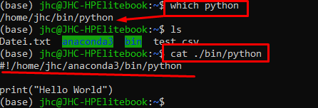
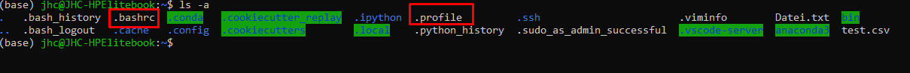

<H1>Soft-Dev in a nutshell</H1>

HIer kurz das vorgehen wie man ein Softwareschnipsel schriebt und ausführbar macht

# 1. Software schreiben

normalerweise liegen ausführbare Dateien immer in einem Ordner "./bin".

Ausführbare Dateien können
1. mit Endung identifiziert werden (bspw .py / .sh)
2. oder innerhalb des Skriptes auf die Execution Engine verweisen.=> dann darf das Textfile aber keine Endung haben

Hier ein mini Bsp für ein Shell-Skript:

>\#!/bin/bash
echo "Hallo Welt,  heute ist:"
date

Anmerkung: Zeile 1 mit ">\#!/bin/bash" verweist auf die Engine, mit welcher diess Sktipt ausgeüfhrt werden soll. Man kann Die engine mit dem "which" command herausfinden.

Hier ein kleines BSP wie man ein Python-Script refferenziell ohne die .py Endung schreiben kann. ZUvor finden wir zunächst heraus in welchem Verzeichnis sich die Python enginge überhaupt befindet:

# 2. Berechtigungen

 im Zeiten Schritt muss die Software Executable werden. In diesem BSP gegebe ich die Berechtigungen 777, da hier keine weiteren Sicherheitsreglements hinterlegt sind.

 > sudo chmod 777 testJHC

 [Link zur Berechtigung](../Permissions.md)

 # Ausführen

 Ab jetzt kann die Datei ausgeführt werden, sofern man sich in dem Pfad befindet und diese lokal aufruft

 >./testJHC

 # hinzufügen des Skriptes zu den Umgebungsvariablen

 Um nun künftig auf die Datei unabhängig vom aktuellen Verzeichnis aufrufen zu können, muss das Program(=Textdatei mit Quellcode) zu den Pfad-Variablen hinzugefügt werden. Die geht temporär(=Ausschließlich für die aktuell laufende Shell-Sitzung, bis diese geschlossen wird) oder persiistent(=Global und nach jedem neustarteiner Sitzung weiterhin bestehend)

 ## Temporäre Einbindung

 Hierbei muss das Verzeichnis direkt in der CLI temporär hinzugefügt werden:
 > export PATH=$PATH:~/bin

 Ab nun kann das Programm von jedem beliebigen Punkt aus gestartet werden (!! halt nach den Reglements, lediglich für diese Sitzung und innerhalb dieses USERS/etc)

## 2.1. Persisitente

Möchte man dieses Programm künfitg persistent haben so muss dieses in die folgenden Dateien hinterlegt werden

1. ~/bashrc
2. ~/profile
3. ggf .~/bash_profile (das ist nich in jeder Linux Distiubution vorhanden0)
   

   

dazu einfach jede dieser 2(3) Dateien mit einem Editor öffnen und das jeweilige Verzeichnis zu dem Start hinzufügen.

Hier exemplarisch wie dieser Teil zur .bashrc hinzugefügt wird, logischerweise bei den anderen Beiden Dateien das gleiche vorgehen:

hier zuletzt die Verifikation, dass nun der Pfad implementiert wurde, und bei der persistenten Einbindung muss dieser Pfad auch nach einem neustart noch vorhanden sein:

> echo $PATH

