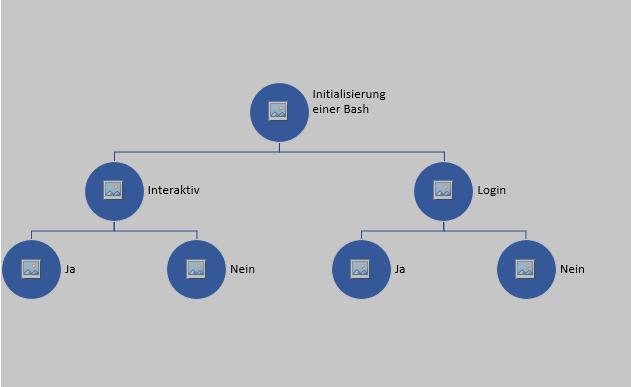
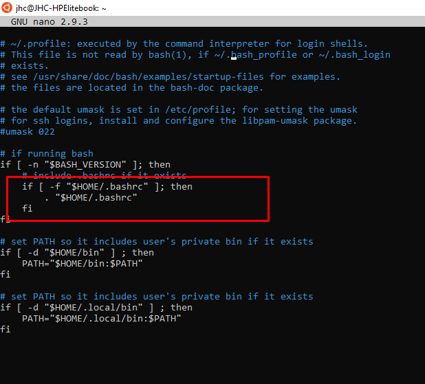
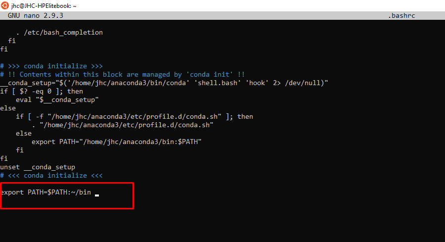

# Initialisieren einer BASH

Eine BASH kann nach unterschiedlichen Gesichtspunkten gestartet werden

1. Interaktiv
   1. Ja 
   Klassisch wie man es kennt wenn man ein Terminal startet. Konkret gibt es einen Courser an welchem man via Texteingaben mit der Shell interagieren kann.
   Wenn man hierbei die bash öffnet dann wird das File **~/.bashrc** geladen. 
   2. nein
   BSP während des ABlaufes innerhalb eines Skriptes, hierbei werden die Befehle prozedual abgearbeitet und man hat als Mensch keine Interaktions-Option
   Wenn man hierbei die bash öffnet dann wird das File **~/.bashrc** geladen. 

2. Login
   1. Ja
   BSP wenn man sich an einem Headless server anmeldet. Bzw wenn man sich via SSH bei einer Maschine anmeldet.
   Wenn man hierbei die bash öffnet dann wird das File **~/.profile** geladen. 
   2. Nein
   Wenn man aus einem Ubuntu Desktop die Bash Öffnet
   Wenn man hierbei die bash öffnet dann wird das File **~/.bashrc** geladen. 

wichtig hierbei ist, das das .profile das .bashrc nachlädt

Die obere Grafik veranschauclicht wie das File .profile das file .bashrc auruft.

Konkret heist das, dass wenn Änderungen im .bashrc vorgenommen werden, diese auch für Remotesitzungen via ssh vorhanden sind, wohingehend Änderungen im .profile File ausschließlich Command Öffnungen via SSH betreffen

Wenn man sicher gehen will dass ein Programm(executable Textfile) in jeder Bash aufgerufen werden kann, so muss in alle [Path-Files](./Bash-ScriptingInANutshell.md) der Befehl:

>export PATH=$PATH:~/bin

>export PATH=$PATH:\"PathZumJeweiligenExecutable\"

hintelgegt sein

