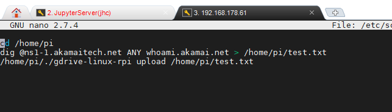
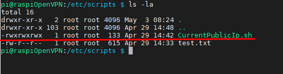
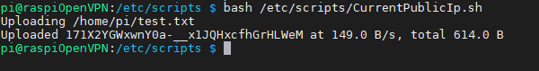
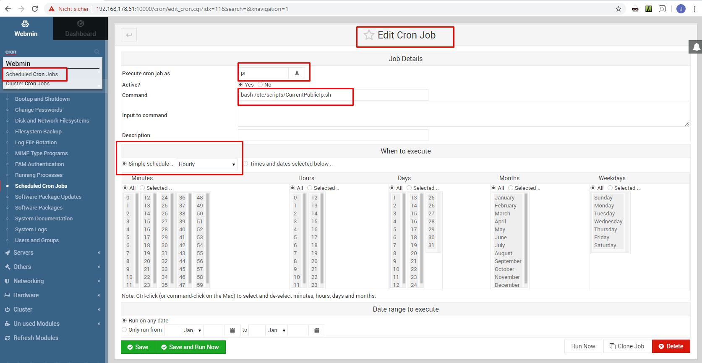

# Linux Bash-Scripting Cheatsheet

Nach gegenwärtigem Verständnis ist der Cron-Job Manager überwiegend bei zeitlich terminierten Aufträgen sinnvoll. Im Gegensatz zu Airflow werden keine Bedingungen geschalten(bspw wenn sich ein File änder etc) bzw auch kein Scheduling (Arrival/ Destination / Duration etc) angefertigt. Somit sind für die Ausführung von Python files [Airflow](./../Airflow/Rollout-Airflow.md) die bessere Wahl.

Hierbei geht es darum, Skripte (= Abfolge von [Linux-Commands](../Linux-Cheat-Sheet.md)) so in einer \*.sh (~ kann wie einen normale Textdatei editiert werden) zu schreiben & mit Ausführungsrechten zu versehen, sodass diese ausgeführt werden kann.

BSP: 
1. erstelle den Folder, in welchen alle Skripte abgespeichert werden sollen
  > mkdir /etc/scripts/
2. Erstelle das skript(hier ein exemplarisches Skript)
  > sudo nano  /etc/scripts/CurrentPublicIp.sh
  
  (das bsp skript speichert die aktuelle Public-IP in den der datei /home/pi/test.txt und lädt diese im Anschluss via .gdrive in die jeweilige Cloud)
3. Check das Execution Level mit
   >ls -la
   

4. ändere nach Bedarf die Ausführungserechtigung; hier die Shotgun
   >sudo chmod -R 777  /etc/scripts/

   > sudo chmod 777 /etc/scripts/CurrentPublicIp.sh

5. Jetzt kann die Datei aufgerufen werden mit 
   > bash /etc/scripts/CurrentPublicIp.sh
   

6. zuguter letzt hinterlegen wir den Spass noch im Cron-Jobs-Management. Ich manage das via dem Webinterface von [Webmin](../webmin/RolloutWebmin.md) 

im konkreten Fall wird mit dem User "pi" stündlich einmal der Befehl 
> bash /etc/scripts/CurrentPublicIp.sh

aufgerufen. 