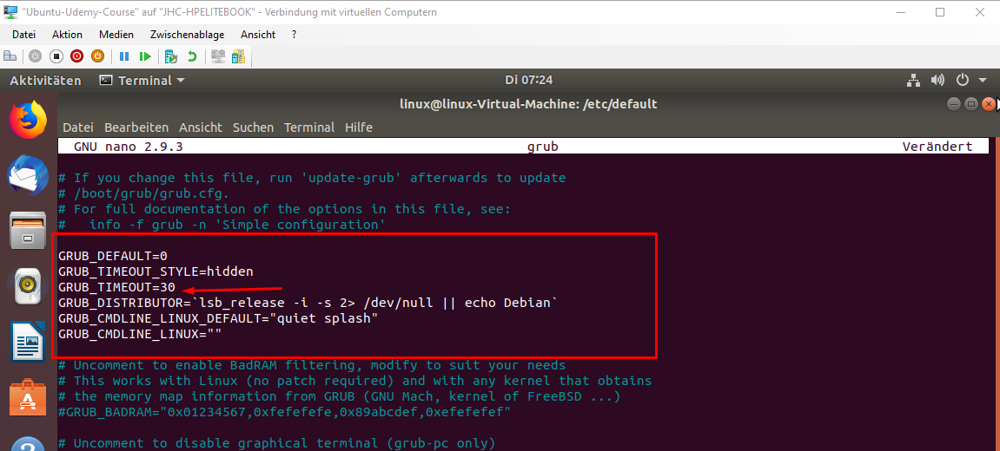
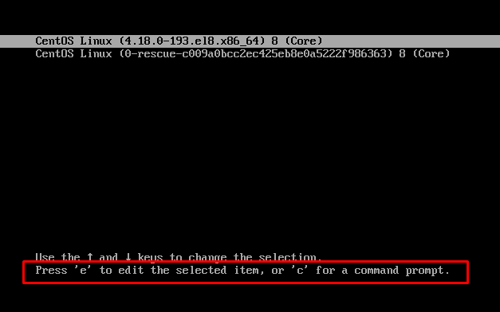
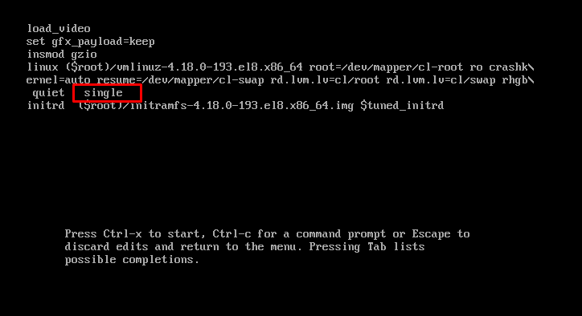
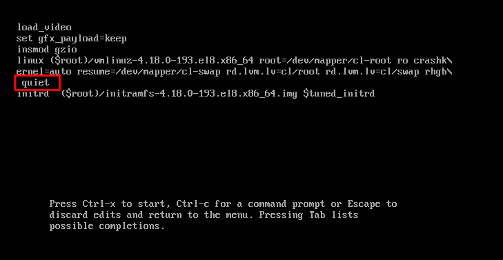

# Grub Ändern

[Theoretische Grundlagen Linux-Booting](../Linux-Booting.md)
[Theoretische Grundlagen S ystemstart](./../T_Systemstart.md)

**Konfiguration übernehmen**
>grub-mkconfig –o /boot/grub/grub.cfg

**BSP wenn grub bootloader nicht mehr zu sehen ist**

1. Öffne die Datei
> sudo nano /etc/default/grub
2. Ändere von  sek in gewünschte Sekundenanzahl
   
3. mach die Änderung persistent:
   > grub-mkconfig –o /boot/grub/grub.cfg

## Runlevel

**anzeige**
>runlevel

## Boot modificated

Sofern Grub aktiviert ist, so kann während des Bootens damit interagiert werden:

mit der Taste e erhalte ich die Config, datei 
Alle Änderungen die ich hier tätige, dienen lediglich diesem einen Boot und sind nicht persistent, wenn ich diese Ändern will dann muss ich.
Wenn Grub nicht aktiviert ist so muss nach dem POST vom BIOS entweder die Umschalt bzw die eSC gedrückt gehalten werden, dann erscheint dass GRUB-Menu

### Change Runlevel im Start
[Runlevel](./../T_RunLevel.md),

bspw ich möchte den Runlevel single Starten => dazu muss ich in die Zeile Single dazuhängen

jetzt wird Linux im Singlemode gebootet. Diese Änderung ist nicht persitent, sondern lediglich auf diesen einen Start begrenzt

### Extended Start

Hierbei werden mehre Stati beim Systemstart ausgegeben => gut fürs Troubleshooting