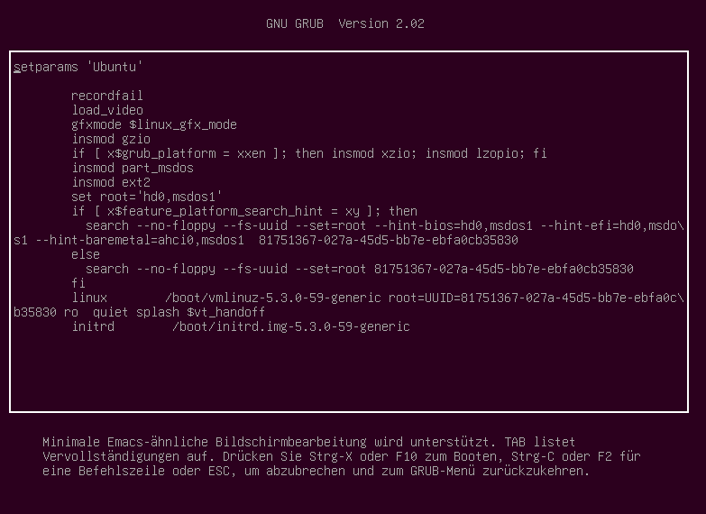
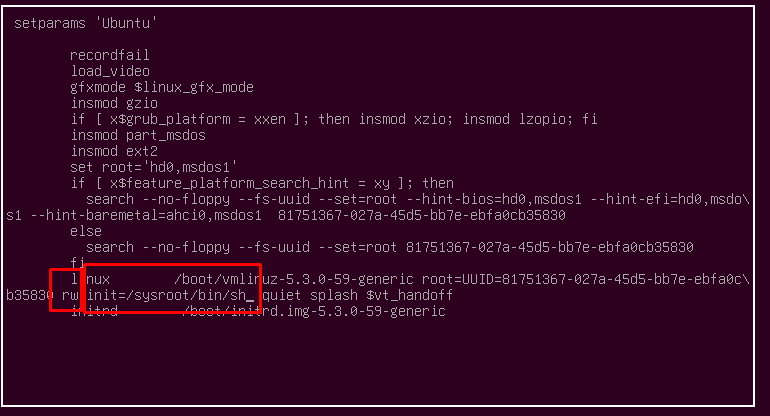

### Hacking-Root PWD

[Öffnen des Grub-Bootloaders](./P_Grub-Config.md) // Die Änderungen finden nur einmal statt.

**Vor Änderung**

**Nach Änderung**

Damit weisen wir an direkt in eine Shell zu starten