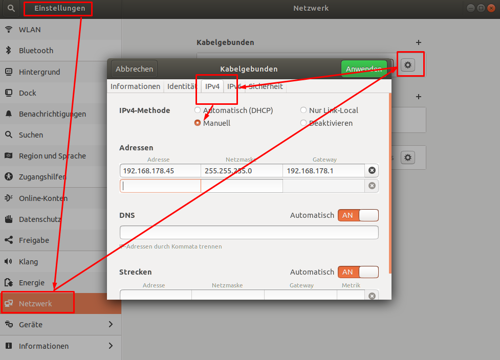
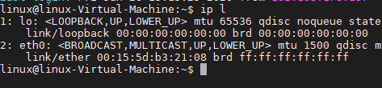
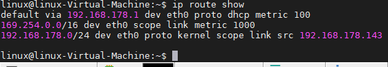
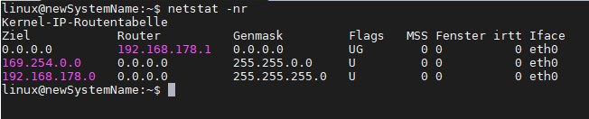
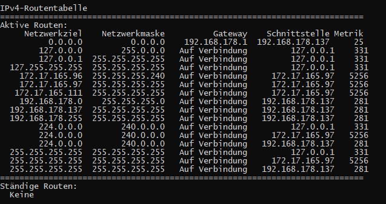
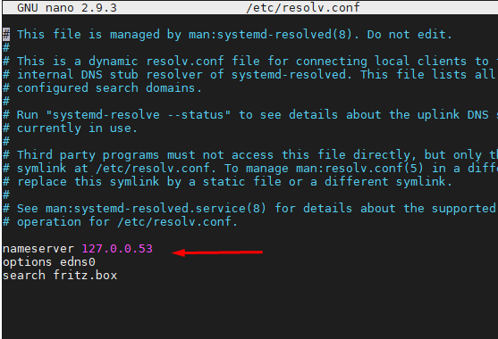

# Networking-Config

## GUI 
### Netzwerkmanager
hier kann man problem los IPv4 && IPv6 konfigurieren.
ähnlich wie in [Windows Networking](./../../Windows/Netzwerk-Konfiguration.md)
hier die Klickwege für die Erstellung einer statischen IP:

wenn eine statische IP verwendet werden soll, so muss dies auch im Router hinterlegt sein.

hier kann man
1. DHCP / Statisch konfigurieren
2. IPv4 / IPv6 konfigurieren
3. Subnetzmaske definieren => [Subnetting](./../../Netzwerktechnik.wiki/G_Subnetting-CIDR-VLSM.md)
4. nach einer Änderung in der Config muss zunächst das interface reinitialisiert werden:
   - Option A: interface über gui am schalter ein und ausschalten
  
         1. sudo ip link set dev eth0 up
         2. sudo dhclient -v
   - Option B: 
   in der GUI am Netzwerkmanager einfach aus und wieder einschalten am Button
## CLI

### Iproute2
Paket das einige Tools mit bringt. Im Paket iproute2 wird insbesondere das Programm ip mitgeliefert, das für alle Aspekte der IP-Konfiguration genutzt werden kann

- Tool **IP**
  Hat ein Manual, 
  - bspw 
    - >ip addr show = ip a
    - >ip link show = ip l

    
    - > ip route show = ip r
  
    
    - >ip ntbale

## SS
Anzeige aller offnen ports. Mit dem Tool ss lassen sich Kommunikationsverbindungen und Portbindungen anzeigen

>ss -t
>ss -tln
>sudo ss -tlnp | zusätzlich noch die Prozessid

## Interface an  oder aus
Die älteren Tools, wie ifconfig, netstat u.a. befinden sich im Paket net-tools, das mittlerweile oft separat installiert werden muss Interface starten / Schließen

>if eth1 up / down

das geht nur wenn eth1 in der datei /etc/network/interfaces hinterlegt ist. Nur dann nutzen, wenn der Network-Manager nicht verwendet wird

### net-tools
Die älteren Tools, wie ifconfig, netstat u.a. befinden sich im Paket net-tools, das mittlerweile oft separat installiert werden muss

>sudo apt-install net-tools

#### ifconfig
>ifconfig 
>ifconfig eth0
>ifconfig -a | anzeige aller 
Anzeige der interfaces & Ip & Statistik infos

#### arp
>arp -a
>arp -an

### route
>route
>route -n
>route -6n 

### netstat
Rückgabe der Routing-Tabelle
diesen Befehl gibt es genauso in Windows
>netstat -nr
Einblick in die Routing-Tabelle
1. Linux

[0.0.0.0 = ]
2. Windows

>netstat -tlpn
>netstat -tulpn
>netstat -nap udp
>netstat -nabp
## /etc/resolv.conf
/etc/resolv.conf enthält traditionell die Nameserver-Einträge (DNS).  Mittlerweile übernimmt das der Dienst systemd-resolved. 

## nmcli
CLI von Network-Manager => recht umfangreich
>nmcli
>nmcli dev show