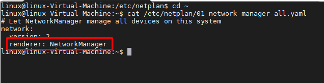
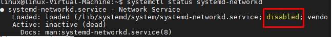
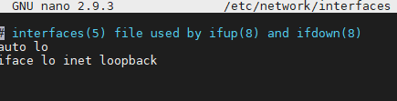
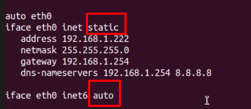
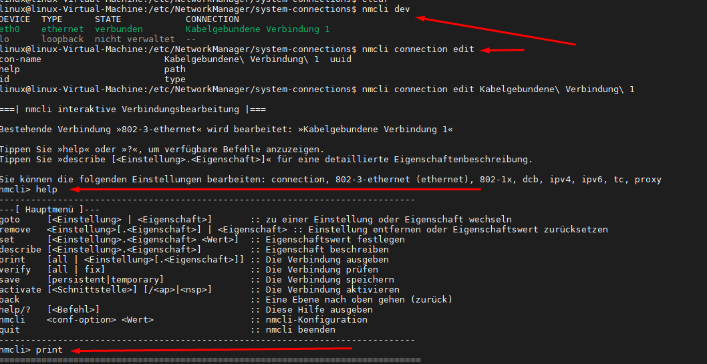

<h1>Networking-Config</h1>

# Herausfinden wer das Interface verwatltet
es kann nur entweder der **Network-manager** oder eben das File **systemd-networkd** ein Interface verwalten. um herauszufinden, wer die NIC gerade verwaltet betrachte die Datei:
>/etc/netplan/01*.yml

Anzeige status von systemd-networkd
> systemctl status systemd-networkd

# Files
## /etc/network/interfaces
heutzutage meist nur für loopback verantwortlich, der rest wird vom networkmanager verwaltet. 

Wenn die INterfaces hier configuriert werden, so muss jede hier aufgelistet werden:
1. BSp für die Loopbacks
2. Bsp fpr eine IPv4 Statisch && IPv6 -DHCP Config     
   

Die interfaces die in dieser Datei gepflegt werden können via 
>if up eth1
>if down eth1 

gewartet werden.

## /etc/resolv.conf
Hier sind die DNS-Server hinterlegt

## /etc/netplan
hier gibt es keine Unterstützung von "if up" / "if down".Metaebene für die Netzwerk-Konfiguration namens netplan. diese Datei gibt an wer gerade für das NIC zuständig ist

# GUI 
eignetlich selbredend
!!! nach Änderung muss Interface neu initialisert werden!!

# CLI

## mit dem NMCLI-Tool
es gibt den Prozess **Networkmanager**, dieser liest unterschiedliche Konfigurationsdateien(v.a **/etc/NetworkManager/system-connections/Kabelgebundene\ Verbindung\ 1**) ein und setzt die Operativ. diese sollte aber nicht in der Datei geändert werden sondern entweder mit der GUI oder mit dem tool "nmcli". Im großen und ganzen sind hier alle Configs hinsichtlich. Sollte die IP-Konfiguration auf der Kommandozeile angepasst werden, kann dies mit dem Tool nmcli durchgeführt werden. Die hier vorgenommenen Änderungen
bleiben auch nach einem Neustart erhalten.
1. Anzeigen der Schnittstellen von NM
>nmcli dev
2. Bearbeiten der Schnittstelle
>nmcli
danach bin ich in dem Programm von nmcli - COnfiguration tool
  1. mit help werden mir die entsprechenden Befehle angezeigt
  2. mit print wird mir die gegenwärtige Config angzeigt
  3. hier kann dann für ein System die entsprechende Config gestatet werden

## ifconfig & Ip
mit diesen kann ich zwar auch Configs erstellen, diese sind aber nicht persistent => nach dem neustart sind diese nicht mehr aktuell

