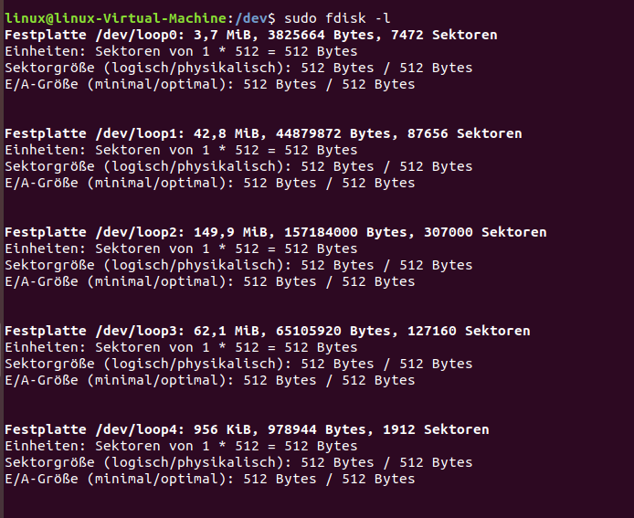
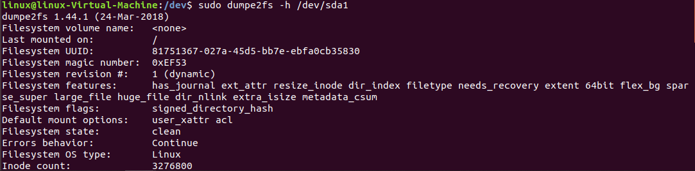
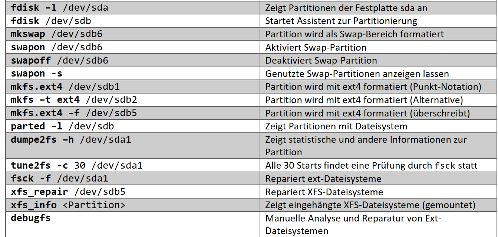

# HDD / SSD Handling

die Geräte werden zunächst mal unter dem Pfad **/dev/** eingebunden. Check die [Verzeichnisstruktur](../Verzeichnissystem.md)

**Anzeige Fesplattenspeicher = Partitionierung**

1. fdisk
   Anzeigen aller möglichen Festplatten(nicht gemountet)
> sudo fdisk -l

vergiss die loop = virtuelle platten, wichtig sind die 
**sda** / **sdb** etc.

2. parted
gibt es sowohl cli als auch gui version [gparted](https://gparted.org/)
> parted –l /dev/sdb

3. dumpe2fs 
liefert weitere Informationen über das System
> dumpe2fs -h /dev/sda

4. df & du
zeigt gemountet Datasysteme
>df -h
>du -h /mnt

**Erstelle Partitionierung**
Ebenfalls mit fdisk, in der [Verzeichnisstruktur](../Verzeichnissystem.md) und dev finden sich die manuelle hinzugefügten festplatten. um eine Parition zu erstellen verwende den Assistenten mit dem Befehl:

>fdisk /dev/sdb

**Erstelle Dateisystem**

>mkfs.ext4 /dev/sdb1

oder
> mkfs –t ext4 /dev/sdb2

oder
> mkfs.ext4 –f /dev/sdb5

----
**BSP-Commands**
