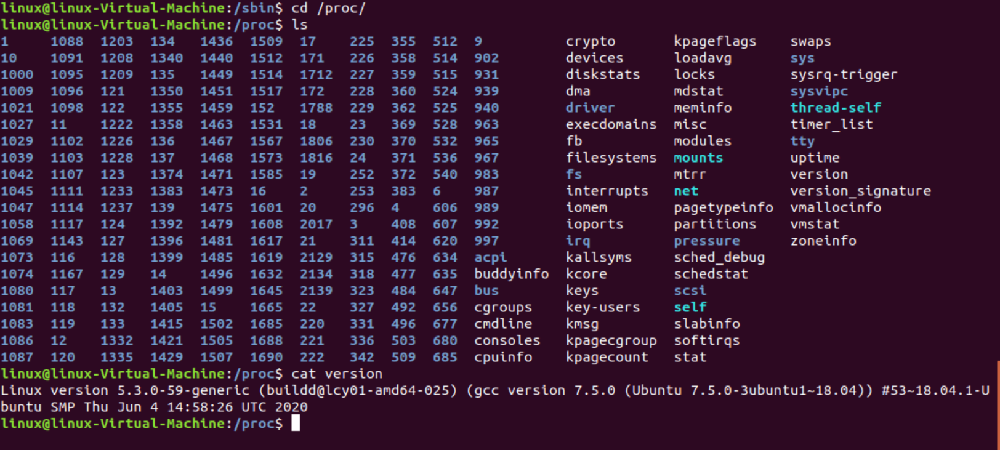

## Post-Installation-Tasks

Folgende Befehle rolle ich auf neu ausgerollten Ubuntu-Systemen mit dem Paketmanager APT aus:

1. Neustarten nach dem Update
> sudo apt-get update && sudo apt-get -y upgrade && sudo apt-get dist-upgrade -y && sudo reboot

2. Ausschalten nach dem Update
> sudo apt-get update && sudo apt-get -y upgrade && sudo apt-get dist-upgrade -y && sudo shutdown -f -t 0

3. Install Net-tools 
   in den neuen Ubunutu-Systemen sind die nettolls und somit kein **ifconfig** hinterlegt
> sudo apt install net-tools

4. Sofern nicht bereits beim Rollout muss ggf SSH aktiviert werden
> sudo apt-get install openssh-server

  5. Anzeige der verwendeten Version
  
> lsb_release -a 

oder unter der Datei
/proc/version

