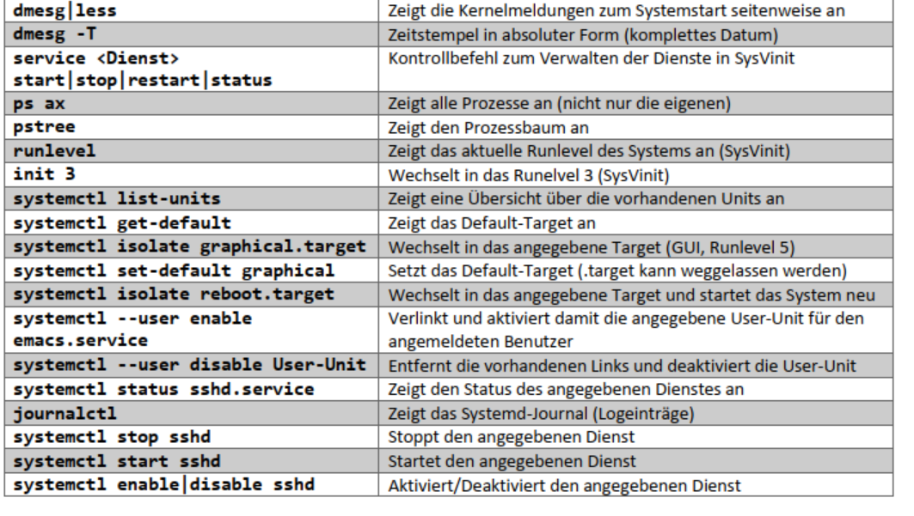
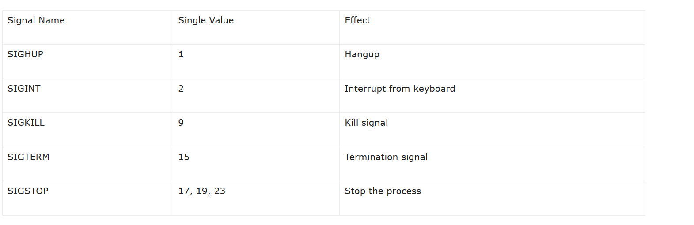
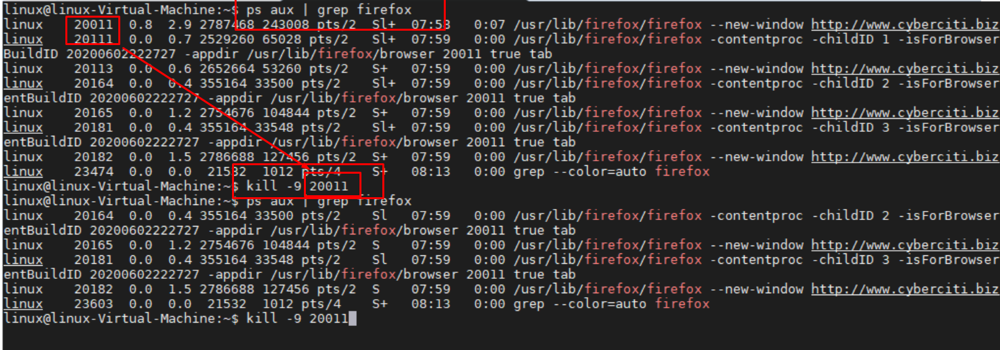

<h1>Prozessmanagement</h1>

[Link zur Theorie](../T_Systemstart.md), wichtig ist hier die Init-Datei. die Init Dtei ist immer der Prozess mit ID = 1

1. Anzeige von laufenden Prozessen

>ps -ax
>ps -ef
>pstree

>top

## Dienste können automatisch gestaret werden

mit automatisch Starten ist gemeint, dass sie entweder

1. mit dem Systemstart
2. oder mit einer Useranmedlung

mitgestartet werden

via den Dienst [systemd](./../T_Systemstart.md)

**systemctl** ist ein Programm für die Verwaltung von systemd Einträgen

---

> systemctl list-units

zeigt alle Dienste die von systemd verwaltet werden

---

> systemctl status ssh
 
Prüft den Status des SSH-Servers

# 

## Dienste Beenden via Kill

[Refferenz-Link](https://www.linux.com/training-tutorials/how-kill-process-command-line/)

1. Herausfinden welches der laufende Prozess ist

>ps aux | grep Firefox

2. PID herausfinden = manuell sichten

3. mit der PID den Prozess beenden. Dazu gibt es aber noch einige Schalter zu beachten:

In meinem Fall möchte ich das Signal "killen"

> kill -9 PID
> kill -9 20011
   

