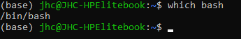
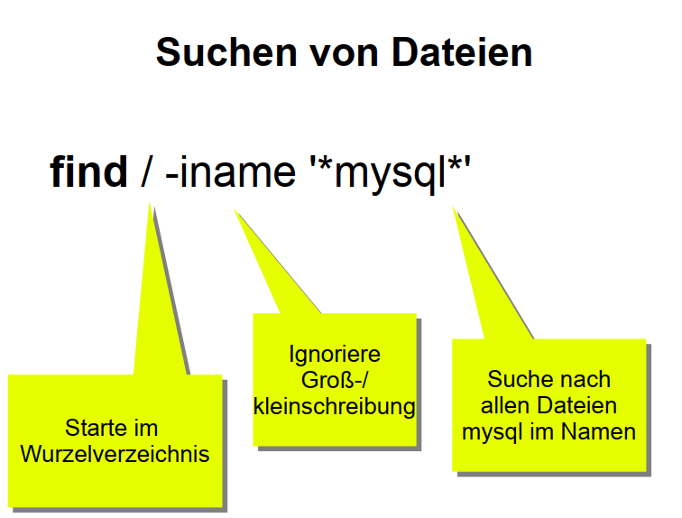
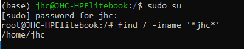

## List
die [LS-Befehle finden sich hier.](./list.md)

## Which
  > which bash

  Which verwendet man um die genaue Pfadlokalisation von Executables zu erhalten

  
  Dieser Befehl wird v.a. beim erstellen von Skripten und Programmcode relevant wenn man sich auf die jeweilige Engine beziehen muss. [BSP](./Bash/Bash-ScriptingInANutshell.md)
## find
  
  
  

 >find
    
Zum suchen von Dateien. Mehr möglichkeiten als ls

> find /Arbeit

sucht im Verzeichnis "/Arbeit"

> find /Arbeit /Freizeit

sucht in den Verzeichnissen "/Arbeit" und "/Freizeit"

> find /

sucht überall

> find /Kursmaterialien -name "test"

sucht in Kursmaterialien nach test

> find /Kursmaterialien -name "*test*"

sucht in Kursmaterialien nach allem, wo der Dateiname test behinhaltet

> find . -size +1M -and -name ”*skype*“

sucht im aktuellen Ordner + alle Unterordnern nach Dateien die größer als 1Mb sind
und der Dateiname skype enthält.

> find / -size -1M -and -name ”*skype*“

sucht überall nach Dateien die kleiner als 1Mb sind und der Dateiname skype enthält.

> find . -name ”*.JPG“ -delete

sucht im aktuellen Ordner + alle Unterordner alle Dateien mit der Endung .JPG und
löscht diese. (Groß und Kleinschreibung beachten)
> find /Desktop name ”*.JPG“ -or -name ”*.CR3“

sucht im Desktop nach Dateien mit der Endung JPG und CR3

> man find

Ruft das Manual von find auf und zeigt alle Parameter an

## Locate || Schnelles suchen nach Dateien

* locate legt eine Datenbank mit allen Dateien an und durchsucht diese.
   * find durchsucht die Dateien auf der Festplatte (Dauert länger) => locate ist schneller
* Datenbank muss aktuell gehalten werden
   * Wenn der Name einer Datei geändert wurde steht diese nicht Automatisch in der
Datenbank und kann noch nicht gefunden werden.
   * Standardmäßig wird die Datenbank unter Ubuntu einmal am Tag aktualisiert
   * sudo updatedb
▪ Befehl zum Aktualisieren der Datenbank
* locate ”Dateiname“
   * sucht die entsprechende Datei
* locate -i ”Dateiname“
   * sucht die entsprechende Datei, groß- und Kleinschreibung wird ignoriert
* locate -i –regex ”ubuntu(.*)\.ISO“
   * sucht nach Dateien die Ubuntu im Namen(oder im Pfad) haben und auf ISO enden
* locate -i --regex – basename ”ubuntu(.*)\.ISO“
   * sucht nach Dateien die Ubuntu im Namen(Pfad wird hier ignoriert) haben und auf ISO
enden

## Grep | Inhalte von Dateien durchsuchen

* Mit Grep können die Inhalte der Dateien durchsucht
* grep ”money“ *
   * durchsucht alle Dateien in dem Aktuellen Ordner nach money
* grep --count ”money“ *
   * durchsucht alle Dateien in dem Aktuellen Ordner nach money und gibt die Häufigkeit
des Wortes an
* grep -E -i ’Subject:(.*)money‘ *
   * durchsucht alle Dateien in dem Aktuellen Ordner nach Subject: ……money……(ignoriert
groß und Kleinschreibung)
   * das zu suchende Wort in einfachen Anführungszeichen da ein regulärer Ausdruck
verwendet wird!
   * (.*) bedeutet es ist egal wie viele und welche Zeichen kommen

## Stream-Editor | Suchen und Ersetzen in Text-Dateien

* sed wird genutzt um Text(= die Ausgabe) in Dateien zu ersetzten (Zeichenketten manipulieren)
* sed ’s/Welt/Linux/‘ hallo.txt
   * Ersetzt in der Datei hallo.txt, das erste Welt in jeder Zeile durch Linux
   * wird nur ausgegeben und nicht abgespeichert
* sed ’s/Welt/Linux/2‘ hallo.txt
   * Ersetzt in der Datei hallo.txt, das zweite Welt in jeder Zeile durch Linux
   * wird nur ausgegeben und nicht abgespeichert
* Durch den Parameter -i wird es in der Datei gespeichert
   * sed -i ’s/Welt/Linux/2‘ hallo.txt
* sed ’3d‘ hallo.txt
   * entfernt die 3. Zeile aus der Datei
   * wird nur ausgegeben und nicht abgespeichert
* sed ’2,3d‘ hallo.txt
   * entfernt die Zeile 2 bis 3 aus der Datei
   * wird nur ausgegeben und nicht abgespeichert
* sed ’/CentOS/d‘ hallo.txt
   * entfernt alle Zeilen die CentOS beinhalten
   * wird nur ausgegeben und nicht abgespeichert
* sed -n ’s/Ubuntu/Kubuntu/p‘ hallo.txt
   * Ersetzt in der Datei hallo.txt, das erste Ubuntu in jeder Zeile durch Kubuntu
   * -n bewirkt das die reguläre Ausgabe nicht erfolgt
   * /p bewirkt das nur die geänderte Zeile ausgegeben wird
* Durch ein Simikolon können mehrere Befehle aneinander gereiht werden
   * sed -n ’s/Ubuntu/Kubuntu/p;s/Welt/Suse/p‘ hallo.txt

* Durch den Parameter -E können Erweiterte reguläre Ausdrücke verwendet werden
   * in manchen Versionen -r
* sed -n -E ’s/model name(\s*)//p‘ /proc/cpuinfo
   * Entfernt in der Datei cpuinfo in allen Zeilen model name und die dahinterstehenden
Leerzeichen
   * (\s*) steht für Leerzeichen