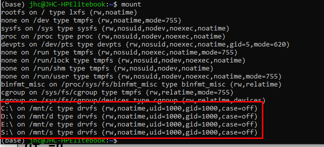

# Mounts
[Erstellen von Partitionen und Dateisystemen](./PartitionierungFileSystems.md) und hier die [Theorie zu Partitionen und Dateisystemen](../PartitionierungDateisysteme.md)

1. Anzeige
   Zeigt alle mountpoints an
   >mount
   

2. Einbinden
   Einbinden eines Gerätes(Festplatte/USB-Stick/SMB-Drive, etc.)
   >mount (-t ext4) /dev/sdb1 /Verzeichnis

3. Ausklinken
   Ausklinken eines Gerätes(Festplatte/USB-Stick/SMB-Drive, etc.)
   >umount /dev/sdb1 oder Verzeichnis

4. Einbinden ohne Schreibrechte = readonly
   >mount –o remount,ro /dev/sdb1 /Verzeichnis

----
# Auto-Mount
Es gibt die datei
> /etc/fstab

Hier werden alle Partitionen gemanaget, welche während des Mount-Vorganges in das System eingebunden werden
   