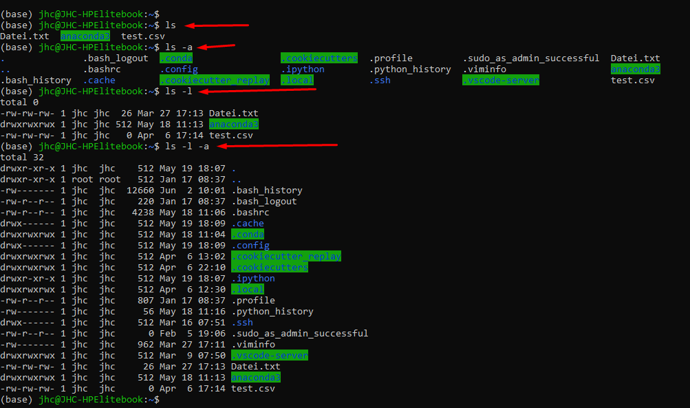
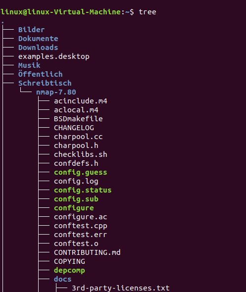

# List

mit diesem Befehl werden die Dateien eines relativen oder Absoluten Pfades dargestellt. Hierbei gibt es zahlreiche Paramter mit welchen der Befehl um weitere Infos (bspw den Permissions oder der art des Objektes) angereichert werden kann.

* **List**
  > ls

  Listet alle sichtbaren Dateien im aktuellen Verezeichnis (pwd)

  > ls /home

  Listet alle sichtbaren Dateien im angegebenen Verezichnis

  > ls -a 

  Listet alle sichtbaren UND unsichtbaren Dateien 

  > ls -l 

  Listet alle sichtbaren Dateien mit dem zugehörigen Nutzungsrechten (Permissions)

   > ls -t 

  Listet alle sichtbaren nach der Zeit sortiert

  
  
    * First character indicates whether it is a normal file ( - ) or directory ( d ) // l = link, c = Character Device (bspw Model) // b = block Device = bspw USB-Stick oder Festplatte
    * Next 9 characters are permissions for the file or directory (we'll learn more about them in section 6).
    * The next field is the number of blocks (don't worry too much about this).
    * The next field is the owner of the file or directory (ryan in this case).
    * The next field is the group the file or directory belongs to (users in this case).
    * Following this is the file size.
    * Next up is the file modification time.
    * Finally we have the actual name of the file or directory.
    *  Ausführbare Dateien werden in grün dargestellt (anhand der Rechte)
    * Die Rechte werden entsprechend angezeigt
    * Die Anzahl der Links auf diesen Eintrag
    * Der Eigentümer des Eintrags und die Gruppe, der der Eintrag zugewiesen wurde
    * Die Größe der Datei wird in Bytes angegeben
    * Datum der letzten Änderung

 
 

  Hier ein paar ls - Befehle im Vergleich
  
  Der Befehl 
  >ls -F 
  
  kann durch angehängt Zeichen kennzeichnen, um welche Art von Eintrag es sich handelt:
* / Verzeichnisse
* \* ausführbare Dateien
* @ symbolische Links

**tree**
  tree ist ein eigenständiges Programm, dass Verzeichnisstrukturen rekursiv gut darstellt:
  > sudp apt-install tree

  Ähnlich wie ls -R , nur dass hierbei die Struktur besser dargestellt wird.

  