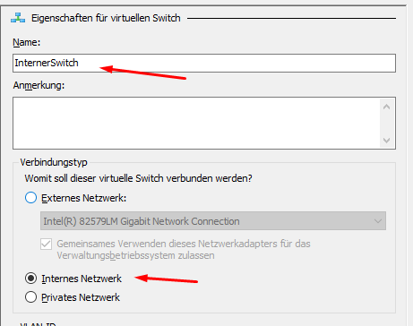
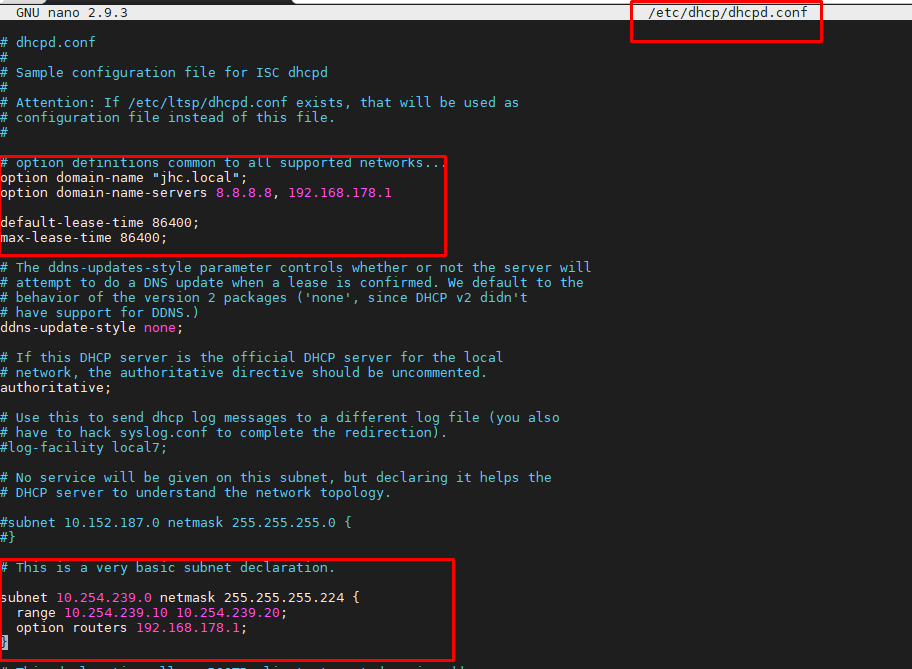
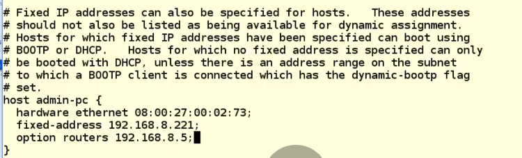
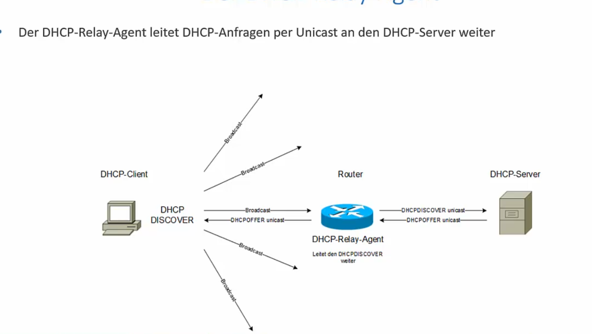
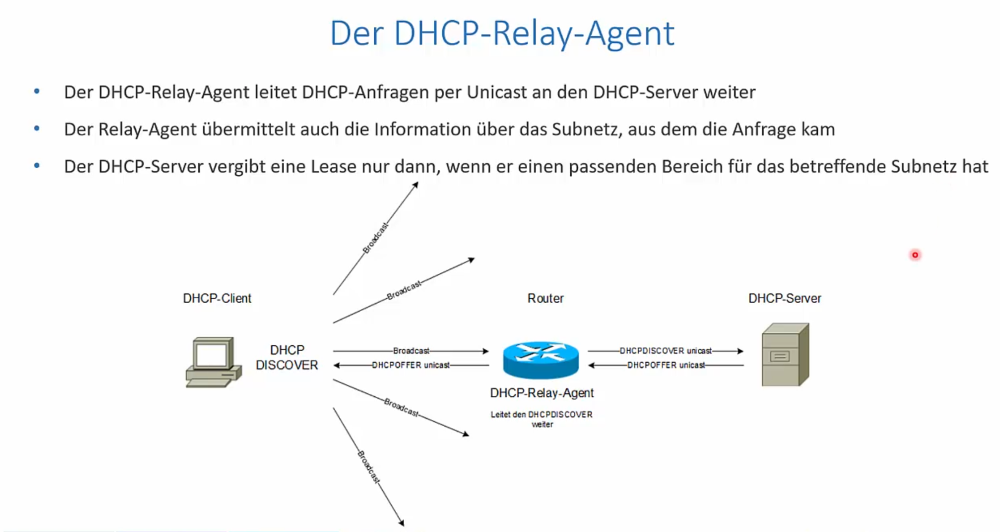

<h1>Installation eines DHCP-Servers</h1>

## LAB im Hyper-V
- Achte darauf dass der heir ausgerollte DHCP nicht im SOHO LAN ist => Zwei DHCP-Server => inkonsitenz im SOHO LAN
- ggf im HYPER-V virtual-Switch Manager eine internen Switch erstellen
  

# Installation eines DHCP-Servers
egal ob DEBIAN, etc
0. erst mal muss das OS iwie im Internet hängen um den Dienst installieren zu können. Ist der Dienst einsatzfähig wird er vor dem Produktivnehmen des DHCP-Servers eben in ein eigenes Netz geschickt
1. Install ISC-Server
   > sudo apt-get install isc-dhcp-server

2. Anpassen der Config-Dateien
   > sudo nano /etc/dhcp/dhcpd.config

a
Anzeige der Config
>cat dhcptd.conf | grep -v ^#

3. Festegen einer Statischen IP-Adresse für den Server
   -[ Vergabe Statische IP in LInux](./)

4. Starten des Servers
   > service -isc-dhcp-server

5. Am Client die IP-Config neu anfordern
   - Windows-Client
     - Ipconfig /release
     - Ipconfig /renew
   - Linux -Client
     - Gui 
     - CLI
       -  ifup eth0 

---  
6. Erweiterung um Reservierte IP-Adressen

> sudo nano /etc/dhcp/dhcpd.config

ändern

>service isc-dhcp-server restart

Nun läuft für das Subnetz der fixen IP der DHCP server mit den gegebenen Configurationen aus 
- DHCP-Range
- Fixe Adressereservierung

--- 
8. Erweiterung um DHCP-Options
   mit dem [DHCPRequest] können noch einge [Options](https://www.iana.org/assignments/bootp-dhcp-parameters/bootp-dhcp-parameters.xhtml) für die Konfiguration des Client Networking mitgeliefert werden

## DHCP-Relay-Server
Zentraler DHCP-Server der mehrer Subnetze versorgt

- Sprich router erhält DHCP Discover via Broadcast vom Client
- router hat Software hinterlegt und leitet den Discover weiter an den DHCP-Server die Nachricht via Unicast
- DHCP offer Unicast zum router und en DHCP-Offer
- DHCP Client weis nicht dass er mit Relay-Agent spricht

