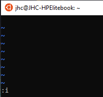

# Editor vi

Nahezu auf jedem Linux vorhanden

## Good-To-Know
im Vi gibt es unterschiedliche Zustände wie mit dem File interagiert werden kann. ändern kann man das immmer durch 
"esc" => ":i" => "Enter", so kann man bsp das file in den Änderungsmodus übernehmen.

## Anwendung File erzeugen
man navigiert auf der Konsole an den entsprechenden Pfad

bspw: "vi test" erstellt eine Datei mit dem namen "test" (achtung hier ist keine Endung dabei, wenn Endung gewünscht dann muss die beigefügt werden "vi test.txt")

## Anwendung File ändern

dazu das file einfach mit vi öffnen, das ist gleich wie beim erstellen, ist es bereits existent wird es zum ändern geöffnet, gibt es das File noch nicht wird es erzeugt

## Anwendung in "insert" mode wechseln
"esc" => ":i" => "enter"

das ":i" wird normalerweise im Bildschirm unten angezeigt

## Anwendung text zum file hinzufügen // append
"esc" => ":a" => "enter"

## Anwendung File speichern
"esc" => ":w" => "enter"

das ":w" wird normalerweise im Bildschirm unten angezeigt

## Anwendung File schließen
"esc" => ":q" => "enter"

das ":q" wird normalerweise im Bildschirm unten angezeigt