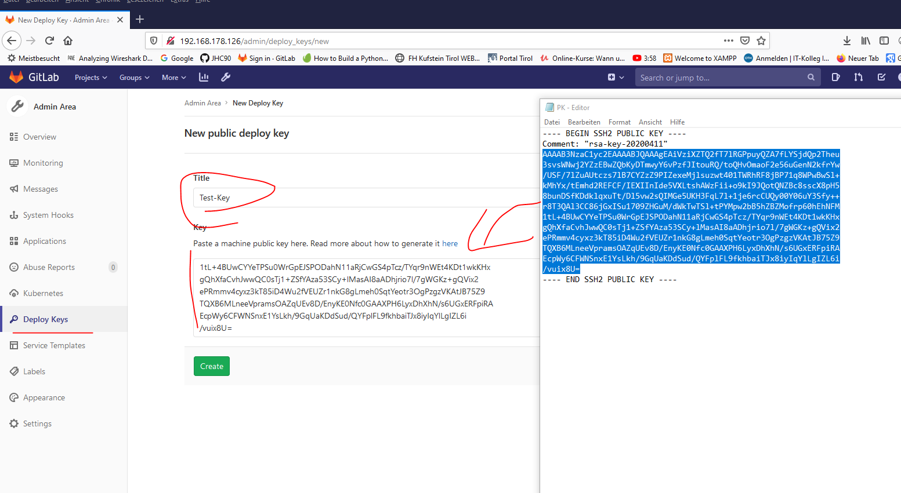

# Git-Server

## Tutorials
1. [BasicRollout](https://www.linuxhelp.com/how-to-install-gitlab-10-5-7-on-ubuntu-18-04)
Einfaches Rollout ohne Zertifizierungsstelle => Quick & Dirty. Gute Erklärung auf welche Weise GIt ausgerollt werden kann.

2. [Link](https://www.techrepublic.com/article/how-to-set-up-a-gitlab-server-and-host-your-own-git-repositories/)
Weiterführendes Tutorial => einbinden einer Zertfizierungsstelle

## Protokoll
Hier sind meine Notizen und zusammenfassungen der oben stehenden Tutorials
1. Erstelle Bare-Metal VM

und rolle wie immer [Linux-Server](./../RolloutUbunutServerOnHyperV/RolloutUbuntuServerHyperV.md) aus.
hostname = git-Server in diesem Tutorial
apt get update & upgrade & distupgrade
2. ggf IP im router hinterlegen => künftig auch sinnvollerreichbar
3. Wenn VM => Checkpoint install

4. Install requirements
> apt-get install openssh-server postfix -y

5. Install Gitlab-Ce
   hierzu gibt es mehere Versionen
   i. Adding Repo & install weiter
   2BC
  
   ii. Lade deb-Package runter und installiere es lokal:
      1. Suche auf dieser [Seite](https://packages.gitlab.com/gitlab/gitlab-ce) nach der Gitlab Version, die man wünscht , weiter [Infomrationen](https://packages.gitlab.com/gitlab/gitlab-ce). Im Falle dieses Tutorials:
   
      1. Lade das File mit wget herunter:
        
       1. installiere das deb package
            >dpkg -i gitlab-ce_10.5.7-ce.0_amd64.deb 

 ---
  6. Configration von Gitlab
   Konkret geht es um die externe Ip / Namen. Nachdem der Server in unserem Setup lediglich aus dem Lan erreichbar istm ist der Externe Name der Hostnmae.
   >nano /etc/gitlab/gitlab.rb

   dort mache folgende Änderung, wichtig ist das hierbei eine Domände dabeisteht:
   
   

   ERGO :
   

   7. Konfiguration einlesen
   > sudo gitlab-ctl reconfigure

   Dieser Strp dauer länger, ggf kann dieser auch in den Error rennen=> einfach nochmals ausführen

   

   Sobald dieses reconfigure durchgelaufen ist, ist gitlab unter dem normalen port 80 zu erreichen

   8. Linux-Ip in den Browser & setzen eines neuen Passwortes ( für den User root)
   
   9. Anmelden mit Root
   10. Checkpoint in der VM
------

# Next Steps
hierbei ist es wichtig auch die Reihenfolge die hier vorgegeben wurde einzuhalten
1. Create Git-User
2. Füge zu User aus 1 SSH-Key hinzu => connect local mit remote Repo

# Add CA-Certification
1. Install ca-Certification
   >sudo apt-get install ca-certificates

# Add remote SSH-Authentication
Ausgehend von dem Server sind andere Pcs Remote-Machines. Diese Remote Machines müssen für den Git-Server "Vertrauenswürdig werden. Dazu muss der Public-Key der remote Maschinen in den Git-Server integriert werden. Um schlüsselpaare zu erstellen gehe ich nach diesem [Tutorial](https://www.heise.de/tipps-tricks/SSH-Key-erstellen-so-geht-s-4400280.html) vor. 
Ohne diese Authentifizierung ist kein Push & Pull zu dem Server möglich

## Schlüsselpaar mit Git-Bash erstellen
1. Schlüsselpaar am SSH-Client(Management-Laptop) erstellen
ssh-keygen -t rsa -b 4096 -C 

1. Lade PublicKey In GitlabServer via Webinterface
   1. Öffne Gitlab-Webinterface >= Einstellungen => SSH-Keys
   2. Füge den aus 1. erstellten Public Key zu dem Git-Server hinzu (einfach den gesammten String copy&Paste) 
   
2. Neustarte Git-Server & git Client (ManagementLaptop) 
3. Bete dass es klappt
4. Anzeige der Anzahl der SSH-Keys am GitLab-System:
   

## Schlüsselpaar mit Putty

1. Remote Maschine = Windows
   Erstelle mit Putty gen ein Schlüsselpaar:
   
2. Remote Maschine = Linux

3. Einbindden des Public-Keys des Clients am Server

dazu alles aus dem PuK in den Gitlab übernehmen (Im oberen Screenshot wird nur ein Teil markiert das ist falsch). Es müssen auch die vermeintlichen Meta-infos übernommen werden. 

Danach ist der PuK am Server hinterlegt:

Jetzt muss vom Client aus eine Verbindung zu dem Server hergestellt werden 

 git clone git@192.168.178.126:root/testprojektforverificationsshkeys.git

 https://help.github.com/en/enterprise/2.17/user/github/authenticating-to-github/generating-a-new-ssh-key-and-adding-it-to-the-ssh-agent
