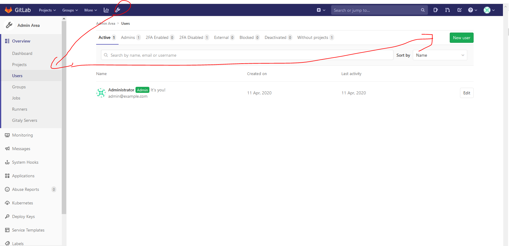
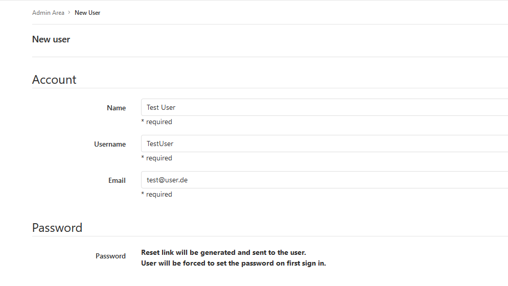
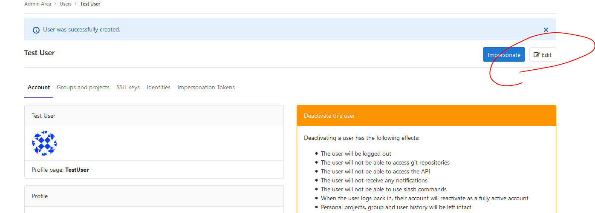
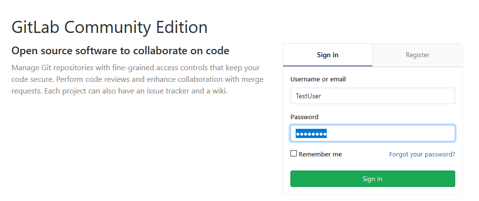
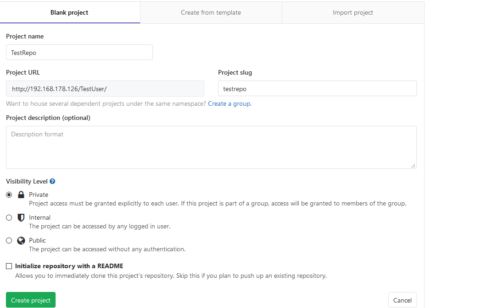
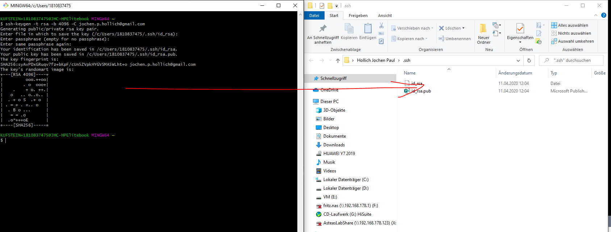
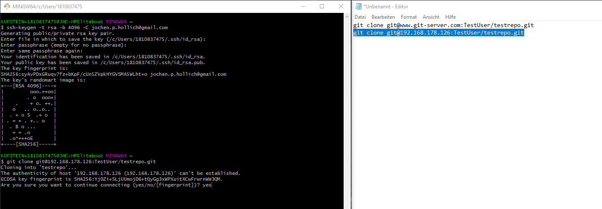
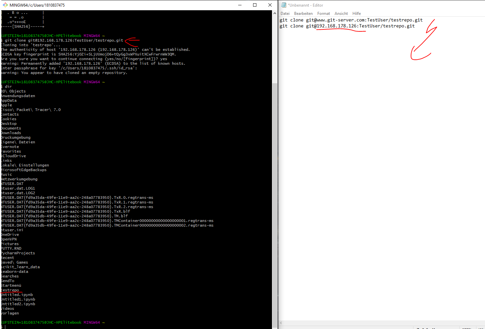

# Git-Server-User-Accounts

## UserAccoutns

Um nun mit dem Git-Server zu interagieren müssen nun an dem Server User-Accounts angelegt werden.

Diese werden mit dem initialen Account root angegelegt:

1. Anlegen neuer Account

   1. Bei der Pw abfrage wird dies zunächst an den User geschickt. Daher haben wir beim Rollout auch einen Mailserver gebraucht. Diesen Schritt übergehen wir gleich mit einem Workaround
   
   2. Workaround
2. Sobald user angegelt setzen wir das Pw Neu
   Das wäre das Szenario dass der user im Helpdesk nach nem neuen Pw frägt. in unserem Lab ist kein Mail-Server hinterlegt => kann der User nicht initial das PW setzen
   
3. Verify dass user sich anmelden kann:
   
----
## Hinzufügen von SSH Account zu dem User
**Vorbedingung** 
* auf dem Managementlaptop(das Gerät dass sich mit dem Server verbinden soll), darf lokal kein User im Git hinterlegt sein. Davor muss Git abgemeldet sein. 
* Der lokale User sollte für den Workaround ein Testrepo im Webinterface angelegt haben

  
1. mit UserAccount am Gitlab Webinterface anmelden 
2. im webinterface auf dem Gitlabserver => User => Setting => SSH Keys
3. Auf der CLI(gitBash) am !!!ManagementLaptop (Remote-Device)
   **Erstellen des Remote-Schlüsselpaares via git Bash in Windows**
   1. Öffne Git-Bash als Admin
   ssh-keygen -t rsa -b 4096 -C <mark>EmailDesUsers</mark>
   > ssh-keygen -t rsa -b 4096 -C jochen.p.hollich@gmail.com
   2. Die Key werden nun in Windows in folgendem Folder erstellt:
   
    3. Öffne Gitlab-Webinterface als TestUser angemeldet >= Einstellungen => SSH-Keys
    4. Füge den Gesamten Public.key der in 2 erstellt wurde in das Textfeld
    5. Save am Webinterface
    6. der Management Laptop einmal den Account ab und wieder anmelden => einlesen des Private Keys in Windows // zweifel neustart
    7. am Management Laptop den Clone befehl
    
    in Meinem Fall hab ich kein DNS => daher muss ich den Name durch die IP austauschen
    

# Status
Nun habe ich einen Git-Server, kann auf diesem User-Accounts erstellen. Diese User können zwischen lokal und remote Repo Daten austauschen. 

