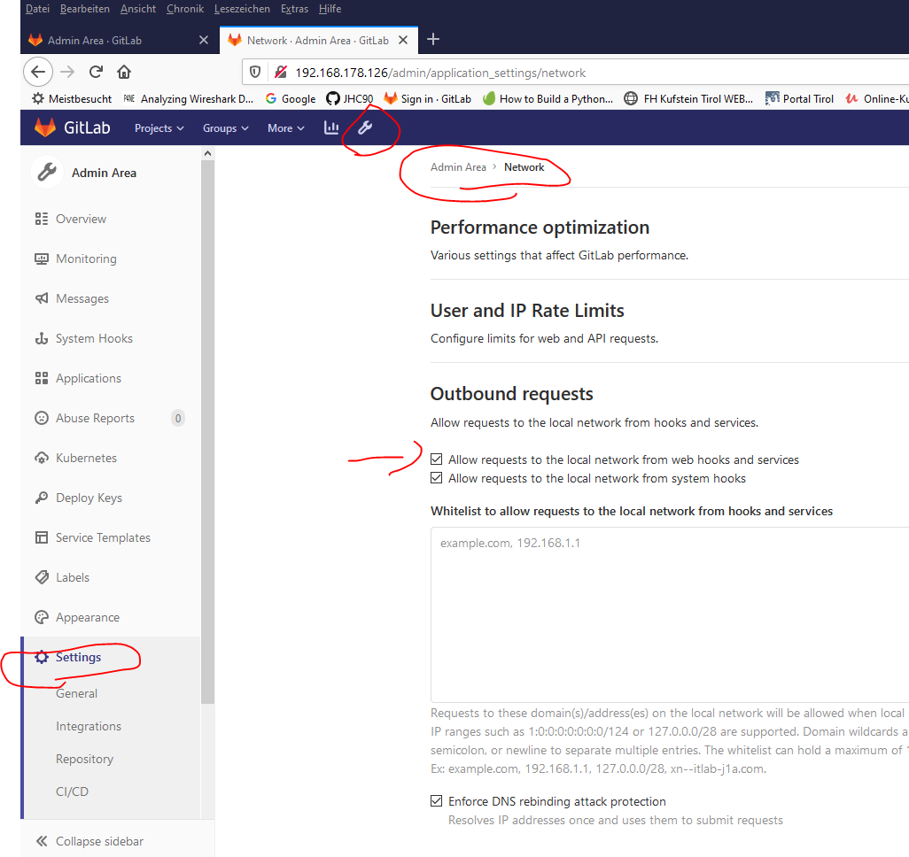
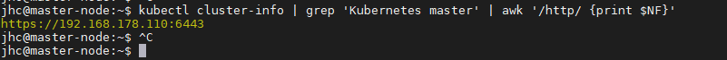
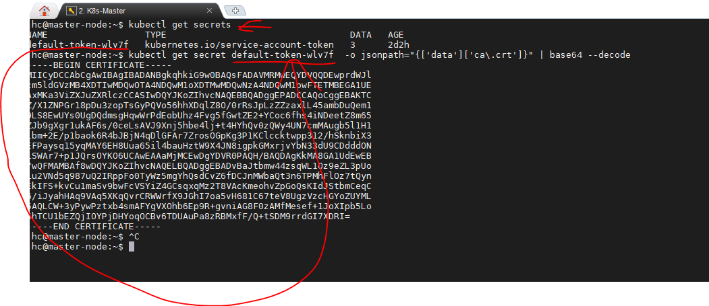
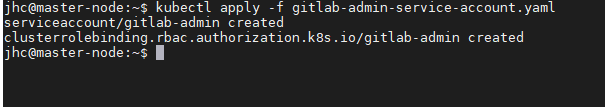
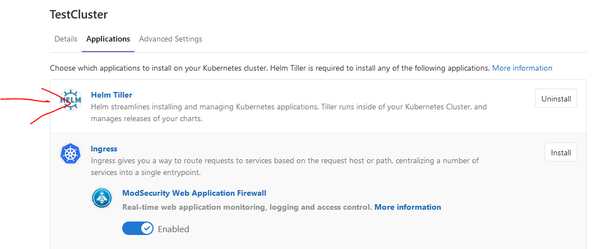

# k8s  
[GermanTutorial](https://gridscale.io/community/tutorials/gitlab-ubuntu-installieren/)
Das deutsche Tutorial habe ich noch nicht eingepflegt
[Tutorial](https://docs.gitlab.com/ee/user/project/clusters/add_remove_clusters.html#access-controls)


https://gridscale.io/community/tutorials/gitlab-ubuntu-installieren/

Bedingung:
es muss bereits ein K8sCluster laufen. (bestehend aus mindesten 2 Nodes, da sonst helm & tiller nicht funktioniert, zumindest nicht via webinterface installiert werden kann)
es muss ein gitlab-Server ausgerollt sein

-Server ausgerollt sein. 


1. Am Git-Lab-Server muss der Dienst freigeschalten werden,dass auch lokale Dienste(aus dem Lan) mit dem Server interagieren können. Dazu mit dem Root Account folgende Einstellung vornehmen:
   
2. Der Name des Clusters kann frei gewählt werden
2. Name der API  herausfinden:
   Dazu am K8s Cluster am Master: 
   > kubectl cluster-info | grep 'Kubernetes master' | awk '/http/ {print $NF}'
   
3. CA-Stelle des Clusters herausfinden
   
>kubectl get secrets
>kubectl get secret default-token-cg4z5  -o jsonpath="{['data']['ca\.crt']}" | base64 --decode
4. Serivce token für das Cluster herausfinden:
   1. Erstellen eines Users am K8s 
   2. Erstelle folgendes YAML File 
   >sudo nano gitlab-admin-service-account.yaml

```
apiVersion: v1
kind: ServiceAccount
metadata:
  name: gitlab-admin
  namespace: kube-system
---
apiVersion: rbac.authorization.k8s.io/v1beta1
kind: ClusterRoleBinding
metadata:
  name: gitlab-admin
roleRef:
  apiGroup: rbac.authorization.k8s.io
  kind: ClusterRole
  name: cluster-admin
subjects:
- kind: ServiceAccount
  name: gitlab-admin
  namespace: kube-system
```

3. Wende das Yaml an
   >kubectl apply -f gitlab-admin-service-account.yaml

   oder
   >kubectl apply -f gitlab-admin-service-account.yaml --username=admin --password=Test123

4. Abfrage des Account-Tokens:
   ```
   kubectl -n kube-system describe secret $(kubectl -n kube-system get secret | grep gitlab-admin | awk '{print $1}')
   ```

   

   1. Install Helm als interconnection zwischen Gitlab & K8s



6. um nun runbooks/jupyter Hub hinzubekommen sollte man nach folgendem Tutorial vorgehen: 
[Runbooks](https://docs.gitlab.com/ee/user/project/clusters/runbooks/)

1. K8s Ist da
2. ingress seperat installieren