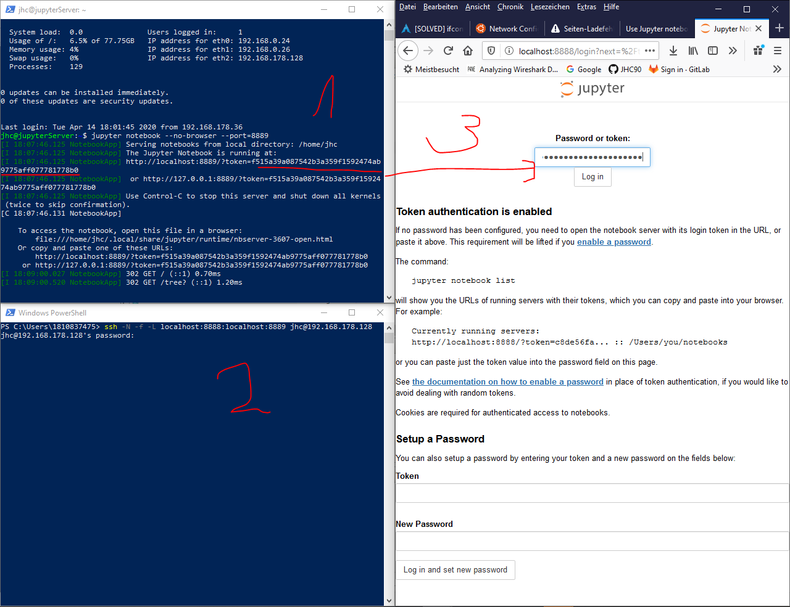

# Jupyter-Server

## Tutorial
[First-Tutorial](https://www.digitalocean.com/community/tutorials/how-to-set-up-jupyter-notebook-with-python-3-on-ubuntu-18-04)

## Protokoll
0. Hardware
Ich habe 8192 ram & 4 Prozesooren rein, klassisch den Open-SSH
2 Nics => Lab intern & Lab Extern

1. [BasicRolloutLinux](../RolloutUbunutServerOnHyperV/RolloutUbuntuServerHyperV.md)
Standardrollout +Extended Update +CHeckpoint in der VM

2. Install Python + pip
>sudo apt install python3-pip python3-dev

3. Install Jupyter 
   ich mach das in der Base Env
   >pip3 install jupyter
   >sudo apt install jupyter-core
 
 ~~ ggf auch jupyterlab
 >pip3 install jupyter
 >sudo apt install jupyter-core

4. Start Jupyter
   > jupyter notebook
   sudo apt install jupyter-core

5. Connect from Remote
   In diesem Bsp von meinem Managementlaptop (windows 10) von CLI
   1. via Powershell und dem SSH -Command
    >ssh jhc@192.168.178.128  

    Auf den Server, dort navigiere in das Verzeichnis in dem der Server geladen werden soll, dann

    >jupyter notebook --no-browser --port=8889

    1. auf dem lokalen Client (Management-Laptop / Windows 10) leite die Loclhoste Abfrage um mit dem Befehl: 
    > ssh -N -f -L localhost:8888:localhost:8889 jhc@192.168.178.128 

    1. Rufe auf dem lokalen Client den in einem Webbrowser den Server ab und bestätige den Token mit Token aus Schritt 1: 
    > http://127.0.0.1:8889/?token=f515a39a087542b3a359f1592474ab9775aff077781778b0

