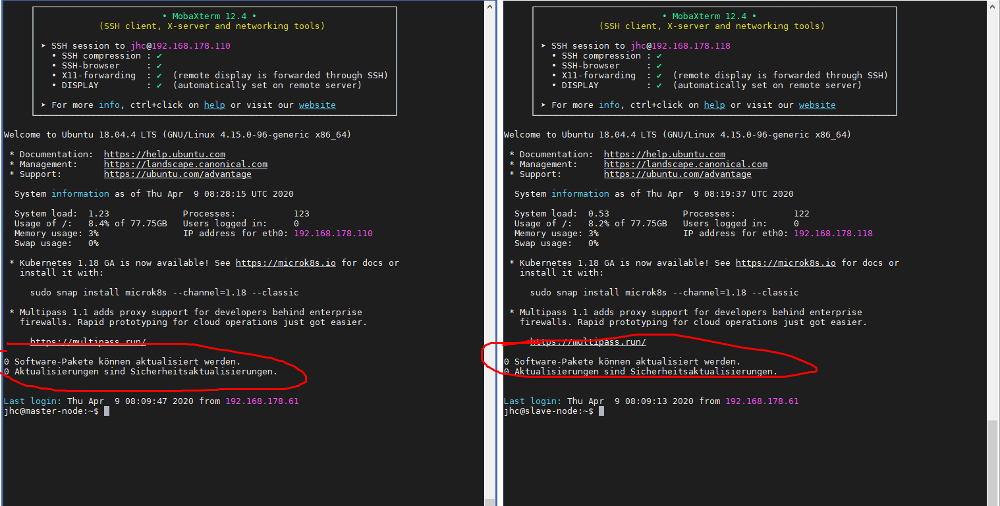
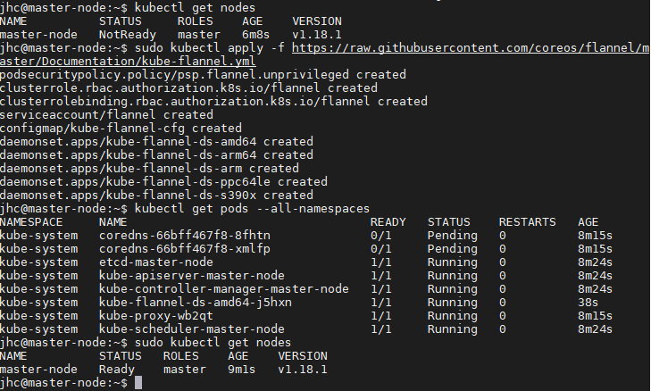
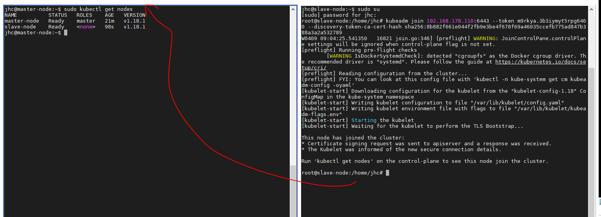

# Hier meine Notizen zu dem Rollout von k8s Basic 

Hier rolle ich einen 2 Node Cluster aus. Ich arbeite vom Managementlaptop aus mit MobaXterm im Split-Screen => es können die beiden aktionen auf den Terminals in den Screenshots gegenübergestellt werden. 

## Preparations
Hier der [Link ](https://vitux.com/install-and-deploy-kubernetes-on-ubuntu/) zu dem Tutorial.

* erstelle 2 vm ubuntu server 19.04
  * Hostname1 = k8s-M1   || sudo hostnamectl set-hostname master-node
  * Hostname2 = k8s-M2  || sudo hostnamectl set-hostname slave-node


* Update like always
     >sudo apt-get update && sudo apt-get -y upgrade && sudo apt-get dist-upgrade && sudo reboot



auf beiden 
* Mache auf beiden virtuellen Maschinen einen Screenshot

* Aufbeiden muss docker installiert werden
    > sudo apt install docker.io
* Check Docker auf beiden
    > docker --version
* enable docker
    >sudo systemctl enable docker

* get Kubernetes signing key
    >sudo apt install curl
    >sudo apt-get update && sudo apt-get -y upgrade
    >curl -s https://packages.cloud.google.com/apt/doc/apt-key.gpg | sudo apt-key add

* add new repo
    >sudo apt-add-repository "deb http://apt.kubernetes.io/ kubernetes-xenial main"

* Install Kubeadm auf beiden
    >sudo apt install kubeadm

    >kubeadm version
    


## Konfiguration

* Disable swap memory (if running) on both the nodes
    >sudo swapoff -a

* Give Unique hostnames to each node || sofern nicht schon beim Rollout geschehen.
    >sudo hostnamectl set-hostname slave-node
    >sudo hostnamectl set-hostname master-node

## Master-Specific-Configuraton
* !!!!Jetzt nur Master node!!! Initialize Kubernetes on the master node
Außerdem müssen an der stelle einige Dinge notiert werden @ Check das Tutorial 
    >sudo kubeadm init --pod-network-cidr=10.244.0.0/16
    

hier ist der Befehl der anderen Nodes ausgeführt wreden muss, sodass diese dem Cluster beitreten können. in diesem konkreten Fall wäre das:

>kubeadm join 192.168.178.110:6443 --token m9rkya.3b3iymyt5rpg6460 \
    --discovery-token-ca-cert-hash sha256:8b882f661e044f2fb9e3be4f678f69a46035ccefb775ad847b388a3a2a532789

* Basis-Config vom Cluster
```
    mkdir -p $HOME/.kube
    sudo cp -i /etc/kubernetes/admin.conf $HOME/.kube/config
    sudo chown $(id -u):$(id -g) $HOME/.kube/config
```
* Check Anzahl der Nodes im Cluster / am Master
  ```
    kubectl get nodes
    ```
    


* Deploy a Pod Network through the master node || erstellen eines Netzwerkes für k8s
```
  sudo kubectl apply -f https://raw.githubusercontent.com/coreos/flannel/master/Documentation/kube-flannel.yml

  kubectl get pods --all-namespaces

  sudo kubectl get nodes || den Befehl nicht mit root account
```




hier ist im Moment nur ein Node inkludiert, da der Slave noch nicht hinzugefügt wurde

## Einbinden des Slaves in das bestehende Cluster

* Add the slave node to the network in order to form a cluster
Beim erstellen des Clusters haben wir uns bereits den Key (und den gesamten Command)rausnotiert. Diesen können wir nun einfach in den Slave übertragen. Dazu muss dieser Befehl als root ausgeführt werden


   
* Verifikation am Master mit dem Befehl (nachdem der Slave dem Cluster zugewiesen wurde)
    >sudo kubectl get nodes || am Master



## Checkpoint
Das Tutorial endet an dieser Stelle
Somit habe ich hier den Hop off zu anderen Tutorials:
ich erstelle aber hier zunäcsht jeweils einen Checkpoint auf der VM
1. Webinterface
[Hier](https://srcco.de/posts/kubernetes-web-uis-in-2019.html) einige Notizen wie man diesen Cluster nun grafisch darstellen kann. 
   1. Kubernetes Dashboard
   Lediglich von Lokal aus zugreifen <br>[Link1](https://github.com/kubernetes/dashboard)
   1. 
2. GIT
3. Airflow

