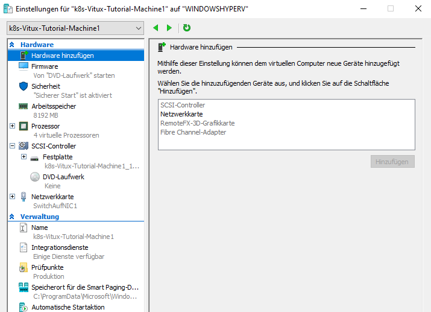
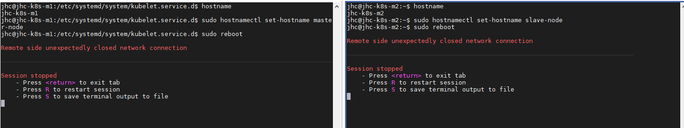
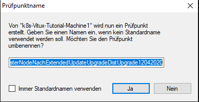
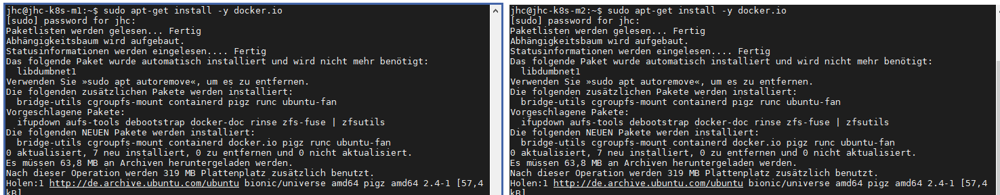
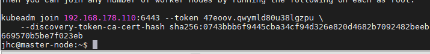
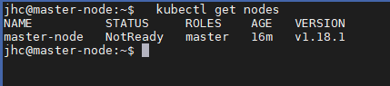
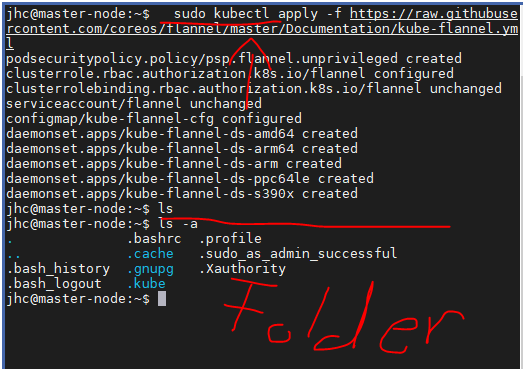
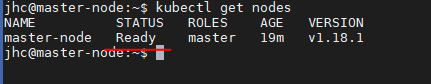
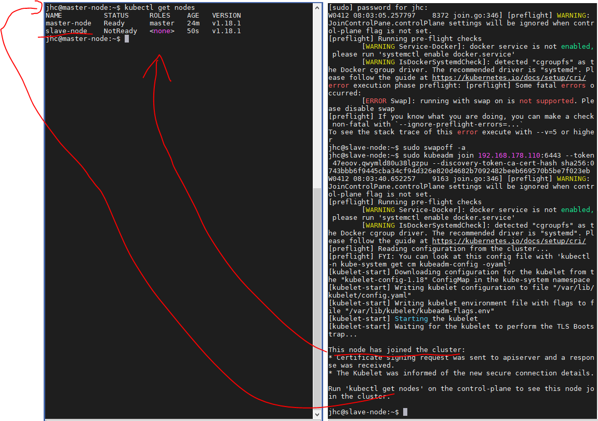
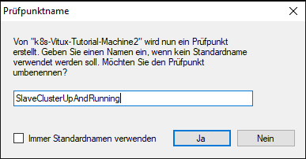

# Extended Deployment
In diesem Tutorial baue ich auf dem [ersten Tutorial](./0_BAsic_Deployment-Notes.md) auf. Jedoch pflege ich nun die Überelgungen von [Gridscale](https://gridscale.io/community/tutorials/kubernetes-cluster-mit-kubeadm/) in mein Rollout mit ein. 

## Ausgangslage
Ich habe zwei VMs mit den gleichen HW-Beschaffenheiten:



Als OS habe ich wie immer einen [Linux-Server](./../RolloutUbunutServerOnHyperV/RolloutUbuntuServerHyperV.md) ausgerollt.

beide erhalten die Ip via DHCP, im Router sind die IP-Adressen auf diese Mac-Adressen reserviert => immer die gleichen IPs. (in meinem Fall der Master X.X.X.110 und der Slave-node X.X.X.118)

Hostname Master = master-node
Hostname Slave = slave-node
die Hostname können via des Befehles
> sudo hostnamectl set-hostname "BspNeuerHostnameOhneAnführungszeichenSchreiben"

Danch einen Neustart des Servers. 



Beide OS sind Ubuntu Server Headless(Version 19), virtualisert auf meinem Hyper-V-Server. 

auf beiden läuft Openssh-Server => Zugriff via SSH(MobaXterm)


Check ob im Ubuntu die FW up ist. Wenn keine Sicherheitsbedenken setz die einfach auf down. Weitere Hints zu dem Management der Firewall finden sich [hier](https://www.configserverfirewall.com/)
>sudo ufw status
>sudo ufw disable (ggf)


Beide Maschinen haben den Standard Rollout & Updated & Upgrade usw durchlaufen.
Nach dem extended Update wurde auf der VM ein Snapshot erstellt. BSPW.:


ich arbeite grundsätzlich mit dem System-User (im Standarfall "JHC"), wenn ich root rechte benötige verwende ich "sudo + Command"

# Rollout 
1. Ausschalten von SWAP Partitionierung. 
   ```
   sudo swapoff -a
   ```
   Der Obere Command scheint nicht persistent zu sein, sondern bei jedem Neustart ist Swap wieder aktiv neu geladen zu werden

2. Install Docker auf beiden Maschinen
   * Aufbeiden muss docker installiert werden
       > sudo apt install docker.io

       bzw
       >apt-get install -y docker.io
       

   * Check Docker auf beiden
       > docker --version
   * enable docker
       >sudo systemctl enable docker

3. kubeadm Toolkit installieren (Ubuntu-Spezifisch)
   * Erst Curl
    ```
    sudo apt install curl

    sudo apt-get update && sudo apt-get -y upgrade

    curl -s https://packages.cloud.google.com/apt/doc/apt-key.gpg | sudo apt-key add
    
    sudo apt-add-repository "deb http://apt.kubernetes.io/ kubernetes-xenial main"

    sudo apt-get update && sudo apt-get -y upgrade

    sudo apt install kubelet kubeadm kubectl -y
    
    kubeadm version
    ```

4. cgroup Driver konfigurieren
Der cgroup Driver, der durch Kubelet genutzt wird, muss mit dem cgroup Driver von Docker übereinstimmen.
Das wird zwar in dem Tutorial vorgeschlagen, jedoch ist in dem File, das das Tutorial vorschlägt ken Flag vorhanden. An dieser Stelle überspringe ich diesen Schritt. Davor mach ich einen Snapshot in der HyperV falls ich den Befehl dennoch ausführen muss. 

5. Dieser Schritt ist nun masterSpezifisch!!!
    Initialisiere den Master:

    ```
    sudo kubeadm init --pod-network-cidr=10.244.0.0/16 
    ```
    Der Vorgang kann ein bisschen dauern… Zuerst werden eine Reihe von Pre-Checks gefahren, die sicherstellen sollen, dass der Master-Server bereit ist mit Kubernetes zu laufen. Während des Prozesses werden zudem Warnungen angezeigt und für den Fall, dass irgendwelche Errors auftreten wird der Prozess abgebrochen.

    Während des Rollouts erscheint nun der Comand, mit welchem wir weitere nodes(künftige Worker in das Cluster einbinden könnnen): 
    
    > kubeadm join 192.168.178.110:6443 --token 47eoov.qwymld80u38lgzpu \
    --discovery-token-ca-cert-hash sha256:0743bbb6f9445cba34cf94d326e820d4682b7092482beeb669570b5be7f023eb

6. Dieser Schritt ist nun masterSpezifisch!!!
   Diesen Behl mit normalen SystemUser (nicht root bzw sudo). Mit diesem Befehl kann dann ein Cluster genutzt werden
   
    ```
    mkdir -p $HOME/.kube
    sudo cp -i /etc/kubernetes/admin.conf $HOME/.kube/config
    sudo chown $(id -u):$(id -g) $HOME/.kube/config
    ```

    An dieser Stelle habe ich nun ein SingleNodeCluster:
    

7. Dieser Schritt ist nun masterSpezifisch!!!
   Pod Network für das Cluster deployen
    Ein sogenanntes Pod Network oder Container Network Interface ist notwendig, damit deine Pods untereinander kommunizieren können.

    Bevor  mit kubeadm ein Cluster gebootstrappt wird und anschließend eine Anwendung deployt werden kann, muss dieses als Add-On auf der Master Maschine installiert werden.
    Im weiteren Verlauf wählen wir für unser Cluster Flannel.

    Das Standard Network kubenet hat einige Limitierungen und nicht sehr viele Features. Es gibt eine Vielzahl an Projekten die Alternativen für unterschiedliche Anwendungsfälle mit breitem Feature-Angebot liefern. Die 3 am häufigsten genutzten Provider sind Weave, Flannel und Calico. Flannel nutzt die Kubernetes API und als Network Model vxlan. Es ist ein einfach aufgebauter Provider der leicht zu konfigurieren ist und sehr viele User hat.

    Nutze folgenden Befehl um Flannel über kubectl zu installieren:
    ```
    sudo kubectl apply -f https://raw.githubusercontent.com/coreos/flannel/master/Documentation/kube-flannel.yml

    kubectl get pods --all-namespaces

    kubectl get nodes
    ```
    
    

8. Dieser Schritt ist nun HOSTspezifisch!!!
Wechsel nun auf den Host, der deinem Cluster beitreten soll und den du zu Beginn des Tutorials ebenfalls vorbereitet und mit Docker und kubeadm ausgestattet hast. In meinem Fall mit dem Hostnamen slave-node.

Hier führst du den kompletten zuvor mit init generierten Befehl kubeadm join, gefolgt von IP-Adresse und Token/Hash, aus.
```
sudo kubeadm join 192.168.178.110:6443 --token 47eoov.qwymld80u38lgzpu --discovery-token-ca-cert-hash sha256:0743bbb6f9445cba34cf94d326e820d4682b7092482beeb669570b5be7f023eb
```



Lass dich nicht von dem Role Status irritieren, kubeadm ist derzeit noch nicht vollständig entwickelt, es existiert hierzu aber bereits ein Thema auf GitHub.

9. Checkpoint on VM auf Master & Slave
    

-----
# Next-Steps
1. Implement K8s to GitLab
    

    


   
  

