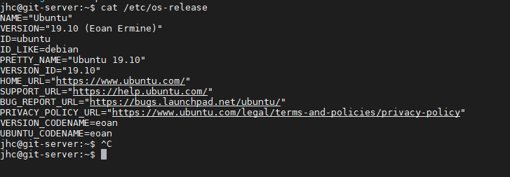

# Cheatsheet - Linux

## Install-Quick&Dirty
* sudo apt-get update && sudo apt-get -y upgrade && sudo apt-get dist-upgrade -y && sudo reboot
* sudo apt-get update && sudo apt-get -y upgrade && sudo apt-get dist-upgrade -y && sudo shutdown -f -t 0
* sudo apt-get install openssh-server
* sudo apt install net-tools
* lsb_release -a || return Akutelle Version

## Basic Command-Navigation

<table style="width:100%">
  <tr>
    <th>Command</th>
    <th>Umsetzung</th>
    <th> mögliche Parameter</th>
  </tr>
  <tr>
    <td>clear</td>
    <td>löscht die Ausgabe auf der Kommandozeile</td>
    <td> 
  </td>
  <tr>
    <td>pwd</td>
    <td>zeigt das aktuelle Verzeichnis</td>
    <td> 
  </td>
  <tr>
    <td>mkdir Verzeichnis</td>
    <td>erstellt einen Folder</td>
    <td> 
  </td>
  <tr>
    <td>cd "Verzeichnis"</td>
    <td>wechsel in das neue Verzeichnis // "Verzeichnis" = entweder absolutes oder Relatives Verzeichnis</td>
    <td>cd .. | wechsel ins höhere Verzeichnis || cd / = Wechsel ins root Verzeichnis || cd ~ = wechsel ins Home-Verzeichnis</td>
  </tr>
   <tr>
    <td>ls</td>
    <td>listet den Inhalt desVerzeichnises</td>
    <td>ls -a || auch die versteckten Dateien & </td>
  </tr>
  <tr>
    <td>man ls</td>
    <td>hier gehts um den "man" Bereich => ruft die Hilfe zu dem Befehl ls auf</td>
    <td></td>
  </tr>
  <tr>
    <td>echo "Hallo Linux"</td>
    <td>gibt den String Hallo Linux auf der Konsole aus</td>
    <td></td>
  </tr> 
  
</table>

## Basic System-Abfragen

<table style="width:100%">
  <tr>
    <th>Command</th>
    <th>Umsetzung</th>
    <th> mögliche Parameter</th>
  </tr>
  <tr>
    <td>sudo hostnamectl set-hostname master-node</td>
    <td>Ändert den Hostname</td>
    <td>in diesem Falle auf den Namen "Master-node" </td>
  </tr>
  <tr>
    <td>hostname</td>
    <td>gibt den Hostname zurück</td>
    <td></td>
  </tr>
  <tr>
    <td>whoami</td>
    <td>gibt den User zurück</td>
    <td></td>
  </tr>
  <tr>
    <td>cat /etc/os-release</td>
    <td>Liefert infos über die OS-Version</td>
    <td></td>
  </tr> 
  
</table>

## Basic File-Interaction

<table style="width:100%">
  <tr>
    <th>Command</th>
    <th>Umsetzung</th>
    <th> mögliche Parameter</th>
  </tr>
  <tr>
    <td>touch Datei.txt </td>
    <td>Erstelle eine neue Datei, mehr nicht :-)</td>
    <td></td>
  <tr>
    <td>  nano Datei.txt ||  vi Datei.txt</td>
    <td>Erstelle eine Neue datei und wechsel direkt hinein mit dem jeweiligen Editor <a href="./Editoren/vi.md" >Vi</a> oder mit <a href="./Editoren/nano.md" >Nano</a></td>
    <td></td>
  <tr>
    <td>cat Datei.txt</td>
    <td>öffnet die Datei auf der Konsole</td>
    <td></td>
  </tr>
  
   <tr>
    <td>echo "Hallo Linux" > Datei.txt || cat Datei.txt</td>
    <td>Schreibt den String "Hallo Linux" in die Datei, wenn die Datei bereits besteht wird diese überschrieben</td>
    <td></td>
  </tr>
</table>

---
## Basic Networking
sudo apt install net-tools

ggf ist das Management via Webmin leichter. Ubuntu ändert ab und an von Release zu release gewisse Parameter(zumindest laut meiner gegenwärtigen Einschätzung) via Webmin werden die Commands entsprechend von der Gui übersetzt und eingefügt

<table style="width:100%">
  <tr>
    <th>Command</th>
    <th>Umsetzung</th>
    <th> mögliche Parameter</th>
  </tr>
  <tr>
    <td>sudo ip link set dev eth0 up </td>
    <td>Schaltet eine NIC ein</td>
    <td>
    <b>Nutze Dafür WEBMIN, das klappt um Welten einfacher und schneller</b>  
    Die manuelle Konfiguraton kann brutal nervig & Mühsam sein => ändern der /etc/network/interfaces -Datei, und den Auto boot setzten  bspw "aut eth1" reinsetzen  
    ''' 
        # network card 
      auto eth0 
      iface eth0 inet dhcp ''' <b>Nutze Dafür WEBMIN</td>

  </tr>
   <tr>
    <td>sudo dhclient -v</td>
    <td>erneuert die IP//ipconfig release & renew in Linux</td>
    <td></td>
  </tr>
  <tr>
    <td>dig +short myip.opendns.com @resolver1.opendns.com/ ODER  dig @ns1-1.akamaitech.net ANY whoami.akamai.net  +shorttd>
    <td>zeigt die public/öffentliche ip</td>
    <td></td>
  </tr>  
  <tr>
    <td>nano /etc/network/interfaces</td>
    <td>in diesem File erstellt man die statischen IPs => muss logischerweise somit auch im DHCP so hinterlegt sein // v.a wenn ein Linux server vorliegt sollte der immer eine statische IP haben</td>
    <td>iface eth0 inet static ( hier steht normalerweise statt static, dhcp )  
    
  
  address 192.168.1.1  

netmask 255.255.255.0 

network 192.168.1.0 

broadcast 192.168.1.255 

gateway 192.168.1.254</td>
  </tr>  
<table>

----

## Variablen

# Sitzungsvariablen && Environment Variablen

https://www.howtogeek.com/442332/how-to-work-with-variables-in-bash/

## ENV

1. Show all Envs
> env | less

2. Create ENV-Variable
   >export NAME=VALUE
   >export JAVA_HOME=/opt/openjdk11
   >export JAVA_HOME=/usr/lib/jvm/java-1.8.0-openjdk-1.8.0.252.b09-2.51.amzn1.x86_64

   wenn eine Binary in einem Verzeichnis liegt und von dort aus gestartet werden soll muss export PATH vorgenommen werden:
   > export PATH=/opt/apache-maven-3.6.3/bin:$PATH
