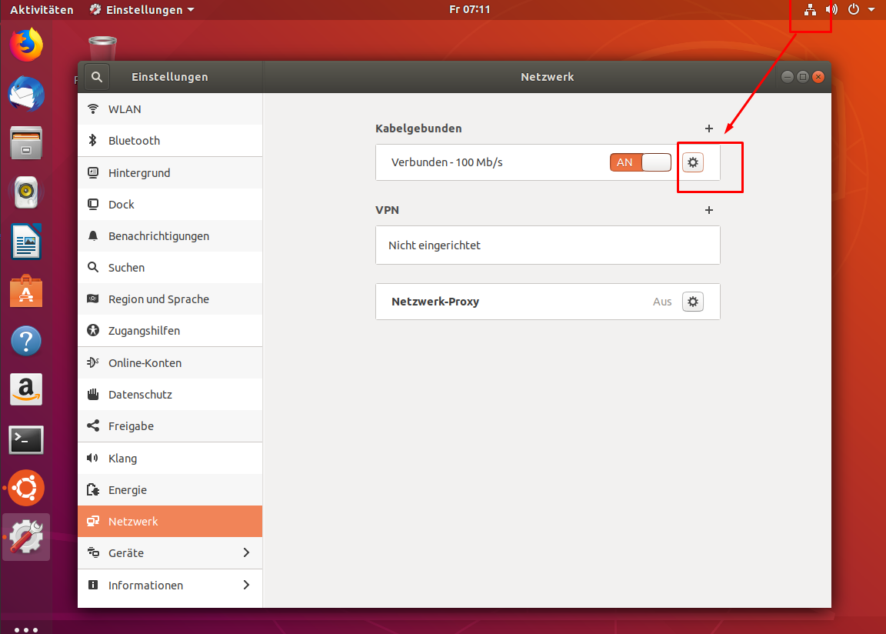
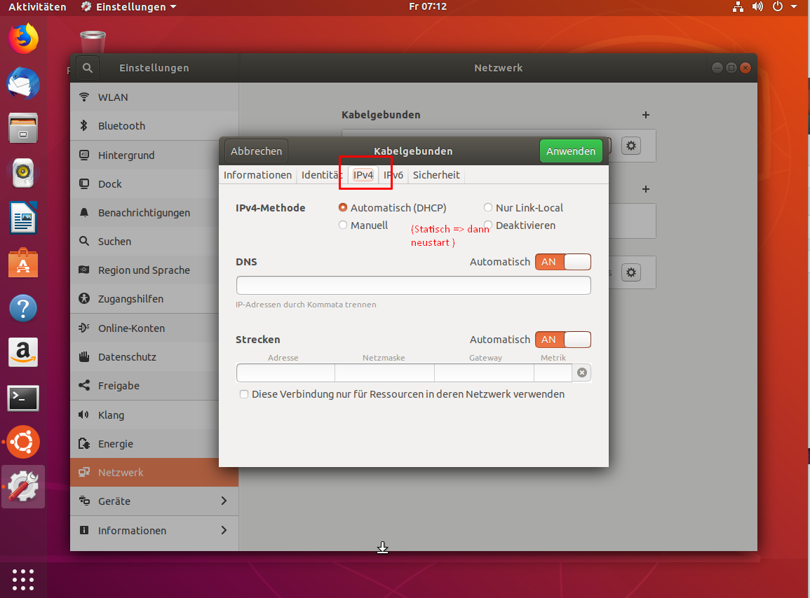
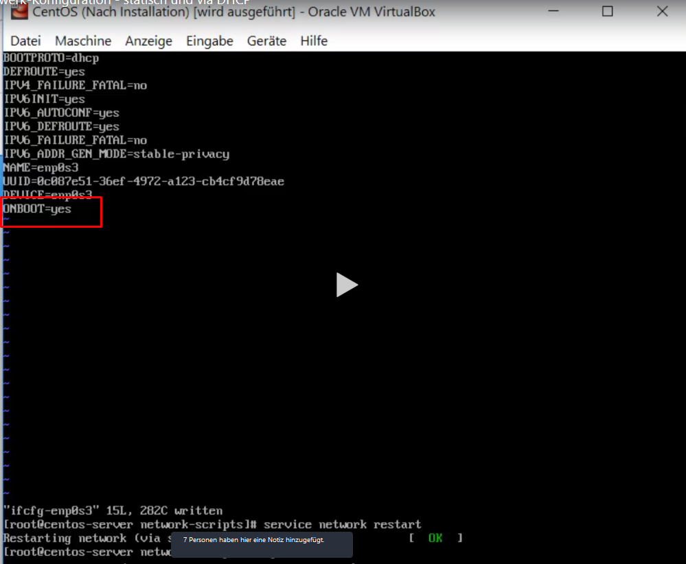
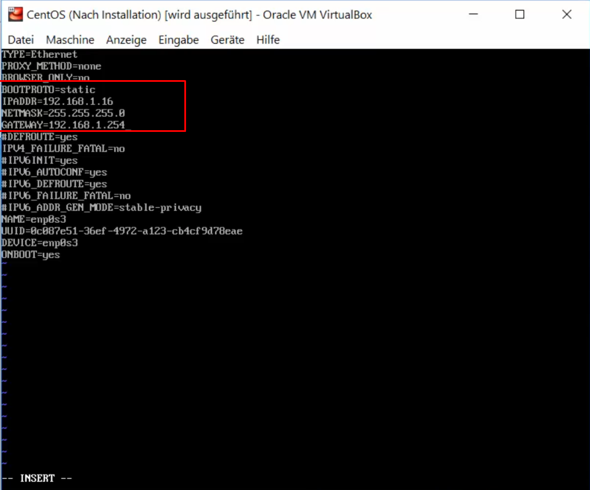
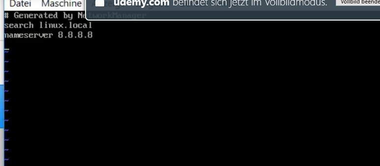

# Networking

## Debian
nutzt zentral Datei Namens /etc/interfaces. Ubuntu nutzt Networkmanager

### GUI

**DHCP / Statisch**

### CLI

## Suse
nutzt Yast für die Configs.
CentOS = Datei /etc/sysconfig/network-scripts

> service network restart 

Für Statische IP 

Dann muss noch zusätzlich die DNS-Einträge hinterlegt werden

> vi /etc/resolv.conf
dort dann die eigenen DNS-Server hinzufügen, bzw hier ist eine DNS-Server hinterlegt

---

* Im Verzeichnis /etc/sysconfig/network-scripts befinden sich die Netzwerk-bezogenen
Einstellungen in Form von Konfigurationsdateien und Skripts
* Mit einem Texteditor können wir die Konfigurationsdateien entsprechend anpassen

> service network restart

