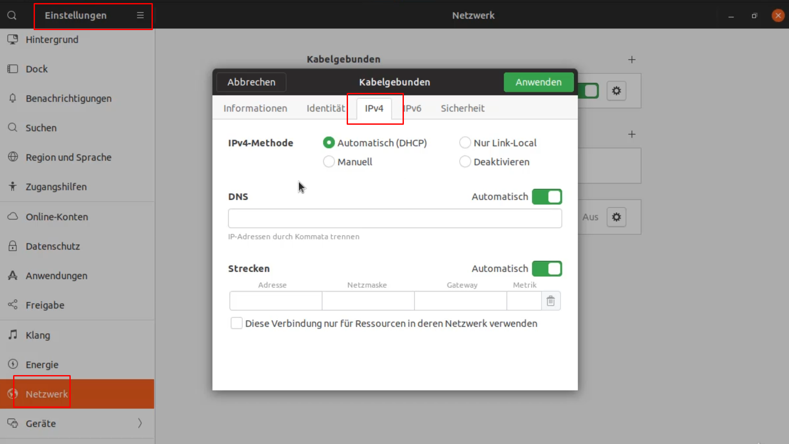
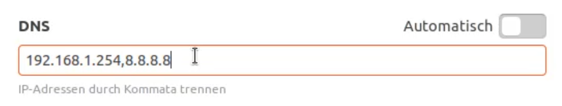
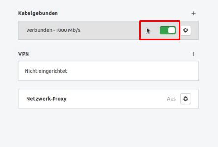

<h1>Networkmanager - GUI</h1>

Hier konfigurieren wir die IP-Adressen mit einer GUI und anschließend auf der CLI.

# GUI

## IPv4

hier kann entweder via Automatisch/DHCP oder statisch (=Manuell) hinterelegen. 


mehrer redundaten DNS-Server
die werden mit einem Komma getrennt


## IPv6
**Reaktivierung**
nach einer Änderung muss die Schnittstelle reaktiviert werden. Reaktivieren = einmal an und wieder ausschalten:


# CLI
hier gibt es unterschiedliche Ansätze. Im großen und ganzen gibt es die Datei 
```/etc/network/interfaces```

für jede ProtokollVersion (IPv4 oder IPv6) muss eine eigene Konfig erstellt werden

## IPv4