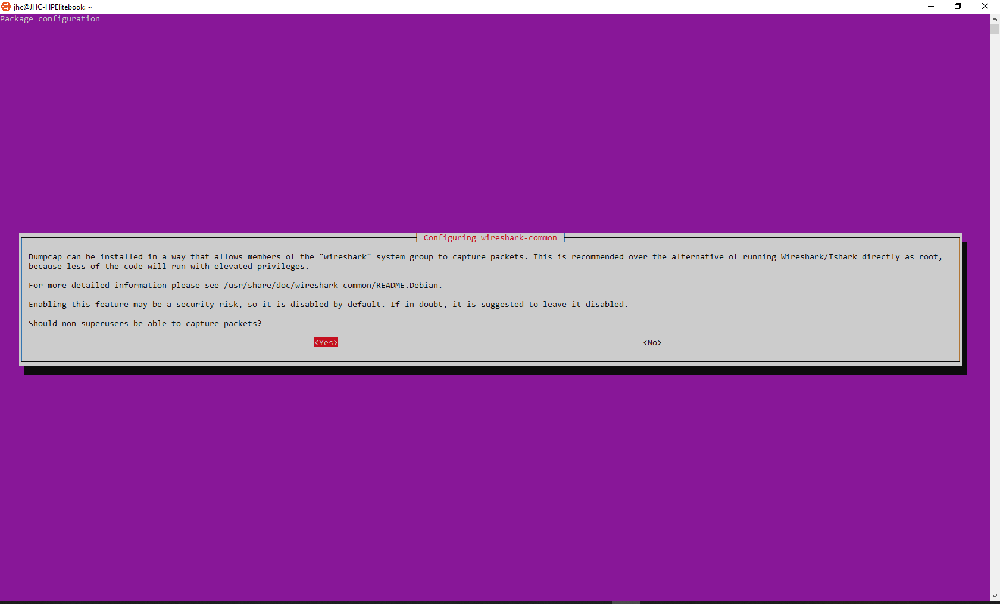
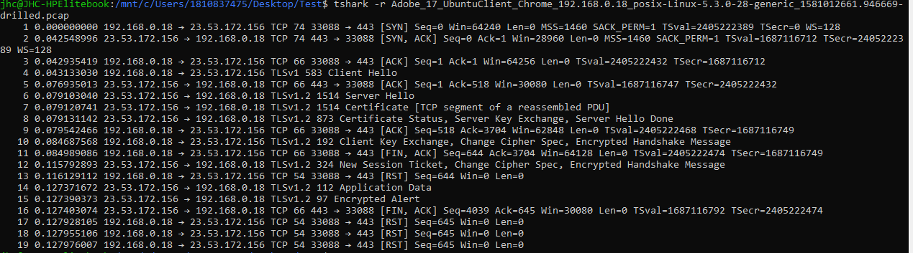

<h1>Installation von Wireshark und T-Shark</h1>

<!-- TOC -->

- [Wireshark & T-Shark](#wireshark--t-shark)
  - [Installation Wireshark](#installation-wireshark)
  - [Installation  t-Shark](#installation-t-shark)
  - [T-Shark Command-List](#t-shark-command-list)
  - [Integration in Python](#integration-in-python)

<!-- /TOC -->

# Wireshark & T-Shark
Das Tool funktioniert nur sauber unter Linux => installier es in Windows Subsystem Linux (WSL).
T-Shark ist ein CLI Tool für WireShark. Vorgehen bei der Installation  
a) Installation WS 
b) Konfiguration WS 
c) Installation Tshark 
d) logoff & logon => tshark is running 

TShark is a network protocol analyzer. It lets you capture packet data from a live network, or read packets from a previously saved capture file, either printing a decoded form of those packets to the standard output or writing the packets to a file. TShark's native capture file format is pcapng format, which is also the format used by wireshark and various other tools.

## Installation Wireshark
1. Installiere WS
   >sudo apt-get install wireshark

2. Sofern nicht während des Rollouts ausgewählt muss hier noch ein Reconfigrue staatfinden
   > sudo dpkg-reconfigure wireshark-common => Yes

3. Hinzufügen des Users zu der Gruppe für den WS
    > sudo usermod -a -G wireshark $USER 
 4. gnome-session-quit --logout --no-prompt

## Installation  t-Shark
1. Befehl für die Installation
   > sudo apt-get install tshark

hier dann den User zulassen

**Erklärung [Berechtigungen](./../Permissions.md) Wireshark**

WIreshark kann entweder ledilgich für die Superuser installiert werden oder für alle User einer Gruppe Bereitgesetllt werden.
   * Sudo-User
    Das impliziert, dass Wireshark immer aus der CLI mit einem Sudo Befehl geöffnet werden muss, sofern man auch auf die Interfaces zugreifen will
   * Alle User der Gruppe "wireshark" => diese Accounts müssen der Gruppe hinzugefügt werden

## T-Shark Command-List
1. BSP Einlesen einer pcapng-Datei
> tshark -r Adobe_17_UbuntuClient_Chrome_192.168.0.18_posix-Linux-5.3.0-28-generic_1581012661.946669-drilled.pcap

## Integration in Python
https://medium.com/hacker-toolbelt/wireshark-filters-list-983c49468a45