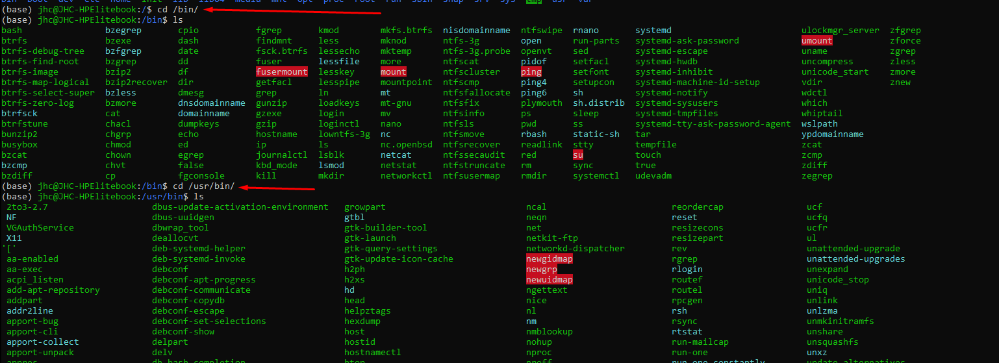

# Path

> echo $PATH

Mit su - oder su -l erstellen wir eine neue Login-Shell für den Benutzer root mit allen
Umgebungsparametern
Dazu gehört z.B. die PATH-Variable. Sie umfasst alle Verzeichnisse, die automatisch nach dem
eingegebenen Befehl durchsucht werden. Damit muss ein Benutzer nicht mehr den
kompletten Pfad zur ausführbaren Datei angeben

Sprich wenn wir Programme ausführbar haben wollen (= nicht absolut sondern einfach nur einen Command und dann soll das Programm starten) so muss dies den jeweiligen [initialisierungsfiles](./Bash/Initialisieren.md) beigesteuert werden.

Jeder User hat seine eigene $PATH -Variable in dem jeweilgen Home Verzeichnis

Nutzerübergreifend gibt es die Verzeichnise:

1. /bin
2. /usr/bin

AN welchen Programm hinterlegt sind, auf welche alle User zugreifen können

