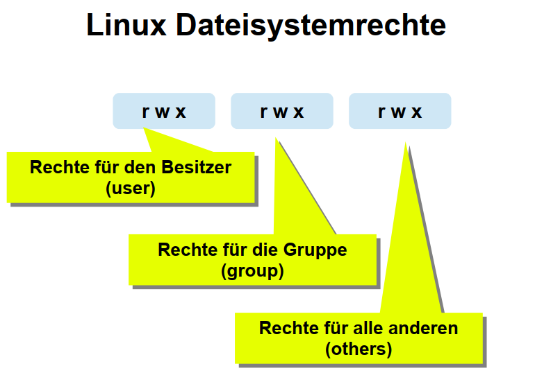
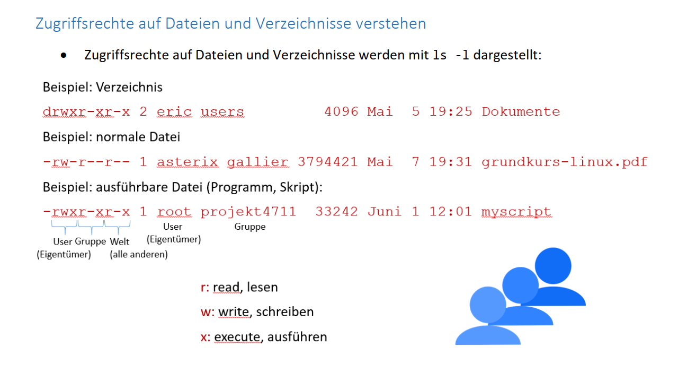
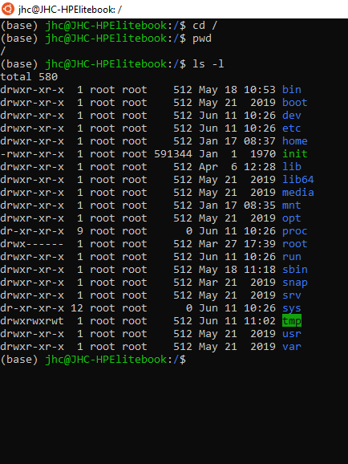
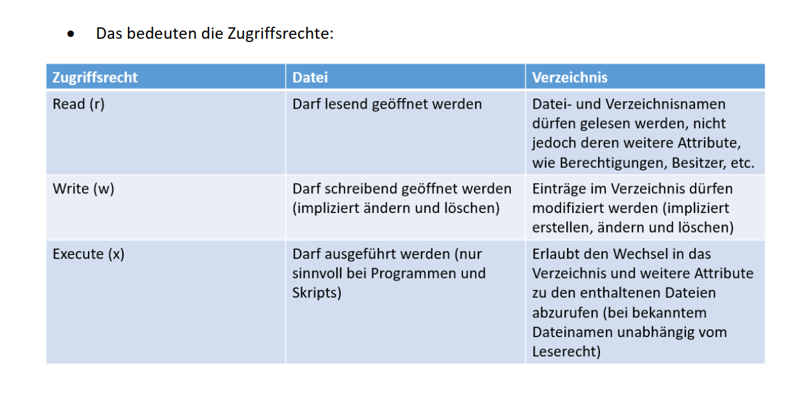
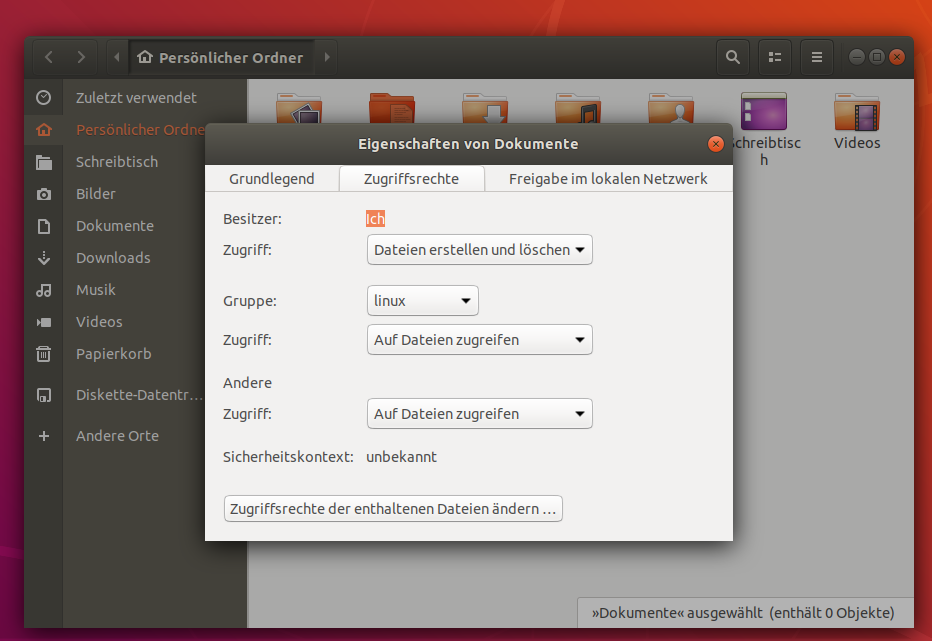
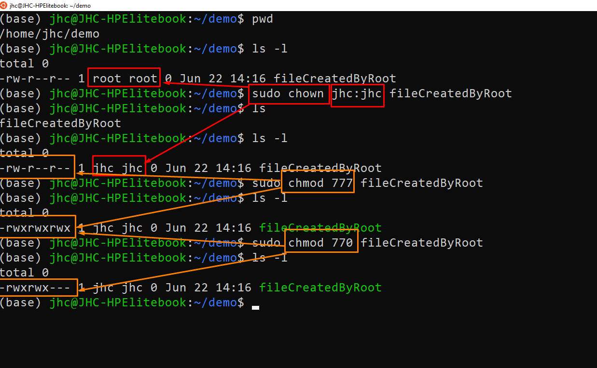
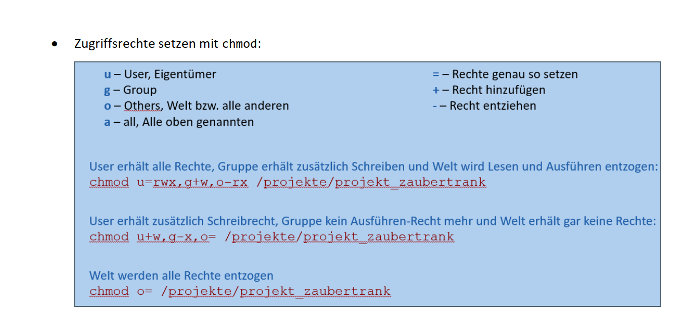
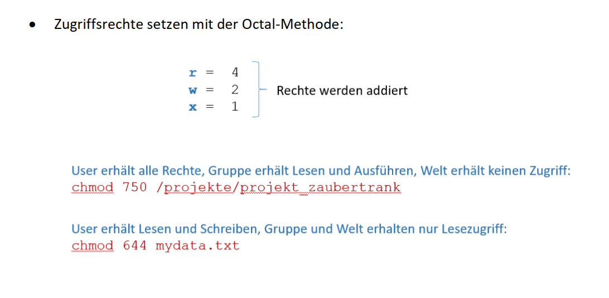

# Linux Berechtigungen

[Link](https://ryanstutorials.net/linuxtutorial/permissions.php)

---

## Ubuntu GUI

hier komme ich via rechtsklick und eigenschaften oder direkt Zugriffrechte hin

## CHOWN vs CHMOD

## chmod

## chown

* User und Gruppen können mit chown gesetzt werden, der Befehl nimmt durch Doppelpunkt
getrennt Benutzer und Gruppe an:
   > chown \<benutzer>:\<gruppe> \<datei>

* Die zweite Möglichkeit besteht darin, mit chown den User und mit chgrp die Gruppe
festzulegen:
> chown \<benutzer> \<datei>
> chgrp \<gruppe> \<datei>

## Sonderrerchte

### SUID

* Wird bei den Benutzerrechten einer Datei ein S statt einem X angezeigt, handelt es sich um
das Set UID-Bit oder Kurz: SUID-Bit. Es sorgt dafür, dass das Programm immer mit den
Rechten des Dateibesitzers läuft
* Das SUID-Bit können wir setzen mit chmod u=rwxs <Datei> oder chmod 4755 \<Datei>

### SGID
* Das SGID-Bit sorgt bei einer Datei mit Ausführungsrechten dafür, dass sie immer im Kontext
der Gruppe läuft. Bei einem Verzeichnis sorgt das Set GID-Bit dafür, dass die für das
Verzeichnis festgelegte Gruppe auf alle neu angelegten Unterverzeichnisse und Dateien
vererbt wird
* Das SGID-Bit können wir setzen mit chmod g=rwxs <Datei> oder chmod 2755 \<Datei>

### Sticky-Bit
* Das Sticky-Bit wird durch ein t anstatt des x für Others gesetzt, also ganz am Ende der
Rechteliste und kommt z.B. beim /tmp-Verzeichnis zum Einsatz
* Wird das Sticky-Bit auf einen Ordner angewendet – und das ist der einzige Einsatzzweck – so
können darin erstellte Dateien und Verzeichnisse nur vom Dateibesitzer gelöscht oder
umbenannt werden
* Es wird über den Buchstaben t gesetzt bzw. Octal über die 1 in der vierten, vorangestellten
Ziffer

## Umask
* Wird ein Verzeichnis erstellt, dann werden standardmäßig bestimmte Rechte gesetzt:
	* rwx für den User,
    * rx für die Gruppe
    * rx für Others
* Wird eine Datei erstellt, dann werden standardmäßig bestimmte Rechte gesetzt:
    * rw für den User,
    * r für die Gruppe
    * r für Others
* Diese Standard-Rechte werden mit umask festgelegt
* Da es sich um eine Maske handelt, wird das angezeigt, was verdeckt wird, also nicht gesetzt
ist:
    * Bei Verzeichnissen ziehen wir die umask von jeweils 7 ab, um die gesetzten Werte zu
erhalten. Dabei wird die erste Stelle ignoriert, da sie Sonderrechte betrifft, die in der
umask ohnehin nicht gesetzt werden
    * Bei Dateien ist die 6 der Ausgangswert
* umask festlegen:
    * Bei CentOS, systemweit: /etc/profile, für Benutzer: .bash_profile
    * o Bei Ubuntu, systemweit: /etc/login.defs, für Benutzer: .profile

