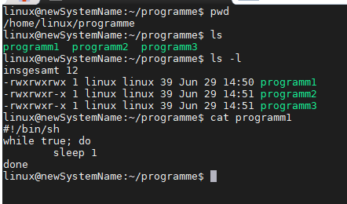

<h1>Prozesse</h1>

1. Anzeigen
   - ps
 - 
   > ps ef # BSD -Notation = 
   > ps -ef # Linux Notation = 1x -
   > ps --ef # GNU-Notation
   > ps -aux
   > ps ax | grep ssh
   > ps -aux| less
   > ps ax | zeigt alle Programme

   - top
   Sortier nach der CPU Last
   > top
   > P
   > M
   > h

   - htop
   > F4 => Filter 
   > F5 => Baumansicht

   - pstree
  Anzeige der Prozesshierarchie

   - jobs
  Anzeigen der laufenden Jobs in der Shell-Sitzung
    > jobs
    > jobs -l
    > disown %1 | Entkoppelt von der Shellsitzung

    jobs können mit 
    > bg
    oder 
    > fg

    in den BackGround oder ForeGround geschoben werden

# Starten und Verwalten von Programmen

Prozesse rennen default mäßig im Kontext der Shell. Wird die Shell beendet, so endet auch alle Programm in dieser Shell. Sie sind hierarchisch an diese Shell geknüft

## Vordergrund

hier öffnen wir ein Programm im Vordergrund. nun ist der Cursor im Programm, mit "STRG +C" kann man aus dem Programm wieder heraus wechseln. BSP:

## Hintergrund

hier erhalte ich zusätzlich noch die Prozess id
>ps -pid

## Öffnen in Vordergrund und Hintergrund

Die Prozesse enden, sobald die Shell geschlossen wird.
deswegen können Programme auch als "nohub" geöffnet werden

## Starten Prozess ohne es an eine Shell zu binden
>nohub ./programm1

Um diesen Prozess nun zu benden muss dieser mit dem Kill befehl beendet werden

# Beenden von Prozessen
Das mach ich via der Prozess id PID. Diese kann ich mir anzeigen lassen (bspw ps -ef)

## kill  command
> kill -l | auflisten aller kill Parameter

> kill -2 PID = Strg +C
> kill -9 PID = hartes beenden(wenn er bspw hängt)
> kill -15 PID
> killall program*

# Prozessprioriäten 
Jeder Prozess erhält ein gewisses Level an NICE-Level = Aufmerksamkeit der CPU. Wenn höhere /Niedere Prios gewünscht sind, dann muss das NICE-Level des Prozesses angepasst werden.

Prio-Range
von "-20" = höchste Prio, und "+19" sind die "unwichtigsten" Prozesse

Aufrufen eines eines Nice-Level von "+10"
>nice -10 ./program1.sh & 

Aufrufen eines eines Nice-Level von "-15"
>sudo nice --15 ./program2.sh & 

Anzeigen des Nice-Levels
> ps -alf | head -n1 && ps -alf | grep programm

Ändern der Prio eines laufenden Prozesses
> renice neuesNiceLevel -p PID
> renice 11 -p 123

# Shared Libraries

Funktionalitäten, die immer mal wieder benötigt werden = Externe Funktionen. Diese sind in Shared Libraries = Programmbibliotheken 

* Shared Libraries (Programmbibliotheken) sind Routine-Funktionen, die immer wieder
benötigt werden und von verschiedenen Programmen auf dem System genutzt werden
können
* Vorteil: Es müssen nicht immer alle Funktionen in jedes Programm einkompiliert werden
* Nachteil: Die Shared Libraries müssen zur Verfügung stehen, sonst läuft das Programm nicht
(Abhängigkeiten)
* Es existieren diverse Pfade und Programme für die Verwaltung von Shared Libraries
(die lib-Verzeichnisse /lib / lib64 /usr/lib ...)

- Vorteil
  - Auslagerung von Programm COde  => Programm selbst wird schlanker
- Nachteil
  - Abhängigkeiten

ld.so => prüft beim Start von Programmen welche benötigt sind und lädt diese ggf

1. Anzeigen der integireten Bibliotheken
    > ldconfig -p
    > ldconfig -p | wc -l
    > ldconfig -p | grep python

2. Anzeigen der Bibliotheksabhängigkeiten eines Programmes
   > ldd /usr/bin/ls

3. BSP-Insallation von Software mit den entsprechenden Abhängigkeiten:
    > sudo apt install apache2 
    

    Anzeigen der Abhängigkeiten:
    >ldd /usr/bin/ls
    

