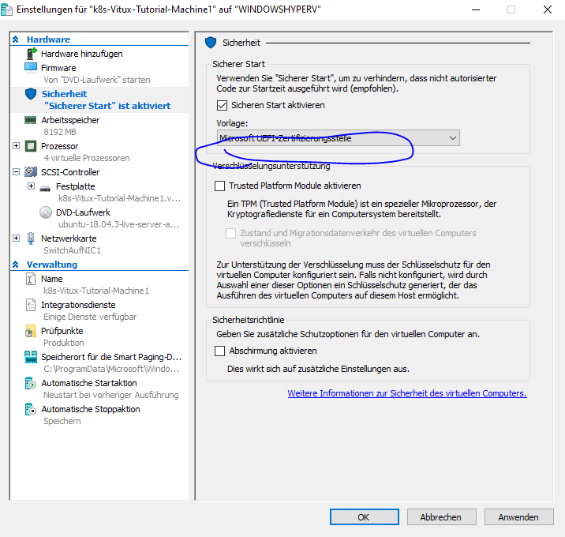
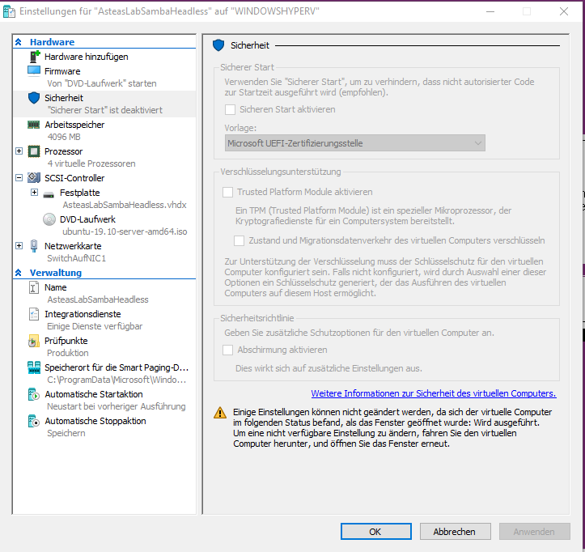
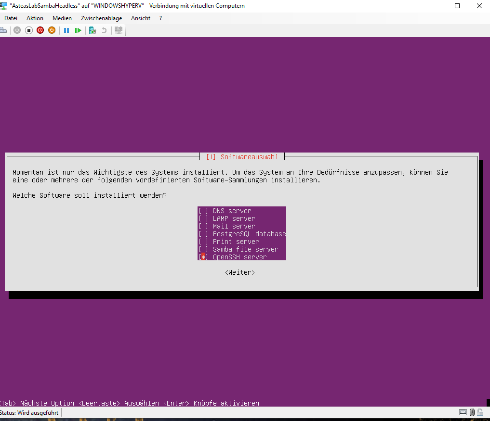

# Rollout Workaround Ubuntu auf HyperV
leider klappt der Rollout von Ubuntu Server häufig nicht auf dem Windows hyperv, da eine Konfig anders sein muss

hier mein Workaround nach dem Troubleshooting von:
https://blog.codetitans.pl/post/install-ubuntu-server-1904-on-windows-10-hyper-v/

* Normales erstellen via Whizzard
* Generation2 bei der auswahl der geneartion
* als iso die Ubuntu server 19.04 !!!! vorsicht hier darf man nicht die Live-Distro nehmen, sondern braucht die Traditional Varainte. di kann hier beschafft werden:http://cdimage.ubuntu.com/releases/19.10/release/?_ga=2.65137838.1629437941.1583936050-279824244.1580910672 || alternativ einfach nach "ubunut server traditional installer" googlen
* 4 kerne / 8192 Ram
* vor dem ersten Booten der VM in die Einstellungen, dort unter sicherheit

!!!! das hier ist die FALSCHE Auswahl im Dropdown: "Microsoft Windows" !!!!
!!!! das hier ist die Richtige Auswahl im Dropdpwn: "Microsoft UEFI-Zertifizerungsstelle" !!!!

und als Vorlage unbedingt auf "Microsoft UEFI-Zertifizerungsstelle" wechseln:

wenn der start danach immer noch nicht geht, deaktiviere den Sichen Start

danach sollte der Boot der virtuellen Maschine in den GRUB-Bootloader normal klappen.

Der Rollout des Servers ist dann lediglich "KlickiBunti"
was sich standardmäßig empfiehlt ist es den OpenSSH-Server gleich beim Rollout zu installieren:

## Tipps & Tricks
ggf im Router die IP als reserviert auf die MAC hinterlegen, sodass diese dann auch immer unter dieser IP erreichbar ist. (in der Fritzbox die IP-Adresse auf die Mac reserivieren)

