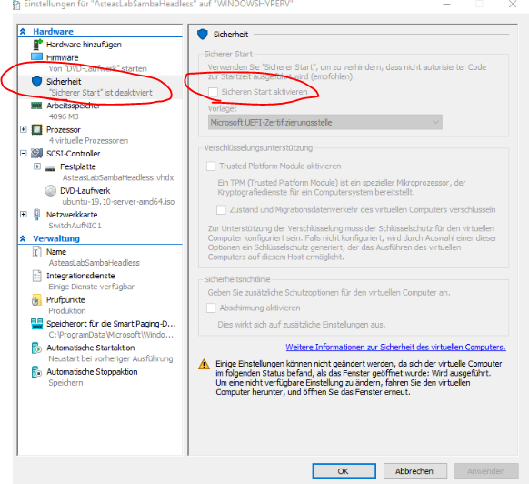

# Rollout Workaround Ubuntu auf HyperV
leider klappt der Rollout von Ubuntu Server häufig nicht auf dem Windows hyperv, da eine Konfig anders sein muss. Mit "Klappt nicht" ist gemeint, das während des Rollouts der Grub-Bootloader der Iso nicht läd, sondern mit einem blinkenden Cursor "stecken bleibt"

hier mein Workaround nach dem Troubleshooting von:
https://blog.codetitans.pl/post/install-ubuntu-server-1904-on-windows-10-hyper-v/

* Normales erstellen des Baremetal via Hyper-VWhizzard
* Generation2 bei der Auswahl der Generation
* als Iso die Ubuntu server 19.04 !!!! vorsicht hier darf man nicht die Live-Distro nehmen, sondern braucht die Traditional Variante. Diese kann [hier](http://cdimage.ubuntu.com/releases/19.10/release/?_ga=2.65137838.1629437941.1583936050-279824244.1580910672) beschafft werden: || alternativ einfach nach "ubunut server traditional installer" googlen
  Für dieses Tutorialist die Baremetal:
* 4 kerne / 8192 Ram
* Vor dem ersten Booten der VM in die Einstellungen, dort unter sicherheit eingestellt werden. Hierzu gibt es zwei Möglichkeiten: 
  1. Sicherheit gänzlich raus:
  * Im Testlab ist die Sicherheit weniger wichitg als die Funktionalität => Sicherheit gänzlich raus
 
  2. Wenn die Sicherheit eine Rolle spielt:

!!!! das hier ist die FALSCHE Auswahl im Dropdown: "Microsoft Windows" !!!!
!!!! das hier ist die Richtige Auswahl im Dropdpwn: "Microsoft UEFI-Zertifizerungsstelle" !!!!

und als Vorlage unbedingt auf "Microsoft UEFI-Zertifizerungsstelle" wechseln:

wenn der start danach immer noch nicht geht, deaktiviere den Sichen Start

danach sollte der Boot der virtuellen Maschine in den GRUB-Bootloader normal klappen.

Der Rollout des Servers ist dann lediglich "KlickiBunti"
was sich standardmäßig empfiehlt ist es den OpenSSH-Server gleich beim Rollout zu installieren:

zustätzlich gebe ich das automatische Rollout von Sicherheitsupdates mit:
* Standard-Command für den initilaen Update:
  > sudo apt-get update && sudo apt-get -y upgrade && sudo apt-get dist-upgrade && sudo reboot

## Management-Software
Nach dem Rollout & Update am besten [webmin](../webmin/RolloutWebmin.md) installieren. Damit kann der Server und die zugehörigen Dienste gut gewartet werden. 

## Tipps & Tricks
ggf im Router die IP als reserviert auf die MAC hinterlegen, sodass diese dann auch immer unter dieser IP erreichbar ist. (in der Fritzbox die IP-Adresse auf die Mac reserivieren)

