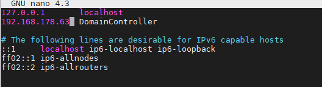
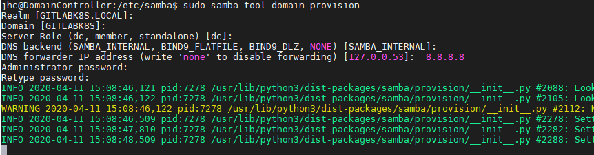
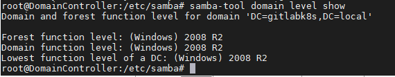

# Samba Domain Controllter

das ganze hab ich nach diesem [Tutorial](https://www.youtube.com/watch?v=Rf7Hk8qWt1Q) geschaffen. Der DHCP wird von der Firtzbox übernommen.
Sprich ich rolle das in den DHCP range der normalen Workgroup. Dort wiederum lass ich gibt es den Bereich der Domäne. 

## Protokoll
Hier sind meine Notizen und zusammenfassungen der oben stehenden Tutorials
1. Erstelle Bare-Metal VM

und rolle wie immer [Linux-Server](./../RolloutUbunutServerOnHyperV/RolloutUbuntuServerHyperV.md) aus.
Hostname in diesem Falle: DomainController
hostname = git-Server in diesem Tutorial
apt get update & upgrade & distupgrade
2. ggf IP im router hinterlegen => künftig auch sinnvollerreichbar
3. Wenn VM => Checkpoint install


4. Create root-Pw
   >sudo passwd root
5. Statische Ip in den Server => ich versuchs zunächst
   > nano /etc/network/interfaces

```
auto eth0
iface eth0 inet static 
address 192.168.178.195 # <= die ich halt beim ersten Mal zugewiesen bekomme
netmask 255.255.255.0
network 192.168.178.0
broadcast 192.168.178.255
gateway 192.168.178.1
dns-nameservers 192.168.178.195
dns-search gitlabk8s.local
```
6. Change Host Ip
   >sudo nano /etc/hosts
   
   7. Change Hostanmae:
   > sudo nano /etc/hostname
   DomainController.gitlabk8s.local
7. reboot
8. upgrade update usw
9. Install Software
    >  sudo apt -y install samba krb5-config winbind smbclient
    gebe die Domaincontroller Daten für Kerberos an
10. wechsel zu sambaconfig
>cd /etc/samba
>sudo cp smb.conf smbORIG.conf
>sudo mv smb.conf smb.conf.old
>sudo samba-Tool domain provision


11. verschieben der Kerberos Config
    > sudo cp /var/lib/samba/private/krb5.conf /etc/

12. Manage Services
>sudo systemctl disable --now smbd nmbd winbind systemd-resolved
>sudo systemctl unmask samba-ad-dc.service
>sudo systemctl enable --now samba-ad-dc.service

13. Check if it is running
    >sudo samba-tool domain level show
    
14. ls -l /etc/resolv.conf


-----
# Add Ubuntu OS to Domain via CLI
[Tutorial](https://blog.netnerds.net/2016/04/joining-ubuntu-to-an-active-directory-domain/)

Logischerweise findet die Config auf der Konsole am Client statt. 

1. sudo apt-get install krb5-user samba sssd
