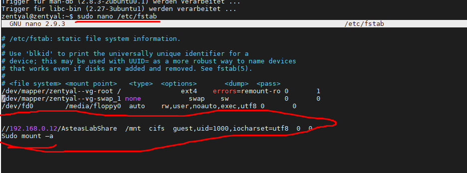

# Samba einbinden

1. >sudo apt-get install cifs-utils
2. >sudo nano /etc/fstab
   
   

# Gastaccount einbinden
   >//192.168.0.12/AsteasLabShare  /mnt  cifs  guest,uid=1000,iocharset=utf8  0  0
Sudo mount –a

