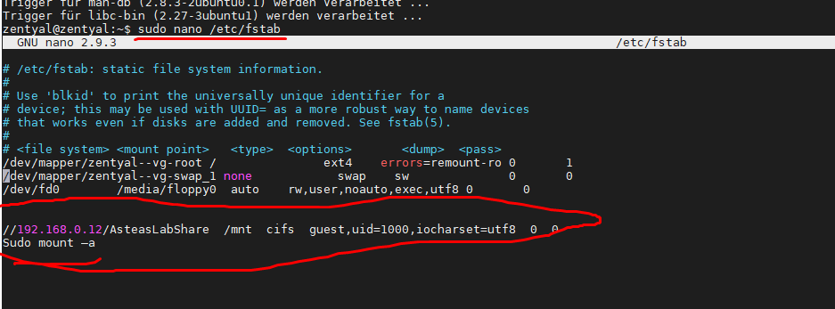
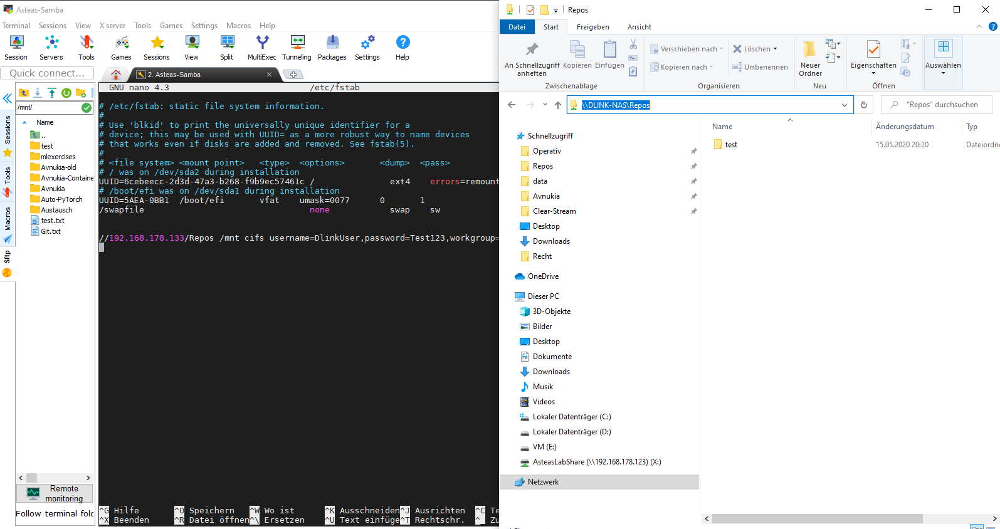

# Samba einbinden

1. >sudo apt-get install cifs-utils
2. >sudo nano /etc/fstab
   
   

# Gastaccount einbinden
   >//192.168.0.12/AsteasLabShare  /mnt  cifs  guest,uid=1000,iocharset=utf8  0  0

dann alle Laufwereke einbinden
> sudo mount –a

-----
Einbinden des DLINK-Nas in Ubunutu - Own Rollout

1. 
2. 
   > //192.168.178.133/Repos /mnt cifs username=DlinkUser,password=Test123,workgroup=WORKGROUP,vers=1.0,users,auto,sec=ntlm,user_xattr 0 0

----
Einbinden des Dlink-Nas in Ubutnut WSL

sudo su

sudo mount -t drvfs //192.168.178.133/Repos /mnt

sudo mount -t drvfs //192.168.178.133/Repos /mnt/nas

