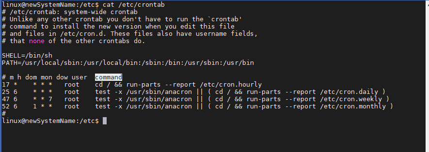

<h1>Cronjobs</h1>

Wenn wir terminieren wollen wann ein Programm/Skript ausgeführt werden soll. Widekehrende Aufgabe

Cronjobs VS [Airflow](./Airflow/Tutorial1.html)

# Funktionsweise

Datei:
/etc/crontab

Format:
- Minute
- Stunde
- Tag dse Monats
- Wochentag
- Benutzername
- Programm

BSPw 
 1. zeile = alle 17 Minuten 
