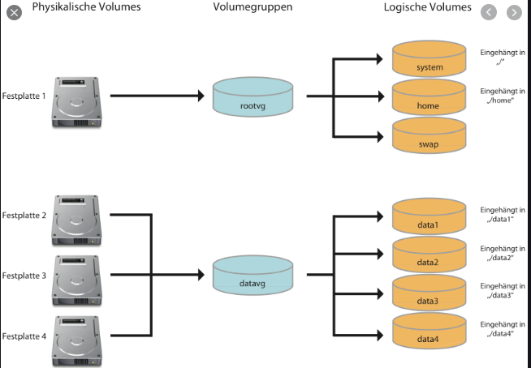
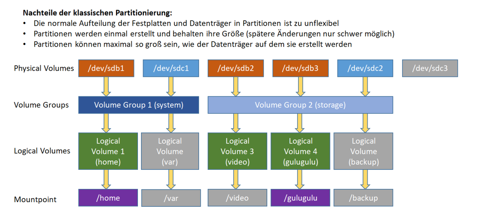

# Logical Volume Manager

[Link zur Implementierung](./CC/P_LVM.md)

* Ist eine Abstraktionsebene zwischen physischen Festplatten bzw. deren Partitionen und den
Dateisystemen
* Die neuen Partitionen werden als Logical Volumes bezeichnet und können aus verschiedenen
Partitionen sogar unterschiedlicher Festplatten zusammengesetzt sein

* Features von LVM:
   * Logical Volumes können sich über mehrere physische Festplatten erstrecken (Physical
Volumes)
   * Unterstützt RAID zur Ausfallsicherheit (hard- und softwarebasiert)
   * Snapshots (Schnappschüsse von Volumes)
   * LV-Mirroring (zwei Physical Volumes spiegeln ein Logical Volume)
* LVM ist auf Linux bzw. Unix beschränkt. Unter Windows existiert ein ähnliches Konzept mit dem
Namen "dynamische Datenträger"
* CentOS arbeitet bereits mit LVM. Bei Ubuntu muss das Paket lvm2 installiert sein
* Physical Extension (PE) ist das virtuelle Pendant zu den Sektoren einer physischen Festplatte, also
eine Speichereinheit. Sie wird vom LVM automatisch verwaltet
* Ein Logical Volume verhält sich wie eine ganz normale physische Partition und kann daher mit
einem beliebigen Dateisystem formatiert werden
* Es empfiehlt sich das Logical Volume auszuhängen (unmount) bevor es erweitert wird. Manche
Dateisysteme (auch ext4) fordern dies sogar
* Um ein Volume zu verkleinern, muss zuerst das Dateisystem verkleinert werden und dann die
virtuelle Partition

* Ein Dateisystem darf niemals größer ausgelegt sein, als sein Datenträger
* Mit Snapshots kann der Stand eines Logical Volumes zum Zeitpunkt des Snapshots
wiederherstellt werden
* Ein Snapshot speichert die Informationen zum jetzigen Stand und registriert alle Änderungen. Er
kann Änderungen im Umfang der angegebenen Größe erfassen und bis dahin den alten Status
wiederherstellen
* Ein Snapshot kann zu jeder Zeit zurückgespielt werden. Wurde das Volume vorher nicht
ausgehängt, dann geschieht das erst beim nächsten Neustart des Systems
* Die Reihenfolge beim Entfernen von LVM-Elementen funktioniert umgekehrt zur Erstellung
* Mit LVM ist es möglich, Mirrored Logical Volumes zu erstellen
   * Damit wird ein Logical Volume auf zwei (oder mehr) Physical Volumes gespiegelt
   * Die einzelnen Physical Volumes werden als "Legs" (Beine) bezeichnet
   * Fällt ein Leg aus, so übernimmt das andere Leg die Datenspeicherung und –bereitstellung
und das defekte Leg kann ausgetauscht werden
   * Die Verwendung von Mirrored LVs ist nur zu empfehlen, wenn RAID 1 nicht zur
Verfügung steht
   * Die Synchronisationsinformationen sollten auf einem dritten Leg gespeichert werden