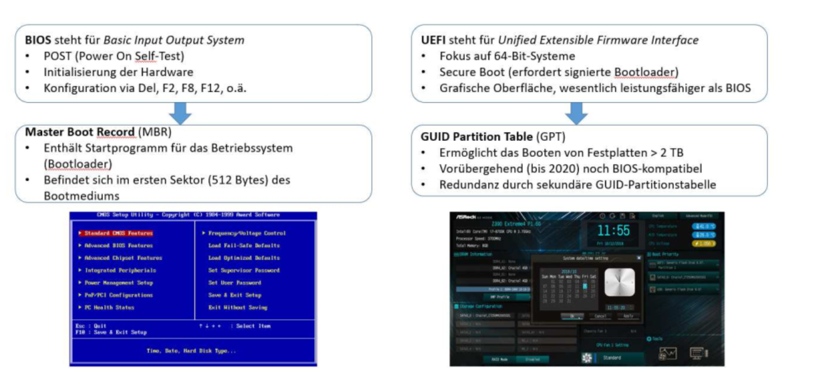
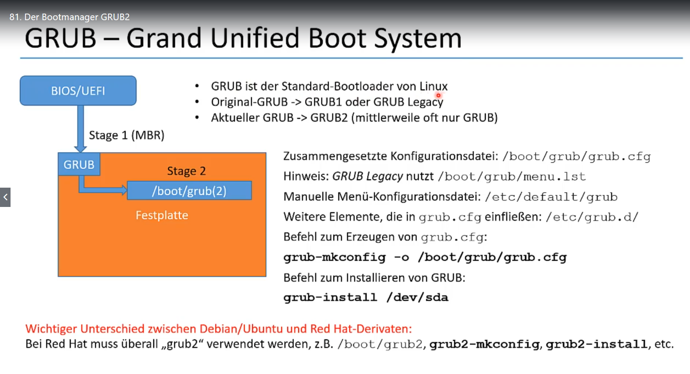

#  Systemstart und Prozess
Hier die Beschreibung des Boot Prozesses.
Wichtig für
- Dualboot
- später die automatischen Systemstarts

* BIOS (Basic Input Output System)
    * Ist auf einem nicht-flüchtigen Speicher installiert
    * Wird automatisch beim Booten gestartet
    * Initiiert den POST (Power On Self-Test) und initialisiert die Hardware
    * Kann konfiguriert werden indem bei Systemstart bestimmte Taste gedrückt wird
    * Startet den Bootloader der im MBR (Master Boot Record) gespeichert ist
      * Beim MBR handelt es sich um die ersten 512 Bytes des Bootmediums
      * Der Bootloader sorgt für das Starten des eigentlichen Betriebssystems
* UEFI (Unified Extensible Firmware Interface)
    * Unterstützt 64-Bit-Systeme
    * Secure Boot, nur noch signierte Bootloader
    * Hat eine grafische Oberfläche
    * Ist wesentlich leistungsfähiger als das BIOS
    * Unterstützt GPT (GUID Partition Table)
      * Keine Festplattenbeschränkung auf 2TB wie bei MBR
      * Sekundäre Partitionstabelle verfügbar die für Redundanz sorgt

# Grub2
GRand Unified Bootloader

* GRUB (Grand Unified Boot System)
    * Standard-Bootloader von Linux
    * Wird in den MBR bzw. in den ersten Sektor der Boot-Festplatte geschrieben
    * Wird vom BIOS bzw. UEFI aufgerufen
    * Stage 1 bereitet den Systemstart vor (Verweis auf /boot)
    * Stage 2 übergibt Systemstart an Linux-Kernel
    * Konfigurations-Dateien:
      * /boot/grub/grub.cfg (GRUB2)
      * /boot/grub/menu.lst (GRUB Legacy)
      * /etc/default/grub (Startmenü)
      * /etc/grub.d (Skriptdateien)
* Unter /boot befinden sich Dateien für den Systemstart
    * vmlinuz* (Linux Kernel)
    * initrd* (Temporäres Dateisystem für Systemstart)
      * Steht für initial ramdisk
      * Systemstart wird flexibler
      * Funktionen können in Userspace ausgelagert werden
      * Nachfolger ist initramfs