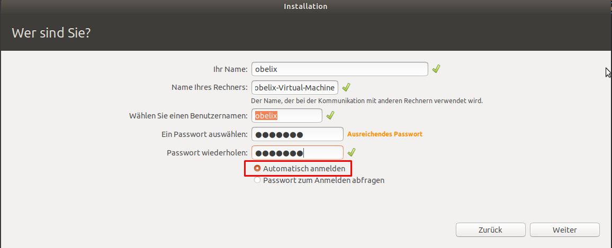

# Installation in VM - Kontext

## Deploy Ubuntu-VM
- Wenn Oracle Virtual-Box als Virtualisierung gewählt wurde kann 
- Wenn Hyper-V als Virtualisierungskontext dann nichts machen
  - SSH und dann über die Verbindung

## Dirty Tip
Wenn es um eine Laborumgebung geht rentiert es sich, den Login einfach zu überspringen:

