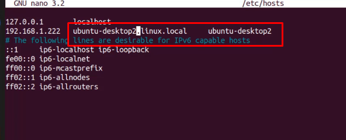
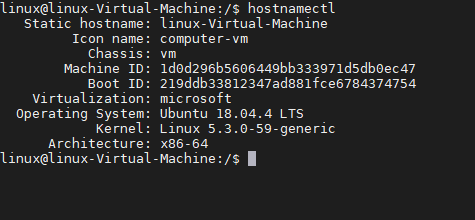
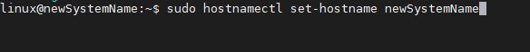

<h1>Naming</h1>

[Link zu FQDN](./T_FQDN.md)

Ein Fully-Qualified **Host** Name (**FQHN**, deutsch „vollständig angegebener Rechnername“) ist ein Hostname, der entweder als vollqualifizierter Name einer Domain (Fully-Qualified **Domain** Name, **FQDN**) oder als numerische IP-Adresse eines Rechners dargestellt wird. Der FQHN bezeichnet einen bestimmten Rechner eindeutig.


hier das Naming von Linux-PC

- Hostname = lokal = FQDH
dient der Identifikation des Hosts lokal und im Netzwerk
liegt in der datei ```etc/hosts```. Diese Datei kann entsprechend geänder werden


> uname
> uname -a
> hostname # => /etc/hostanme
> hostname -f # => vollständiger FQDN  

**Ändern des hostname**
1. Ändern der Datei

mit ip / vollen Namen /Alias

2. systemd
   >hostnamectl => anzeige des systems
   

   >hostnamectl set-hostname = newSystemName
   

- Domainname = FQDN
  nicht zwingend nötig, dann wenn der PC eben in einer Domain hängt
