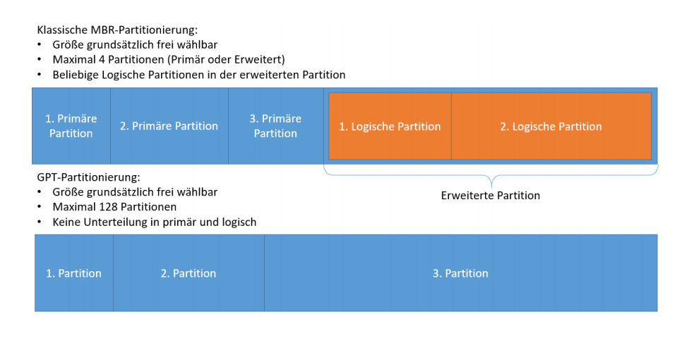
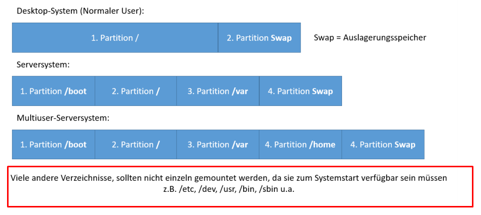
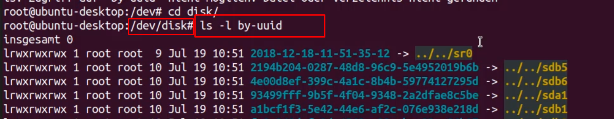
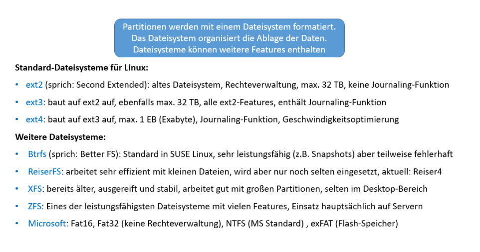
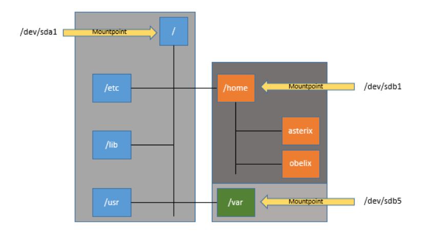
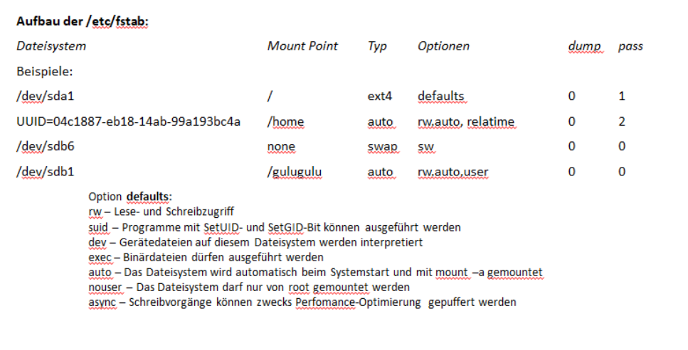

[Link zur Implentierung](./cc/PartitionierungFileSystems.md)

# Partitionierung
* Eine Partition ist ein logischer Datenträger auf einer physischen bzw. virtuellen Festplatte
* Vorteil:
    * Logische Unterteilung der Daten
    * Das kann Betriebssystem unabhängig von den restlichen Daten auf dem Datenträger
gesichert und wiederhergestellt werden
   * Für jede Partition kann separat das Dateisystem festgelegt werden, das optimiert die
Performance
    * Partitionen sind separat administrierbar
      * Quotas (Speicherbeschränkungen)
      * Verschlüsselung
      * Tausch bzw. Wechsel des Mediums,
      * Dateisystem-Reparaturen

* Eine Swap-Partition nimmt Daten auf die aus dem Arbeitsspeicher ausgelagert werden sollen
wenn es dort eng wird

* Im Verzeichnis /dev befinden sich alle Gerätedateien, diese referenzieren auf die Hardware
* IDE-Festplatten werden mit hda, hdb, hdc usw. bezeichnet
* SCSI- und SATA-Festplatten werden mit sda, sdb, sdc usw. bezeichnet
* Die Ziffer hinter der Bezeichnung zeigt die Partition an
* Das Bootflag, zu erkennen am Asterisk zeigt dem BIOS oder UEFI, dass von dieser Festplatte
gebootet werden kann
* Bootflag muss bei der Partitionierung explizit gesetzt werden
* Ubuntu erstellt per Default keine Swap-Partition
* Mit fdisk können MBR-basierte Partitionen verwaltet werden
* Per Default vergibt fdisk jeder erstellten Partition das Label 83, geändert werden auf 82 Linux
Swap
* Ein weiteres Programm zur Partitionsverwaltung, ist parted

## UUID
ist eine Partion erstellt kann diese eingesehen werden z.b als sda1. dieses sda1 kann sich aber theoretisch ändern, z.b wenn man physische die verkabelung im PC ändert. So kann es vorkommen dass sda1 => sda2 wird. Daher benötigen wir eine andere Version um die Einheiten eindeutig zu identifizieren. das können wir mit der [UUID](https://wiki.ubuntuusers.de/UUID/) erledigen: 

Jedes Linux-Dateisystem besitzt einen UUID, über den es identifiziert werden kann. Zwar kann man das auch über die Geräte-Dateien /dev/sdaX tun, aber die Nummerierung kann sich hier ändern - z.B. beim Vertauschen von Kabeln. Andere Eigenschaften wie Label oder Größe des Dateisystems garantieren keine Eindeutigkeit. Vergleichen kann man den UUID also mit einer Personalausweisnummer: Zwei Personen können den gleichen Namen tragen, sie haben aber trotzdem unterschiedliche Ausweisnummern.

>cd /dev/disk
>ls -l by-uuid

# Dateisysteme

* Partitionen sind im Rohzustand noch nicht für das Betriebssystem nutzbar
* Partitionen müssen mit einem Dateisystem formatiert werden
* Das Journaling erfasst Änderungsvorgänge am Dateisystem und kann dabei helfen das
Dateisystem wieder in einen konsistenten Zustand zu bringen

* Um ein XFS-Dateisystem zu etablieren, muss unter Ubuntu das Paket xfsprogs nachinstalliert
werden
* Die Formatierung bestehender Partitionen geht immer einher mit vollständigem Datenverlust
* Für das Prüfen diverser Dateisysteme (außer XFS) existiert der Befehl fsck
* Wird ein gemountetes Dateisystem mit fsck geprüft, können Inkonsistenzen entstehen, da
gleichzeitig Reparaturen durchgeführt werden, während das Betriebssystem die betreffende
Partition für Schreib- und Lesevorgänge nutzt
* Das System führt nach einer bestimmten Anzahl an Starts oder nach Ablauf eines bestimmten
Zeitraums automatisch eine Prüfung durch
* Dateisysteme müssen gemountet sein um genutzt werden zu können
* Die Dateisystem-Hierarchie ist bei Linux weitgehend immer gleich, Root, /etc/, /home, /var, etc.
Dahinter werden ggf. verschiedene Datenträger und Partitionen eingebunden, die den jeweiligen
Teilbaum speichern:

# Mounten

* Mit dem Befehl mount können Mountpoints erstellt und angezeigt werden
* An Mountpoints werden Dateisysteme in das Betriebssystem eingehängt und die Partitionen
können genutzt werden
* Beim Systemstart müssen die Daten, auf die das Betriebssystem während des Bootvorgangs
zugreifen muss, zur Verfügung stehen. Wir können also nicht erst booten und dann im laufenden
Betrieb alle Dateisystem mounten

* Unter CentOS sieht die Datei im Detail etwas anders aus, da hier mit dem LVM (Logical Volume
Manager) noch eine Abstraktionsschicht vorhanden ist
* Der Befehl df (disk free) zeigt alle gemounteten Dateisysteme an. Dazu werden die gesamte
Größe des Dateisystems, wie viel insgesamt bereits genutzt wird und wie viel Platz noch
verfügbar ist angezeigt
* Genauere Informationen über den verwendeten Festplattenspeicher liefert das Programm du
(disk usage)
* Das grafische Programm baobab zeigt die Festplattenverwendung als Verzeichnisbaum an und in
einer Grafik den verwendeten Plattenplatz
