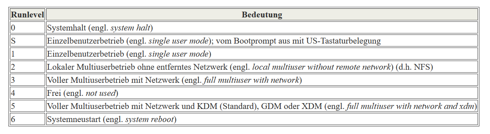

#  Runlevel

 Unter Linux existieren verschiedene Runlevels, die den jeweiligen Zustand des Systems definieren. Der Standard-Runlevel, in dem das System beim Booten hochfährt, ist in der Datei /etc/inittab durch den Eintrag [initdefault](./T_Systemstart.md) festgelegt. Für gewöhnlich ist dies 3 oder 5 (siehe Überblick in Tabelle 10.1. “Liste der gültigen Runlevels unter Linux”). Alternativ kann der gewünschte Runlevel beim Booten (zum Beispiel am Boot-Prompt) angegeben werden; der Kernel reicht die Parameter, die er nicht selbst auswertet, unverändert an den init-Prozess weiter.

Um zu einem späteren Zeitpunkt in einen anderen Runlevel zu wechseln, kann man init mit der Nummer des zugehörigen Runlevels aufrufen; das Wechseln des Runlevels kann nur vom Systemadministrator veranlasst werden. Beispielsweise gelangt man durch das Kommando init 1 oder shutdown now in den Einzelbenutzerbetrieb (engl. single user mode), der der Pflege und Administration des Systems dient. Nachdem der Systemadministrator seine Arbeit beendet hat, kann er durch init 3 das System wieder in den normalen Runlevel hochfahren lassen, in dem alle für den Betrieb erforderlichen Programme laufen und sich die Benutzer beim System anmelden können. Mit init 0 oder shutdown -h now kann das System angehalten, bzw. durch init 6 oder shutdown -r now zu einem Neustart veranlasst werden. 