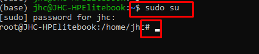
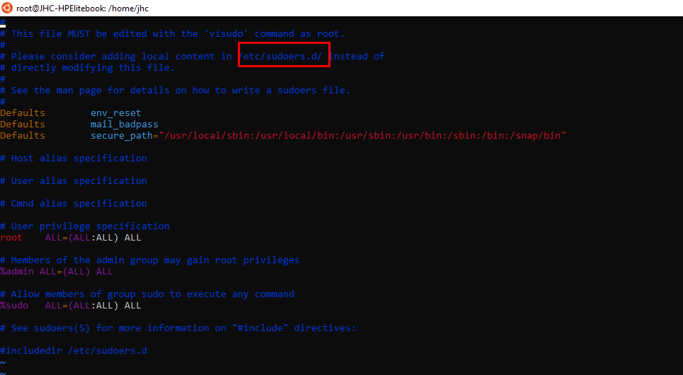

# Sudo Command

SU = Substitute User != Super User
Basic von Ubuntu

Sudo greift auf etc /Sudors zu => User mit Privilegien

In der Datei **etc/sudoers** werden alle Benutzer mit ihren jeweiligen Privilegien aufgeführt, die erhöhte Rechte nach dem Sudo-Konzept erhalten haben.

in etc/sudoers.d werden alle Richtlinien gemanaget

* Das Dollarzeichen $ am Ende des Prompts zeigt uns, dass wir mit einem normalen
Benutzer ohne Administrator-Privilegien arbeiten

* Die Raute # am Ende des Prompts zeigt uns, dass wir mit Root angemeldet sind

--
• Sudo greift in erster Linie auf eine Datei namens /etc/sudoers zu. Dort werden alle Benutzer
mit ihren jeweiligen Privilegien aufg
Hier erfahren wir, dass dem Benutzer root, den es ja eigentlich gar nicht gibt, der Gruppe
Admin und der Gruppe sudo, sämtliche Privilegen zugestanden werden
• Das Prozentzeichen vor dem Namen kennzeichnet eine Gruppe.
• Das kann man ziemlich granular steuern und diverse Beschränkungen einführen
• Unter dem Strich sind alle Mitglieder der Gruppen Admin und Sudo de facto Administratoren
• In der Datei /etc/group sind alle Gruppen des Systems und deren Benutzer aufgeführt

