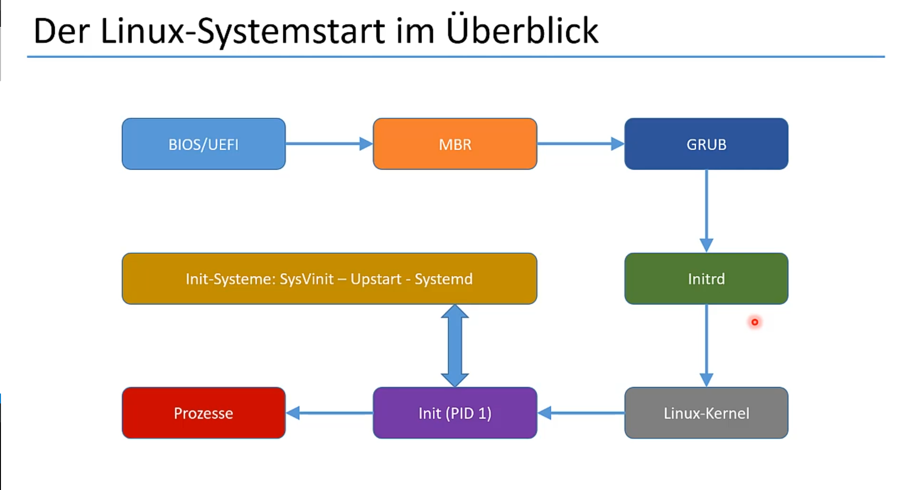
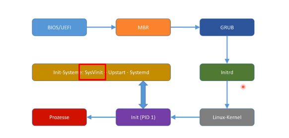
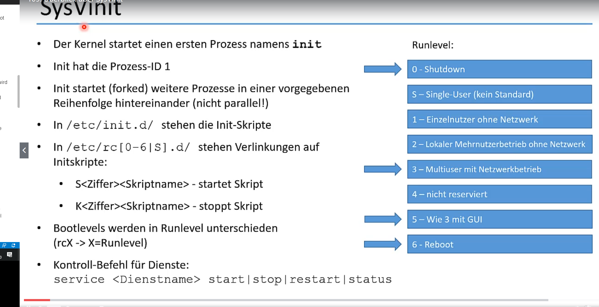
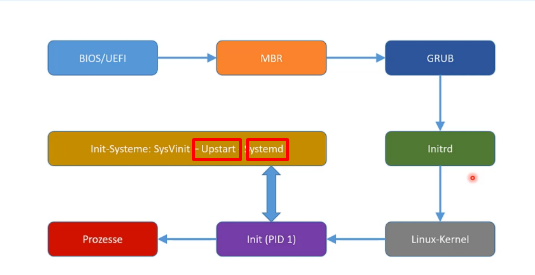
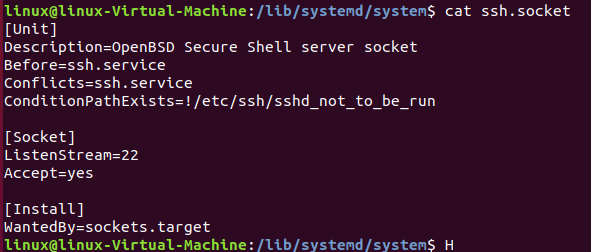
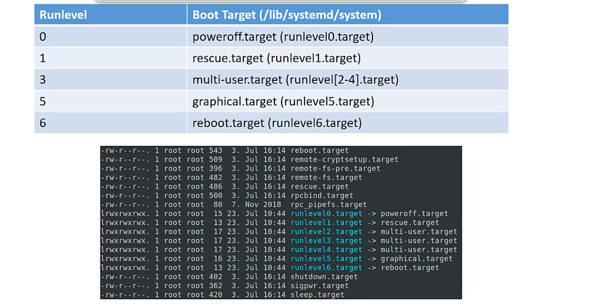
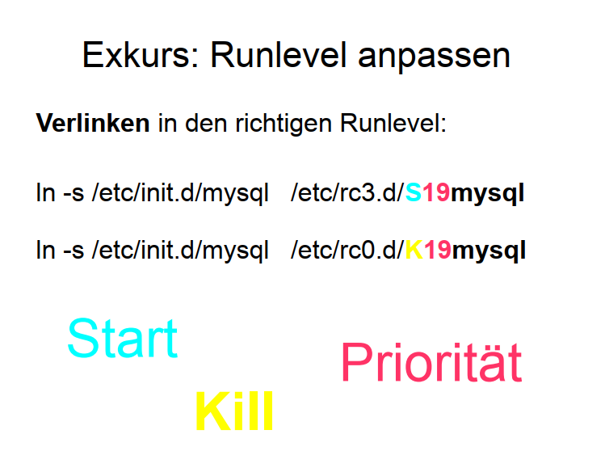
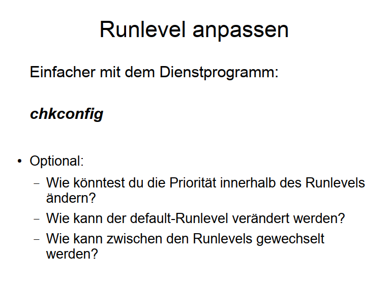
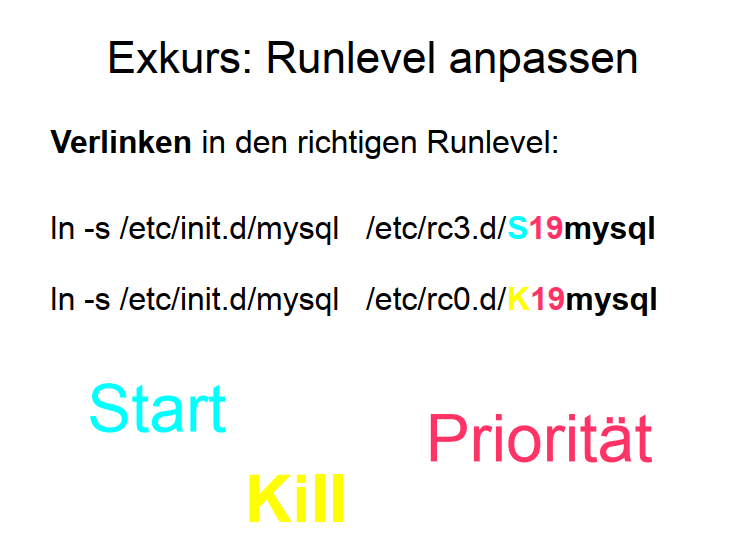

<h1>Systemstart</h1>

[Link zu Linux-Booting Theorie == Theoretische Grundlage dieser Thematik](./T_Linux-Booting.md)
[Befehle für die Modifikation von GRUB](./CC/Grub-Config.md)
[Prozessbefehle](./CC/P_Prozesse.md)

## Überblick

* Nachdem GRUB2 durch das [MBR](./T_Linux-Booting.md) initialisiert wurde, startet der Bootloader Initrd, eine Initial-Ramdisk
* Initrd enthält einen Mini-Kernel und hat nur einen Zweck: die passenden Treiber für die gefundene Hardware zu finden und die Festplatten zu mounten
* Initrd übergibt dann an den echten Kernel **vmlinuz**
* Vorteil von Initrd: der Linux-Kernel muss nicht alle möglichen Treiber enthalten sondern nur die laden, welche tatsächlich benötigt werden
* Der Kernel initiiert einen ersten Prozess (Init) mit der PID 1
* Init prüft die Systemkonfigurationsdateien und ermittelt die Parameter für den Systemstart
* Dies betrifft das System-Level (Bootlevel) und die Programme (z.B. Shell oder GUI, zahlreiche Dienste etc.), die nach dem Systemstart (**!!! = nicht nach der Anmeldung**) zur Verfügung stehen sollen
* Es gibt verschiedene Systeme zum Systemstart:
   * SysVinit (der alte Standard, mittlerweile veraltet)
   * Upstart (wurde eine Zeitlang von Ubuntu genutzt)
   * Systemd (der neue Standard)

Linux = eigentlich nur der Kernel, der Rest sind Programme zum Starten und verwalten // Windows = ein großer monolither Block, sondern eigentlich recht Schlank, der Rest ist ausgelagert

## Kerneloptionen und Bootparameter beim Systemstart übergeben

* Der Bootloader GRUB ermöglicht das Editieren von Systemstart-Parametern (Taste e)
* Via Taste c ist sogar eine minimalistische Kommandozeile verfügbar für Reparaturaufgaben
* Mit e öffnet sich der Editor mit den Startparametern. In der Zeile für den Linux-Start kann
z.B. single ergänzt werden, um den Single-User-Mode zu starten.
* Mit Strg+x startet der Bootloader das System mit den aktuellen (geänderten) Einstellungen
* Es gibt verschiedene Befehle, um das System herunterzufahren bzw. zu rebooten (siehe
Befehlsübersicht)
* Der Parameter quiet sorgt für einen Systemstart mit deutlich weniger Meldungen, für
Troubleshooting kann der Parameter entfernt werden
* Über entsprechende Parameter (bei CentOS 7: rw init=/sysroot/bin/sh) wird eine Root-Shell
ohne Login geöffnet
* Im nächsten Schritt muss mit CentOS 7 an der Eingabeaufforderung ein chroot
/sysroot eingegeben werden.
* Anschließend muss bei CentOS 7 touch /.autorelabel eingeben werden, um SELinux
upzudaten

## Überblick über SysVinit

* SysVinit (sprich: Sys five init) ist das alte Init-System, das langsam abgelöst wird
* SysVinit spielt momentan noch eine große Rolle, da Systemd weitgehend kompatibel damit ist und die Systemdienste noch immer nach altem Standard verwaltet werden können mittels Init-Skripten

* SysVinit startet einen ersten Prozess namens init, der wiederum weitere Prozesse "forkt"
* Unter /etc// werden die Init-Skripte gespeichert, sie verwalten die Dienste
* Es gibt Runlevel, die den Status des Systems nach dem Start definieren
* Über [Runlevel-Verzeichnisse](./T_RunLevel.md ) (/etc/rc[0-6[S].d/) werden Verlinkungen für die Skripte gesetzt, die die Dienste im jeweiligen Runlevel starten oder stoppen sollen
* Der Kontroll-Befehl für die Dienste lautet: service \<Dienstname> start|stop|restart|status

## Einführung in Systemd

* SysVinit ist langsam und arbeitet alles seriell ab, daher nicht mehr zeitgemäß
* Upstart kommt als Alternative von Ubuntu/Canonical und ist 100% kompatibel zu SysVinit
* Systemd baut den Systemstart komplett um, ist nur noch oberflächlich mit SysVinit
kompatibel und nutzt Binärdateien
* Systemd stellt die alten SysVinit-Systembefehle bereit, die aber neu programmiert wurden
und die Dienste im Hintergrund nach Systemd-Art verwalten
* Systemd nutzt Units (/lib/systemd/system)
* Units definieren verschiedene Konfigurationsaspekte:
   * Target: Systemzustand, analog zu Runlevel
   * Service: Dienstkonfiguration
   * Socket: (Netzwerk-)Schnittstelle, BSP:    . Diese Info ist v.a. bei der Programmierung im Netzwerkkontext wichtig

* Systemd wird mit Hilfe des Befehls systemctl verwaltet
* Im Gegensatz zu sysVinit wird bei systemd die Dienste Parallel gestartet

## Die Boot-Targets

* Boot-Targets dienen dazu, einen bestimmten Systemzustand herzustellen. Es gibt unter /lib/systemd/system diverse Targets, einige davon sind äquivalent zu den [Runlevels](./T_RunLevel.md) von
SysVinit:
   * poweroff.target (Symlink: runlevel0.target)
   * rescure.target (Symlink: runlevel1.target)
   * multi-user.target (Symlink: runlevel[2-4].target)
   * graphical.target (Symlink: runlevel5.target)
   * reboot.target (Symlink: runlevel6.target) 
* Das Default-Target (default.target) wird unter /etc/systemd/system als Symlink auf eines der
obenstehenden Targets gesetzt.
* Unter /etc/systemd/system werden Einstellungen vorgenommen, die in jedem Fall
berücksichtigt werden müssen.

* /etc/systemd/system/*.target.wants-Verzeichnisse enthalten die Dienste, die in dem
jeweiligen Systemzustand (*.target) gestartet werden sollen – analog zu den RunlevelVerzeichnissen
* Die Datei /etc/inittab regelt unter SysVinit den Systemzustand. Bei Systemd spielt sie keine
Rolle mehr

## Die Systemd-Units unter der Lupe
* Systemweite Units werden unter /lib/systemd/system abgelegt, /usr/lib/… ist ein Symlink
* Anpassungen werden immer in /etc/systemd/system vorgenommen
* User-Units werden im Gegensatz zu **System-Units nicht beim Systemstart, sondern bei An und Abmeldung eines Benutzers ausgeführt bzw. beendet**
* User-Units stehen z.B. unter /lib/systemd/user bzw. /etc/systemd/user – hier werden sie über *.target.wants-Verzeichnisse ebens   * verlinkt, wie die System-Units
* Im Home-Verzeichnis eines Benutzers können .local und .config als Unterverzeichnisse
existieren, in denen User-Units abgelegt werden können
* Wichtiger als User-Units sind die System-Units, deren Konfigurationsdateien folgenden
Aufbau haben (Beispiel: Service-Unit):
   * [Unit] – enthält allgemeine Informationen zur Unit
   * [Service] – enthält Einstellungen, wie der Service zu starten ist
   * [Install] – enthält Abhängigkeiten und Startbedingungen
* Service-Units können aktiviert oder deaktiviert werden (systemctl enable|disable <Unit>)
* Aktivierte Units können gestartet und gestoppt werden (systemctl start|stop <Unit>)
* Weitere Unit-Typen sind:
   * *.mount – zum Ein- und Aushängen von Dateisystemen
   * *.socket – zum Herstellen von Verbindungen zwischen Prozessen
   * *.path – zur Ausführung von Prozessen in Abhängigkeit von bestimmten Änderungen

---
**Slides Imst**

