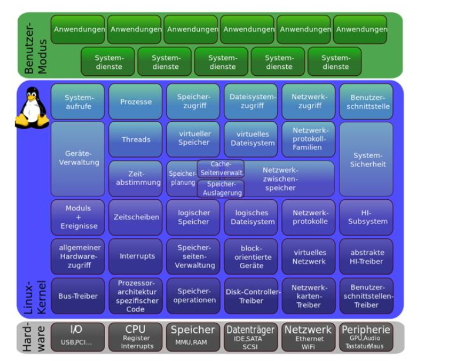

# Gerätetreiber verwalten mit modprobe & Co.

Kernel = monolothisch => großes ganzes
Kernel = Vermittler und Verwalter

* Voraussetzung für die Kommunikation des Linux-Kernels mit der im Computer integrierten
oder angeschlossenen Hardware ist, dass der Kernel die Sprache der Komponente versteht.
Hierfür ist ein Gerätetreiber notwendig
* Der Gerätetreiber kann entweder bereits im Kernel fest einkompiliert sein oder aber
dynamisch beim Systemstart oder im laufenden Betrieb als Loadable Kernel Modul (kurz:
LKM) nachgeladen werden
* Bei modernen Linux-Systemen erledigen die Subkomponenten des Kernels in der Regel die
Hardware-Erkennung und integrieren den benötigten Treiber ganz automatisch
* Verantwortlich für die Kernelverwaltung ist eine Komponente namens kmod. Das steht für
Linux Kernel Module Handling

# USB-Sticks

* Wird ein USB-Stick an einem Linux-System angeschlossen, s   * wird dieser automatisch
erkannt, Treiber nachgeladen und gemountet
* Mountpoint ist die UUID des USB-Sticks
* Treiber-Module für die Unterstützung von USB:
   * OHCI, steht für Open Host Controller Interface
   * UHCI, steht für Universal Host Controller Interface und ist eine lizenzpflichtige
Version von Intel. Beide dienen der Unterstützung von USB 1.1
   * EHCI, steht für Enhance HCI und stellt Unterstützung von USB 2.0 dar
   * UAS steht für USB attached SCSI und ist ein Protokoll, das für USB 3.0 eingeführt,
aber abwärtskompatible ist
   * xHCI stellt ebenfalls den Support für USB 3.x sicher

# UDEV

* Udev dient zur Geräteverwaltung und läuft als udevd im Hintergrund
* Udev dient in erster Linie zur Verwaltung von Hotplugging-Geräten
* Udev generiert die Inhalte des Geräteverzeichnisses /dev
* Udev arbeitet nach festen, aber konfigurierbaren und erweiterbaren Regeln
   * /etc/udev/rules.d
   * /lib/udev/rules.d
* Meldungen des Kernels die bestimmte Ereignisse, wie das Einbinden eines Speichermediums,
anzeigen werden als uevents bezeichnet
* Die uevents werden vom Udev-Daemon abgefangen und ausgewertet

# Udev vs D-BUS

D-Bus optimiert für Grafische Anwendungen mit GUI / UDEV für Hotplugin
D-Bus ist eine Erweiterung von UDEV

# D-Bus
* Der D-BUS ist eine Programmbibliothek, die dazu dient, dass Prozesse untereinander über
einen logischen BUS kommunizieren können
* Der D-BUS ist eine Middleware, eine Vermittlungsschicht zwischen Prozessen
* Der D-BUS besteht aus drei Komponenten:
   * Dem D-BUS-Daemon
   * Der D-BUS-Bibliothek namens libdbus
   * Dem D-BUS-Protokoll
* D-BUS erhält Informationen von Hotplugging-Ereignissen von Udev und sorgt im Beispiel des
USB-Sticks dafür, dass diese Informationen an den Dateimanager weitergegeben werden.
* Der D-BUS muss nicht konfiguriert werden