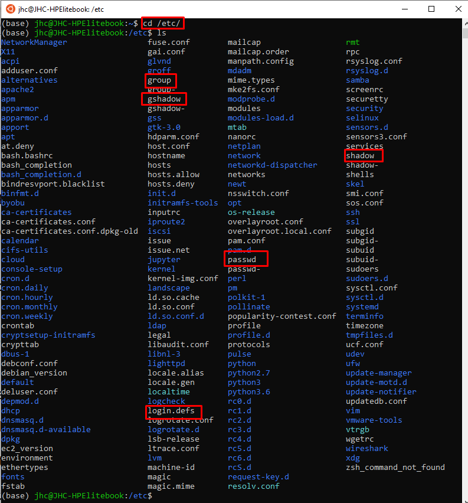
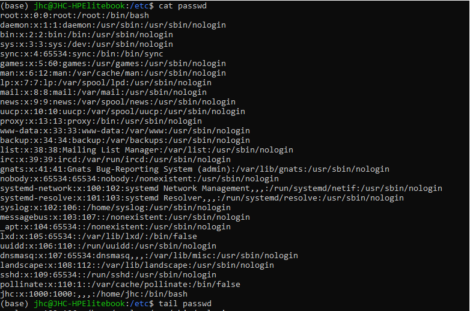
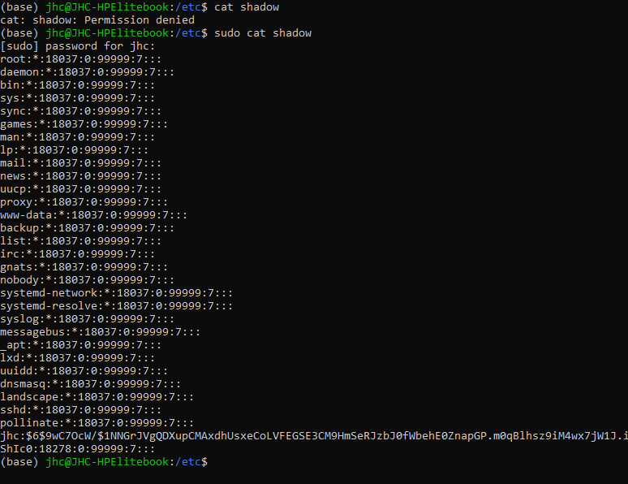
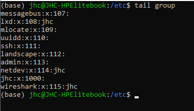

# User

* Linux ist ein Multiuser-System: Es können mehrere Benutzer das System verwenden, auch
gleichzeitig (bspw bei CLI -Sitzung mit alt +F1-6)
* Jeder Benutzer hat normalerweise sein eigenes Benutzer-Konto
* Obligatorisch ist ein Benutzername, mit der der Benutzer sich am System anmeldet. Dieser
Name muss auf dem System eindeutig sein
* Linux unterscheidet generell zwischen Groß- und Kleinschreibung, das gilt auch für die
Benutzernamen
* Die UID, also die User-ID muss ebenfalls eindeutig sein und wird normalerweise vom System
automatisch vergeben

Es gibt unterschiedliche User

1. Systemuser => können keine Shellsitzung starten. Diese werden häufig für Dienste verwendet. Defaultmäßig haben diese eine UID von < 1000
2. Useraccounts => kann GUI & Shell haben. Defaultmäßig haben diese eine UID von > 1000

* Benutzer erhalten eine Login-Shell. Das ist die Umgebung, die für sie bereitgestellt wird,
wenn sie sich auf der Konsole einloggen
* Dash steht für Debian Almquist Shell und wird als Standard-Shell für Debian-Derivate
verwendet
* Einem Benutzer wird ein Home-Verzeichnis zugewiesen
  * root hat sein Home-Verzeichnis unter /root
  * Normaler Benutzer in der Regel unter /home/Benutzername
* Einstellungen im Zusammenhang mit **useradd** und **userdel** werden in der Datei
/etc/login.defs festgelegt
* In der Datei **/etc/default/**useradd können weitere Voreinstellungen getroffen werden
(zBsp. Festlegung der Login-Shell als Standard bei der Erstellung eines neuen Benutzers)
* Gruppen werden verwendet, um mehreren Accounts Zugriffsrechte auf eine Ressource
zuzuweisen
* Jedem Benutzer wird eine Hauptgruppe zugewiesen. Standardmäßig wird hierfür eine
Gruppe mit demselben Namen und derselben ID wie die des Benutzers angelegt
* Als Alternative erhalten alle Benutzer dieselbe Hauptgruppe namens users. Sie hat meistens
die ID 100. Das ist jedoch nicht so flexibel, daher erhalten Benutzer auf den meisten
Systemen per Default ihre eigene Gruppe
* Benutzer können Mitglied mehrerer Gruppen sein und werden teilweise automatisch
bestimmten zusätzlichen Gruppen zugewiesen

## Dateien für das User & Gruppen Management
unter dem Pfad 
> /etc/

liegen alle Dateien der Nutzer bzw Gruppenverwaltung

* Benutzer-Informationen werden in drei Dateien verwaltet:
  * /etc/passwd
    * Login-Name
    * x = Passwort
    * UID (Benutzer-ID)
    * GID (Hauptgruppen-ID)
    * GECOS-Feld (Kommentarfeld)
    * Home-Verzeichnis
    * Login-Shell
    * 
  * /etc/shadow
    * Login-Name
    * Passwort (als Hash)
    * Datum der letzten Passwort-Änderung (Tage seit dem 1.1.1970)
    * Minimale Anzahl an Tagen zwischen zwei Passwort-Änderungen
    * Anzahl der Tage an denen vor Passwortablauf gewarnt wird
    * Anzahl an Tagen bis zur Deaktivierung, nachdem das Passwort abgelaufen ist
    * Datum an dem Account automatisch deaktiviert wird
    * 
  * /etc/group
    * Gruppenname
    * Group ID
    * Gruppenmitglieder
    * 

