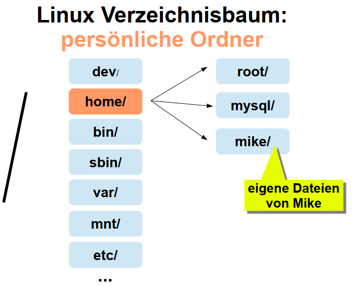
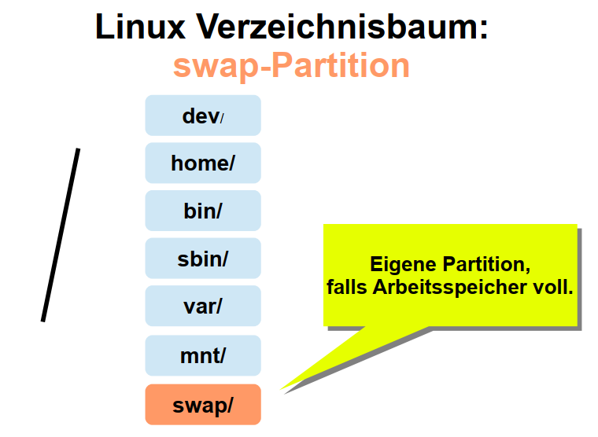

<h1>Linux Verzeichnissystem</h1>

File System Hierarchy Standard (FHS)

Das Verzeichnissystem kann nach unterschiedlichen Logiken auf unterschiedliche physische und logische Platten und Partionen(&Dateisysteme) via [Mountpoints](./PartitionierungDateisysteme.md) verteilt werden. Der [LVM](./T_LVM.md) ist dabei eine große Hilfe um diese logischen Einheiten zu verwalten.

In Linux liegen alle Dateien in einem Verzeichnissystem root. das Wurzelverzeichnis(root-Directory) wird mit dem Symbol "/" dargesetellt:

---
**DEV**

* Im Geräteverzeichnis /dev befinden sich aktive Komponenten, und auch Geräte die nicht permanent aktiv sind:
   *  Character Devices, die nur seriell angesprochen werden können, also bit für bit hintereinander lesend und schreibend. Zum Beispiel die virtuellen Terminals tty xy
   * Block Devices, auf die wahlfrei und blockweise zugegriffen wird. Das bedeutet, dass nicht erst die ersten 1000 Bytes des Datenträgers ausgelesen werden müssen, bevor die Daten ab dem 1001. Byte gelesen werden können. Stattdessen kann gezielt auf
die gewünschten Speicherblöcke zugegriffen werden. Zum Beispiel Festplatten und andere Speichergeräte 
  * Die drei Ein- und Ausgabekanäle Stdin, stdout und stderr verweisen auf
/proc/self/fd/
  * cdrom und dvd zeigen auf sr0. Dies ist die Gerätedatei für optische Laufwerke
  * Hinter /dev/random steckt ein hochwertigen Zufallsgenerator
  * Hinter /dev/urandom steckt ein nicht s  * hochwertigen Zufallsgenerator
  * /dev/zer  * liefert die geforderte Anzahl an Null-Bytes zurück
  * Bei /dev/null handelt es sich um den virtuellen Mülleimer. Alles was hier hin
geschrieben wird ist unwiederbringlich verloren. Bsp-Zynische Antwort: Schick deine Anfragen an "/dev/null"
* Das Verzeichnis /dev ist Mountpoint für eine virtuelle Komponente namens udev und das verwendete Pseudo-Dateisystem nennt sich devtmpfs. Dieses Verzeichnis wird dynamisch
vom Kernel und seinen Komponenten gefüllt und die hier aufgeführten Dateien sind nur virtuell vorhanden
* Auch die Unterverzeichnisse unter /dev sind dynamisch erzeugte Objekte, die zur besseren
Verwaltung dienen und meistens Symlinks bereitstellen. Denn wenn sich die
Gerätebezeichnungen ändern, weil z.B. Festplatten intern umgesteckt werden, s   * werden
hier einfach die Symlinks korrigiert und es passt wieder

---
**Home**

// normalerweise ist das Home verzeichnis von root = /

---
**SWAP**
Diese Verzeichnisstruktur muss nicht zwingend in jeder Linux Version vorhanden sein

[Link zur SwapConfig](./CC/Swap.md)

---
**Bin / SBIN**
Hier liegen die Programm Binaries.

---
**VAR**

> tail /var/log/syslog

zeigt die letzen Aktionen des Systems

---
**MNT / MEDIA**

---
**ETC**

---
**USR**
hier sind die spezfischen Berechtigungen für Anwendungen die ein User installiert hat

---
**PROC & SYS**
* Es gibt zahlreiche virtuelle Dateisysteme für die verschiedenen Zwecke
   * Das Dateisystem proc, wird unter /proc gemountet
   * Das Dateisystem sysfs wird unter /sys gemountet
* /sys und /proc stellen virtuelle [Kernel-Verzeichnisse](./T_LinuxVersionen-BasicHistory.md) bereit
* Sie existieren nur im Arbeitsspeicher und werden vom Kernel dynamisch erstellt
* Die Daten darin werden beim Herunterfahren nicht gespeichert
* Wichtige Dateien in /proc
   * cpuinfo: Zeigt z.B. Informationen zum Prozessor
   * interrupts: Zeigt Anfragen für Datenaustausch mit dem Prozessor
   * ioports: Zeigt die Input-Output-Adressen der Hardware-Komponenten. Über sie ist
ein Datenaustausch zwischen der CPU und dem jeweiligen Gerät möglich
   * meminfo: Zeigt die Verwendung des Arbeitsspeichers
   * swaps: Hier wird der verwendete Swap-Space aufgeführt
   * version: Zeigt die Linux-Version des Systems an
   * Unter /proc befindet sich das Unterverzeichnis /sys mit weiteren
Unterverzeichnissen für verschiedene Aspekte des Systems. Das umfasst Hardware,
wie dev, fs oder net, aber auch Software, wie z.B. users
   * Die Unterverzeichnisse mit den Ziffern entsprechen den Prozess-IDs und beinhalten
Dateien zu diesem jeweiligen Prozess
* Die Dateien unter /proc können auch zur Manipulation und zum Tuning des Systems
angepasst werden
   * Beispiel: Unter /proc/sys/net/ipv4 diverse Tuning-Parameter für den TCP/IP-Stack
unter IPv4
* Im Verzeichnis /sys befinden sich wie unter /proc Informationen über Geräte, KernelModule, Dateisystem und andere Kernel-Komponenten
   * Auch hier sehen wir diverse Unterverzeichnisse. Unter denen sich Dateien und
weitere Unterverzeichnisse befinden
* Während /sys sich mehr auf die Kernel-bezogenen Informationen konzentriert, bezieht sich
/proc auf die Prozesse des Systems
* Beim System-Tuning arbeiten wir meistens im /proc-Verzeichnis

---
# RUN
enthält Laufzeitinformationen von bestimmten Prozessen
