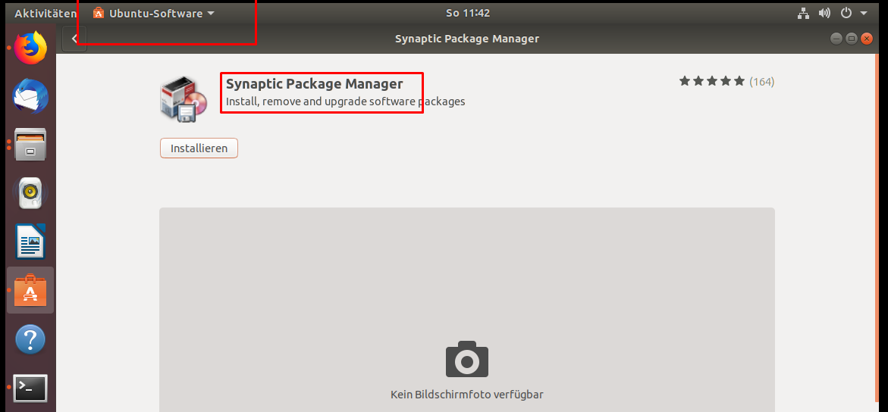
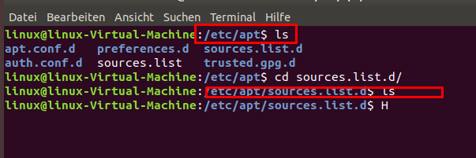
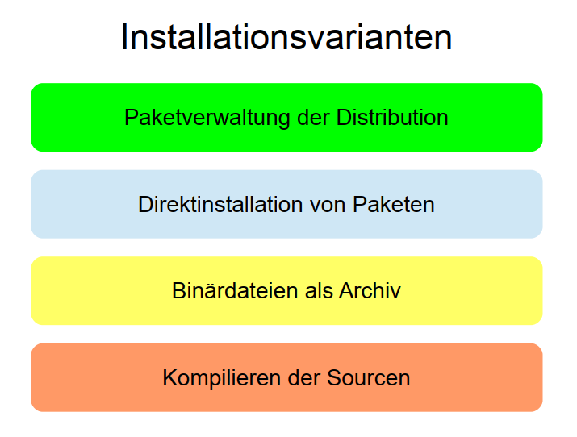
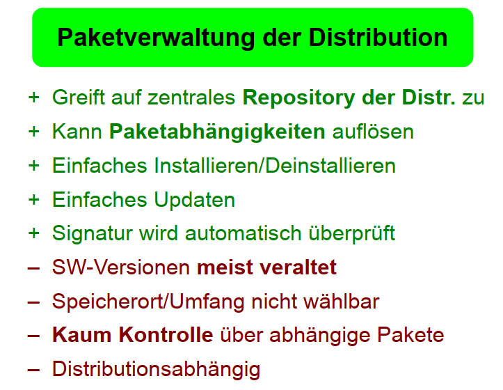
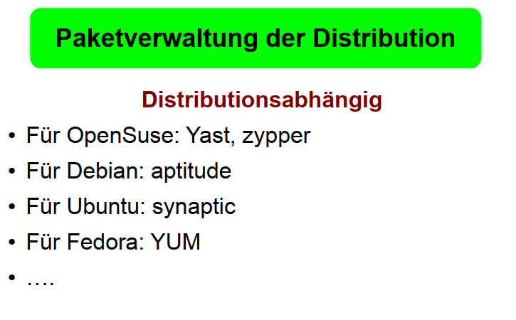
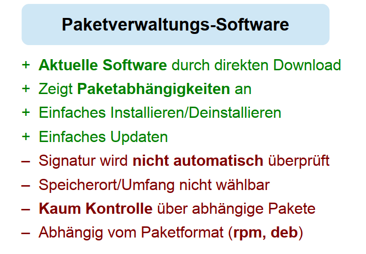
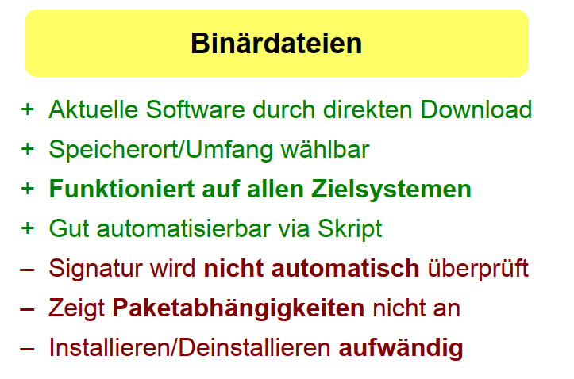
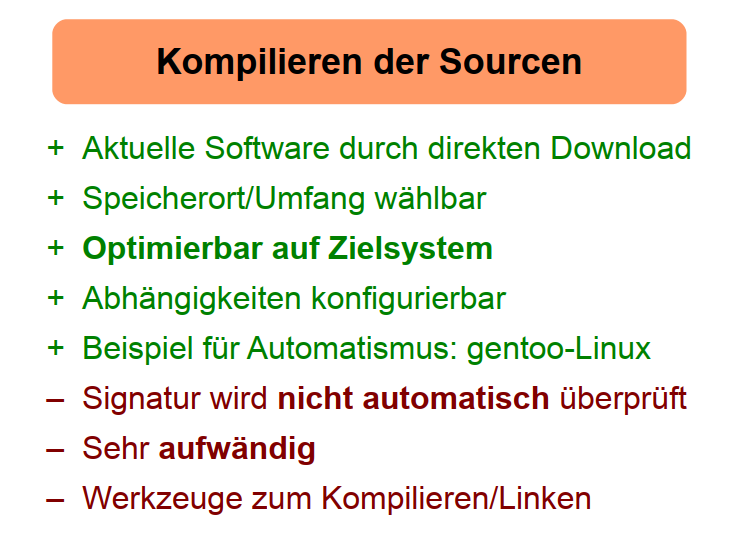
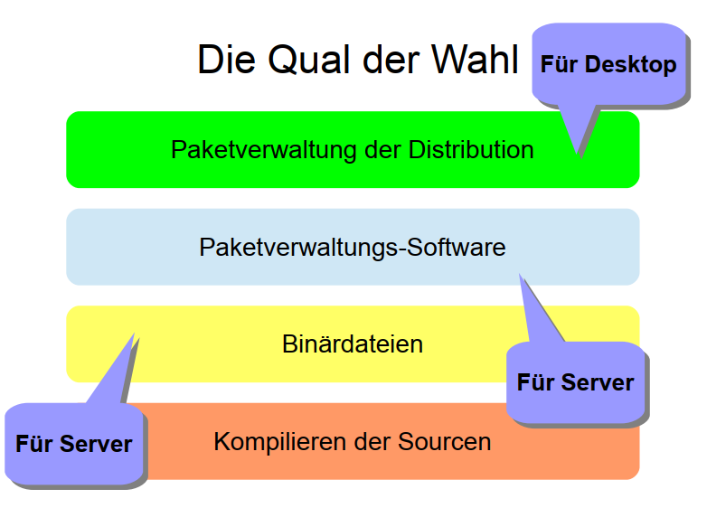

<h1>Möglichkeiten der Softwarebeschaffung</h1>

<!-- TOC -->

- [Ubuntu-GUI](#ubuntu-gui)
  - [Software Center (vgl appstore)](#software-center-vgl-appstore)
  - [DEB-Files](#deb-files)
- [CLI / Terminal](#cli--terminal)
  - [apt-Commands / apt-get install * // Debian && Ubuntu](#apt-commands--apt-get-install---debian--ubuntu)
    - [Einfache Installation = Paket bereits in bestehenden Repos hinterlegt](#einfache-installation--paket-bereits-in-bestehenden-repos-hinterlegt)
    - [Extended Installation = Repo, in welchem das Paket ist muss erst noch hinzugeüfgt werden](#extended-installation--repo-in-welchem-das-paket-ist-muss-erst-noch-hinzugeüfgt-werden)
  - [dpkg / *.deb-files](#dpkg--deb-files)
  - [Flatpak](#flatpak)
  - [Snap Packages](#snap-packages)
  - [AppImage](#appimage)
  - [PPA / Personal Package Archive](#ppa--personal-package-archive)
  - [Package Manager](#package-manager)
  - [Source Code](#source-code)
  - [Web Browser](#web-browser)
  - [pip](#pip)
  - [yum](#yum)
  - [Manuell selbst kompilieren](#manuell-selbst-kompilieren)
  - [Installationsvarianten - Slides](#installationsvarianten---slides)

<!-- /TOC -->

In Ubuntu gibt es mehrere Möglichkeiten Software zu beschaffen. Nachdem jedes Tutorial(egal zu welchem Thema) gefühlt einen anderen Weg der Softwarebeschaffung wählt, gehe ich hier lediglich auf die Möglichkeiten ein, wie Software beschafft werden kann. Diese "Beschaffungstutorial" basiert auf folgenden Tutorials:
**Basic-Tutorial**
Das [Basic-Tutorial](https://www.ubuntupit.com/how-to-install-software-in-ubuntu-linux-a-complete-guide-for-newbie/) liefert zahlreiche Beschaffungsmöglichkeiten und deren Erklärung

**Udemy-Tutorial**
Das [Udemy-Tutorial](https://www.udemy.com/course/lpic-1-linux-bootcamp-in-30-tagen-zum-linux-admin/learn/lecture/15821388#notes) beizieht sich v.a. auf die Softwarebeschaffung von Ubuntu (Gui && CLi) via apt und dpgk -i als auch in centos(linux) via yum
# Ubuntu-GUI
   ## Software Center (vgl appstore)
   Hierbei wird  empfohlen mit folgendem Verwaltungstool zu arbeiten:

   **Synaptic Package Manager**

   
   ## DEB-Files

# CLI / Terminal
* Wird genutzt wenn zum Beispiel keine Grafische Oberfläche zur Verfügung steht
* Befehl für die Paketverwaltung: apt (je nach system auch: apt-get oder aptitude)
* sudo wird beim installieren/updaten von Paketen benötigt

## apt-Commands / apt-get install * // Debian && Ubuntu

in Ubuntu werden die textuellen versionen der Repos unter den beiden folgenden Objekten gespeichert:
1. source.list file => textuell alle Repos hinterlegt
2. soruce.list.d => hier werden Repos hinterlegt, welche durch manuelle Installation künftig automatisch mit dem **apt get update / upgrade** mitinstalliert werden sollen. 

* Ubuntu Paketlisten überprüfen/updaten:
  >
   sudo apt update
* Ubuntu Paketliste installieren 
  > sudo apt upgrade
    *  fügt zusätzlich neue Abhängigkeiten hinzu falls benötigt:
        >sudo apt dist-upgrade
(Updatet dann auch Pakete die eine neue Abhängigkeit benötigen)

### Einfache Installation = Paket bereits in bestehenden Repos hinterlegt

* Ubuntu Paket installieren: 
  > sudo apt install paketname
  > sudo apt install htop

### Extended Installation = Repo, in welchem das Paket ist muss erst noch hinzugeüfgt werden
Normalerweise gibt es hierzu auf der jeweiligen Seite eine Anleitung. ([Vgl Installation Atom in Ubunutu](https://flight-manual.atom.io/getting-started/sections/installing-atom/#platform-linux))

  1. Füge den Key des Repos zu deinen Keys hinzu => stellt sicher dass die SIcherheit gewährleistet ist
  > wget -qO - https://packagecloud.io/AtomEditor/atom/gpgkey | sudo apt-key add -

  1.  Füge neues Repo zud einen Repo listen hinzu:
  > sudo sh -c 'echo "deb [arch=amd64] https://packagecloud.io/AtomEditor/atom/any/ any main" > /etc/apt/sources.list.d/atom.list'

  1. Date up
  > sudo apt get update

  1. Installiere Paket aus dem neuen Repo
  >suo apt-get install atom

  **Suchen von Paketen für apt**
  
* packages.ubuntu.com / packages.debian.com
  * Website mit grafischer Oberfläche zum suchen von Paketen
* sudo apt search paketname || sudo apt search htop
  * Terminal Befehl zum suchen von Paketen
* Pfad zur Datei mit Paketquellen: /etc/apt/sources.list
* Pfad zum Ordner für eigene Paketquellen: /etc/apt/sources.list.d

**Aufösen der möglichen Depencies**
> sudo apt-get install -f

## dpkg / *.deb-files

   Im Grunde wird hierbeit die Datei heruntergeladen, entpackt und dann installiert. Das ganze soll mit SU-Rechten gemacht werden. Ergo braucht man hierfür auch kein repo, die Adresse erhält man einfach durch das browsen. 
   Der Name dpkg ist eine Abkürzung für Debian Package. Das Debian-Software-Paket-Format wurde im Debian-Projekt entwickelt, allerdings wird dieses Paketformat und das Paketverwaltungsprogramm dpkg auch von anderen Software-Distributionen verwendet.
1.  Hier wird zunächst ein File heruntergeladen. Bspw via wget (bsp-Command: 
    > wget --content-disposition https://packages.gitlab.com/gitlab/gitlab-ce/packages/debian/buster/gitlab-ce_12.9.2-ce.0_amd64.deb/download.deb")

2. Navigation zu dem File:
 
   > cd "Dahin wo man das File hingeladen hat"
    
3. Installation des Files

    > sudo dpkg -i gitlab-ce_12.9.2-ce.0_amd64.deb/download.deb

4. Aufösen der möglichen Depencies

    > sudo apt-get install -f

5. Packet entfernen

    > dpkg -r 'paketname'
    > dpkg -r --force-depends'paketname' # Wenn paket Abhängigkeiten aufweist

6. Packete auflisten

    > dpkg -l
    

## Flatpak
## Snap Packages
## AppImage
## PPA / Personal Package Archive
[Debain-PPA](https://launchpad.net/debian/)
[Ubuntu-PPA](https://launchpad.net/ubuntu/)
* PPA (Personal Package Archives)
  * eigene Pakete zur Verfügung stellen
  * von anderen Usern Pakete runterladen
(man muss wieder den Autoren des Paketes vertrauen)

## Package Manager
##  Source Code
##  Web Browser
##  pip
## yum
Dieser Dienst wird gern von Linux/CentOS verwendet. In der Basic Variante ist hier aber kaum Software hinterlegt. Daher kann dieser zunächst um ein weiteres Repo erweitert werden:

**YUM-Befehle**
1. Empfehlung nach der Fresh installation erst mal weitere Repos hinzufügen:
   A. Anmelden als root
   B. 
   > yum install epel-release

* Paketmanager: yum
  * yum install paketname || Installation eines Paketes
  * yum remove paketname || Deinstallation eines Paketes
  * yum downgrade paketname ||  Installiertes Paket auf ältere Version bringen
  * yum search paketname  || Nach einem Paket suchen.

* Es können auch Pakete über URLs installiert werden
  * yum install https://LinkzumPaket.com/test.rpm
  * wichtig ist das .rpm am ende
* Hinzufügen eines neuen repository (epel-release)
  * yum install repositoryname
  * epel (extra packages for enterprise linux)
  * beim ersten herunterladen eines Paketes muss man bestätigen, das man dem
repository vertraut. (Fingerabdruck überprüfen)

## Manuell selbst kompilieren
1. Wenn möglich vermeiden, da es ab hier komplexer als wie mit einer Paketverwaltung wird
2. Kann den Vorteil haben, dass man neuere Releases hat
3. Checke Slides unten in diesem Markdown

**Vorgehen**
1. Suche auf Webseite nach der Installationsanleitung
2. Stelle sicher dass folgende Unterstützungen vorhanden sind:
   > sudo apt install make gcc g++ automake

   (sind nicht zwingend, aber können unterstützen)

3. Configure-Befehl
   > ./configure
4. make-Befehl
    > make

* sudo apt install make gcc g++ automake
  * wird benötigt um ein Paket zu kompilieren
* Der Quellcode wird benötigt
  * auf der Website des Programms ist meistens auch eine Anleitung vorhanden
wie man dieses richtig kompiliert
* Nach dem Compilieren kann das Programm aus dem Programm Ordner aus
gestartet werden
* su root
make install
  * fügt das Programm auch zur Paketverwaltung hinzu.
Nicht zu empfehlen da es zu Komplikationen kommen kann.
* Fall das Programm nach einen Systemupdate nicht mehr laufen sollte, einfach das
Programm nochmal neu kompilieren

----
## Installationsvarianten - Slides

