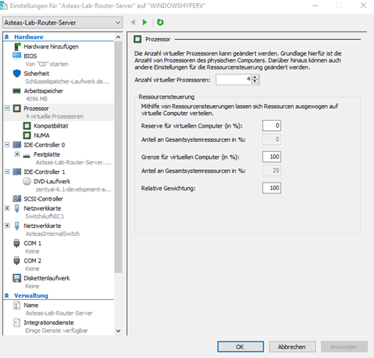
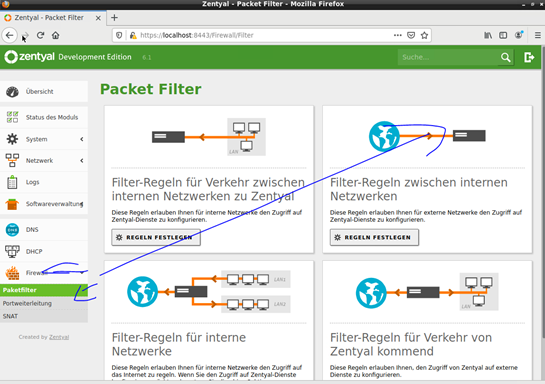
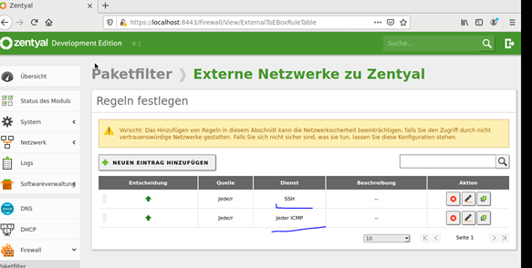

# Zentyal-Server Rollout

1. Physische / Virtuelle Konfiguration
   Vor dem Rollout der eigentlichen ISO sicherstellen, dass zwei NICs verbaut sind
   
2. aus der phyisischen Konfiguration die entsprechenden MAC-Adressen der NICs notieren.(bei der Konfiguration von Zentyal via webinterface muss bekannt sein welche Nic an welchem Netzhängt)
3. Nach dem initalien Rollout müssen die NICs einmalig in den State Up gesetzt werden

> ip link set dev <interface 1> up 
> ip link set dev <interface 2> up 
> sudo dhclient -v (= ipconfig release & renew in Linux)

4. Standard Update von Linux
> sudo apt-get update && sudo apt-get -y upgrade && sudo apt-get dist-upgrade && sudo reboot

5. Konfiguration des Zentyal-Servers via Webinterface
   1. Routing Dienst während der Konfiguration ausrollen
   2. DHCP-Dienst
      1. Statische IP auf NIC zum Virtuellen Netz
      2. Start & Endbereich der IP-Adressen im virtuellen Lab festlegen
      3. Domäne festlegen
      4. Sicherstellen, dass DHCP nur auf dem virtuellen LAB läuft => andernfalls DHCP konfligt im phyisischen LAB
      5. Modul muss nach der Konfiguration aktiviert werden
   3. DNS-Dienst
      1. Statische IP auf NIC
   4. SSH-Dienst aktivieren via GUI:
   Klick1)
   

    Klick2)
   

6. Wireshark installieren.
   Hierbei geh ich nach meinem [Standard](../Networking/tshark.md) vor.
   

