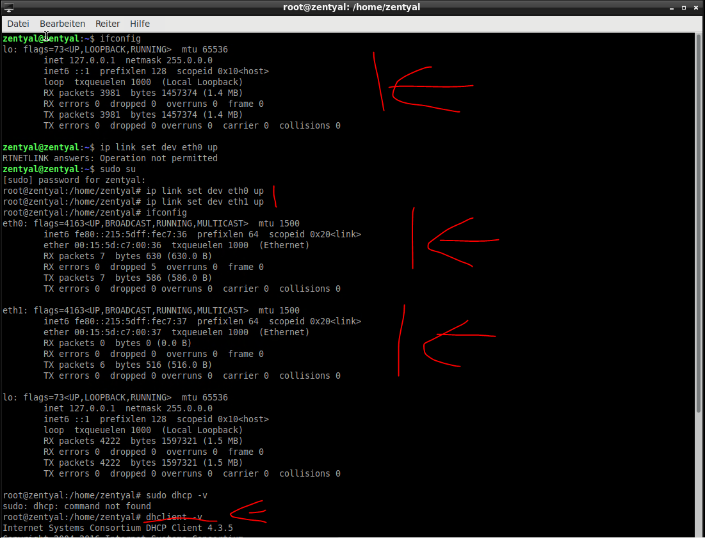
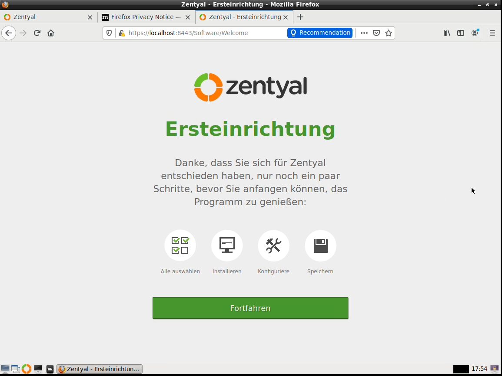
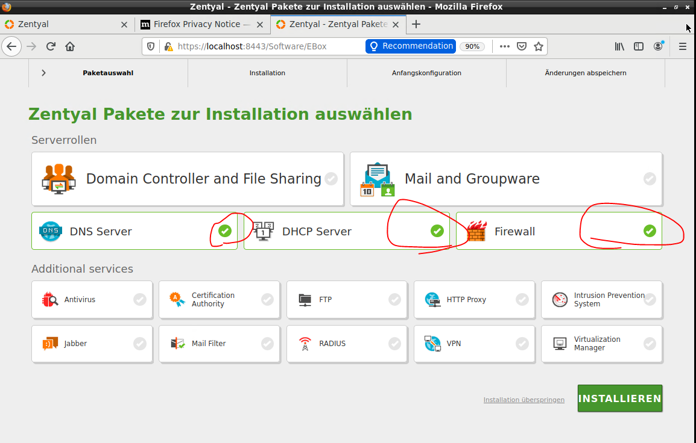
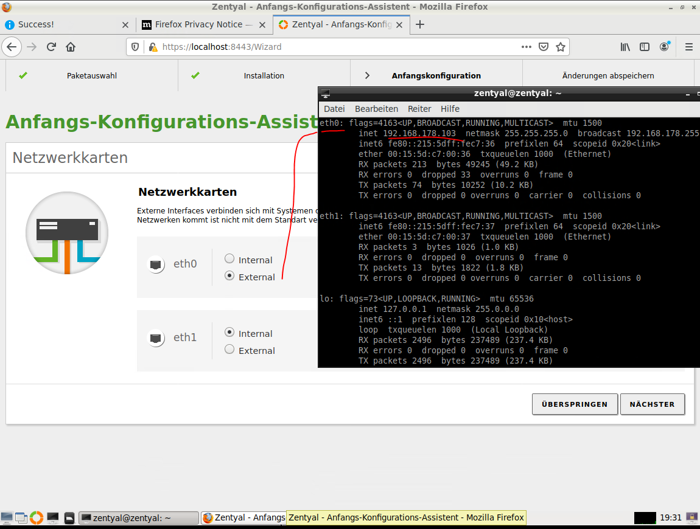
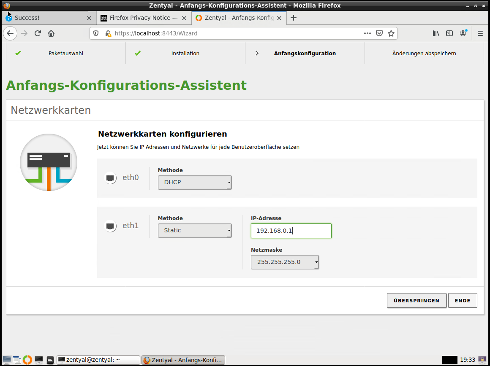
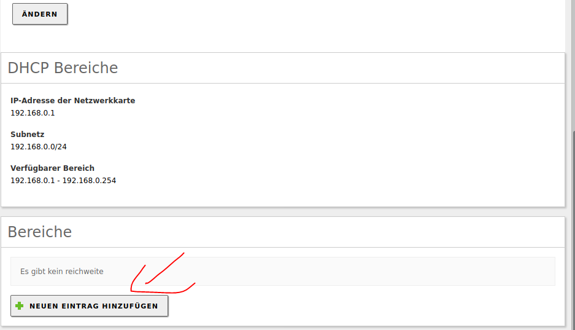
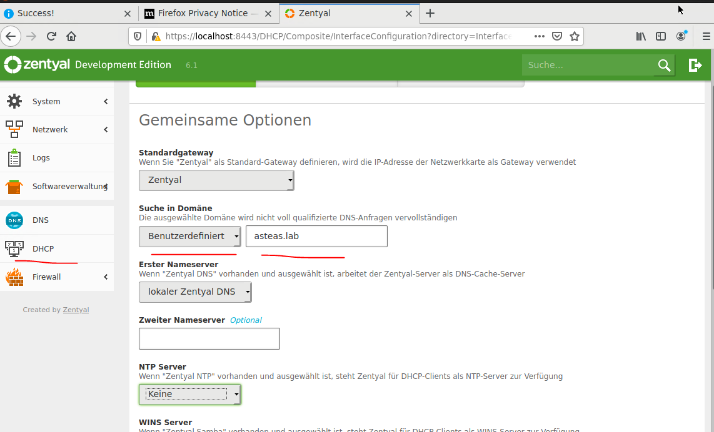
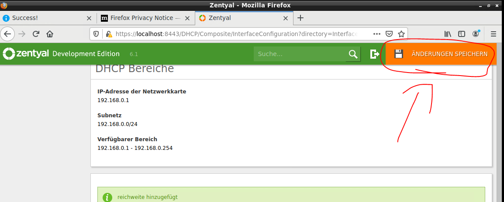
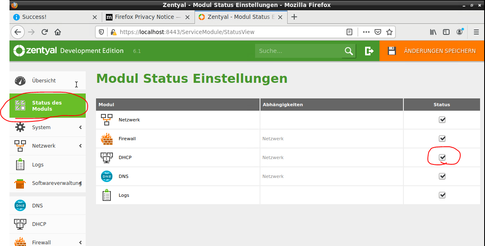

# Zentyal-Server Rollout

1. Physische / Virtuelle Konfiguration
   Vor dem Rollout der eigentlichen ISO sicherstellen, dass zwei NICs verbaut sind
   
2. aus der phyisischen Konfiguration die entsprechenden MAC-Adressen der NICs notieren.(bei der Konfiguration von Zentyal via webinterface muss bekannt sein welche Nic an welchem Netzhängt)
3. Nach dem initalien Rollout müssen die NICs einmalig in den State Up gesetzt werden.

> ip link set dev eth0 up  
> ip link set dev eth1 up  
> sudo dhclient -v (= ipconfig release & renew in Linux) 

1. Standard Update von Linux
> sudo apt-get update && sudo apt-get -y upgrade && sudo apt-get dist-upgrade && sudo reboot

5. Konfiguration des Zentyal-Servers via Webinterface
   
   1. Routing Dienst während der Konfiguration ausrollen
      1. Auswahl von DNS / DHCP & Firewall-Dienst
      

      2. Bei der Auswahl welche Netzwerkkarte intern und extern ist nochmals "ifconfig" zu rate ziehen
      

      3. Anschließend die IP Vergabe tätigen. Das Interne Netz wird die Adresse 192.168.0/24 haben
      

   2. DHCP-Dienst
      1. Statische IP auf NIC zum Virtuellen Netz(wurde bereits während Wizard erledigt)
      2. Start & Endbereich der IP-Adressen im virtuellen Lab festlegen(im folgenden Bild ist noch kein Bereich angelegt)
        
   
      3. Domäne festlegen
        
      4. Bei Zentyal muss der Spass immer nochmals bestätigt werden
        
      5. und das Modul muss noch aktiviert werden
        

      6. Sicherstellen, dass DHCP NUR auf dem virtuellen LAB läuft => andernfalls DHCP Konflikt im phyisischen LAB
      7. Sicherstellen, dass DHCP überhaupt läuft 
         1. Häng einen Virtuellen Rechner an den virtuellen Switch auf dem die NIC von Zentyal-DHCP läuft
         2. prüfe via ifconfig/ipconfig ob der virtuelle Rechner eine IP erhalten hat
      8. Modul muss nach der Konfiguration aktiviert werden
   3. DNS-Dienst
      1. Statische IP auf NIC
   4. SSH-Dienst aktivieren via GUI:
   Klick1)
   

    Klick2)
   
   icmp = ping
   ssh = mobaXterm
   webmin = Konfigruation via Webinterace von Management-Laptop

   ab jetzt ist das Zentyal webinterface vom management rechner unter "externalIp:8443" => bspw(https://192.168.178.103:8443/) erreichbar

6. Wireshark installieren.
   Hierbei geh ich nach meinem [Standard](../Networking/tshark.md) vor.
   

